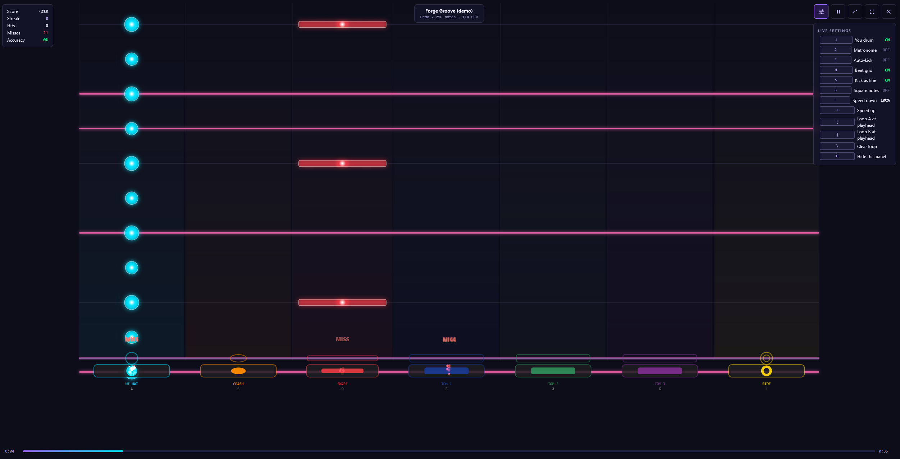
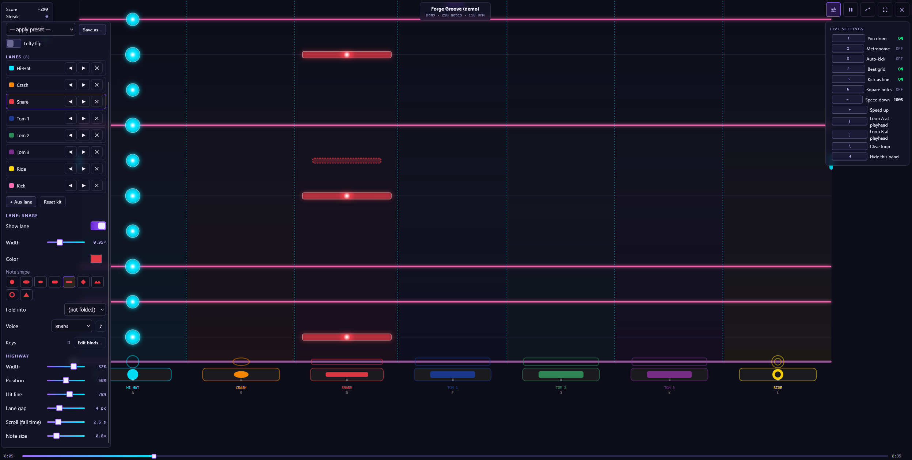

# ParaKit — Practice Mode v3 (Web Edition)

**Falling-note drum practice + a full Kit Studio, in one self-contained web app.**

Practice Mode v3 is a from-scratch rebuild that folds the v2 falling-note **play** experience together with a **Kit Studio** for shaping your kit, and a polished, everything-up-front home. One file, opens in any modern browser, no install. Charts are Paradiddle `.rlrr`.

> **v3 ships alongside v2 on purpose** — try both and use whichever you prefer while the best-of-both version for ParaKit v5 is decided. (See the main README.)

## Play

- Notes fall down 8 lanes in time with the music; play along on your **keyboard** or a **USB-MIDI drum kit** (Shift = accent).
- **Latency-calibration** wizard, a **results screen** with a timing histogram (early / late split + suggested input offset), a per-lane accuracy table, and a "practice the worst section" shortcut.
- **In-play live-settings dock** (toggle with **H**): you-drum, metronome, auto-kick, beat-grid, kick-as-line, square notes, speed, loop A/B.

## 🥁 Kit Studio (the headline)

Shape the kit to match how you think: **rearrange the lanes**, set each lane's **color / shape / width**, add **aux lanes** for split-out instruments, **lefty-flip** the whole highway, tune the highway width / position / hit-line / scroll, save **kit presets**, and pin a kit to a song. Open it from the home or live mid-song.

## The home — Song / Setup / Input

- **Song** — play the built-in demo, point at a **songs folder** (a searchable library of `.rlrr` packages), or **load a single `.rlrr`** (+ optional audio; a synth fills in if there's none).
- **Setup** — auto-kick · square notes · kick-as-line · beat-grid toggles, fall-time + note-size sliders, calibrate, Kit Studio.
- **Input** — Web-MIDI status + enable, and **every lane with its bound key(s) shown inline** (click to rebind; Shift = accent).

## Notes

- Lanes are dual-coded by **color + shape + position**: Hi-Hat · Crash · Snare · Tom 1 · Tom 2 · Tom 3 · Ride · Kick, with accessible (Okabe-Ito / Tritan) palettes available.
- Everything stays on your machine — preferences in localStorage; library handle / records / presets in IndexedDB. Nothing is uploaded.

## Screenshots

| Home | Gameplay | Kit Studio |
|---|---|---|
|  |  |  |

---

*Part of [ParaKit](../README.md) — free forever, no ads. Released under GPLv3.*
