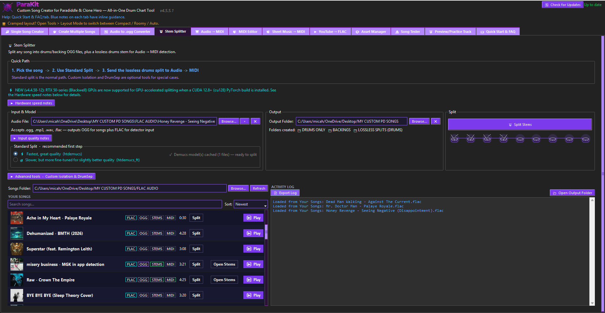
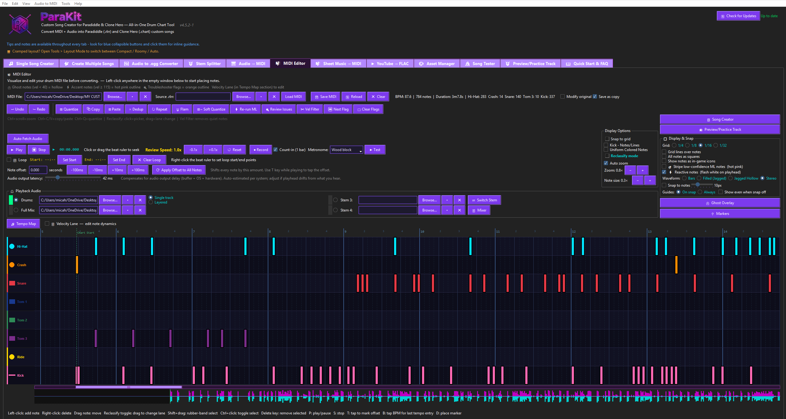
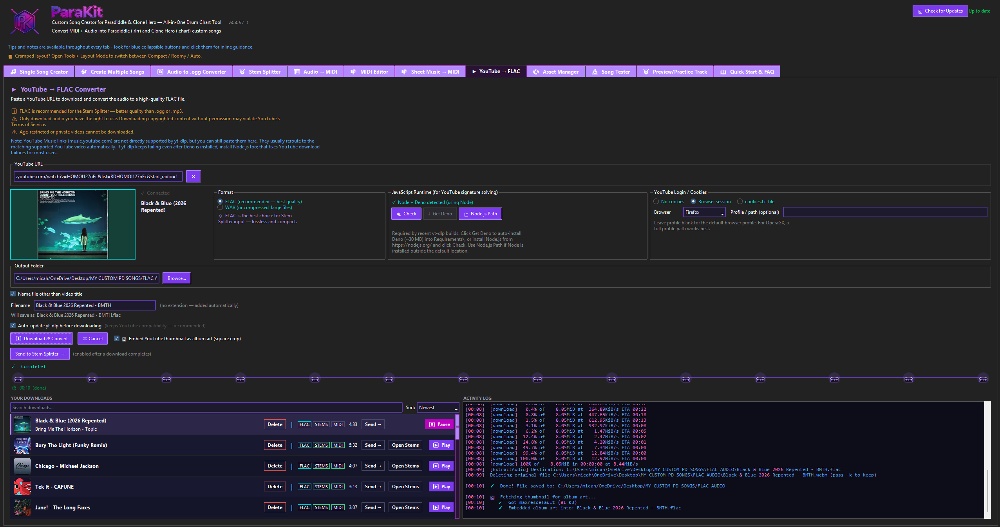
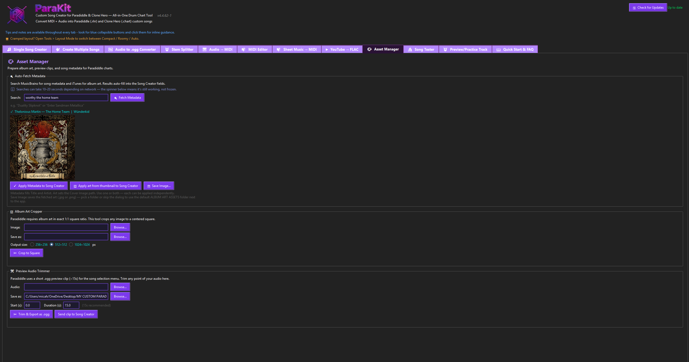

# ParaKit (v4.x source release)

**An all-in-one drum-charting tool for [Paradiddle](https://www.paradiddleapp.com/) (`.rlrr`), with Clone Hero (`.chart`) support.**

STANDALONE .EXE VERSION: https://limewire.com/d/UV9Zm#DHqxKgEtmn

REPO FOR .EXE VERSION: https://github.com/sherifican/ParaKit---Releases

Note: Both the Practice and Preview mode updates that are currently HTMLs will be folded into ParaKit propper in a future update,
but for now the HTML/web versions function fine as a quick and easy substitute until then.

Take a song, isolate the drums, turn them into a playable drum chart, refine it in a
visual MIDI editor, practice it with falling notes, and export it, use iTunes/MusicBrainz to find Album Art & Meta Data,
turn Sheet Music into MIDI files, and create batches of songs at once — all in one app.

ParaKit **always has been and always will be free of charge, and will _never_ host ads.**
This repository now makes the full **v4.x source code** open under the **GPLv3** license,
so anyone can run it from source, learn from it, fix it, or build their own version.

> **Version in this release:** `4.4.59-12`  •  **Runtime:** Python **3.12** (required)

---

## ⚠️ Read this first — which ParaKit is this?

ParaKit is mid–transition between two generations, and it matters for what you can do here:

| | **ParaKit v4.x (this release)** | **ParaKit v5 (future)** |
|---|---|---|
| UI framework | **Tkinter / TTK** | **PySide6 / Qt** |
| Status | The **complete, stable, shipping** app | Early rebuild, barely started — **not in this release** |
| Themeable with UI Studio? | **No** | Yes (UI Studio is built for v5) |

**UI Studio** — the visual UI/layout designer — is built for the **v5 (PySide6)** rebuild
and is **not compatible** with this v4.x (Tkinter) app. It is **not included in this
release** because it can't run without the v5 code, which isn't ready yet. UI Studio and
v5 will arrive in a **later follow-up**. You **cannot** use UI Studio to re-theme or edit
this v4.x app — but once it ships, you'll be able to use it to design for v5 or build your
own custom ParaKit from source.

See [`docs/ROADMAP.md`](docs/ROADMAP.md) for the v5 / UI Studio / GPU-build plan.

---

## 🥁 New — Practice Mode v2: Web Edition

The falling-note **Practice** experience has been rebuilt from scratch as a fast, **self-contained web app** — a big step up from the in-app mini-game and the `practice_v2/` alpha. Notes fall down 8 lanes in time with the music while you play along on a **USB MIDI drum kit or your keyboard**.

- **Rock-solid timing** — a sample-accurate Web Audio clock, no drift.
- **One file, zero setup** — open it in any modern browser; includes a built-in demo plus a synth that makes any chart audible even with no audio file.
- **Latency calibration, mid-song mix/stem switching, touch support, a results screen with a timing histogram**, and full keyboard + MIDI play.
- **Loading your own song** — the built-in demo + synth play by default, so a track is always there the moment you open it. To practice your own: click **Choose MIDI** or **Choose .rlrr** to load a chart, and **Full Mix** / **Drum Stem** to load the audio (no audio file? the chart is synthesized so it's still audible).

**▶ Try it:** download **[`Practice Window v2 - Web Edition/parakit-practice.html`](Practice%20Window%20v2%20-%20Web%20Edition/parakit-practice.html)** and open it in any modern browser (Chrome or Edge for USB-MIDI).

<p align="center">
  
  
  
</p>

> **This web edition is the de-facto final version of Practice Mode v2 for now.** An updated native (`.py`) version folded back into the app is planned for a later release — but you don't need to wait: the web edition is complete and ready to play today.

---

## 🔎 New — Preview Track v2: Web Edition

**Watch your drum chart fall in time with the music — then fix what's wrong without ever leaving the view.** Preview Track is the *review* half of ParaKit's Preview/Practice tab, rebuilt as a fast, **self-contained web app**. Notes scroll down 8 lanes synced to the audio so you can **catch detection problems** — a snare a hair early, a crash that should've been a ride, a doubled hit — and the headline of v2: a **live Edit Mode that lets you fix them right there on the falling chart**, then resume. The see-it → fix-it loop, closed, with no tab switch.

- **✎ Edit Mode (press `E`)** — pause and the subdivision grid becomes a precise ruler. **Click** an empty spot to place a note (snapped to the grid); **drag a note vertically to move it in time, horizontally to reclassify its lane** — drag a wrong-drum note onto the right one; one gesture, two fixes. **Right-click deletes** (hold & sweep = eraser); **wheel** scrubs, **Ctrl+wheel** zooms the fall window; `Ctrl+Z` / `Ctrl+Y` undo/redo.
- **Tap-along charting** — keys **`1`–`8` drop a note at the hit line, even during playback**, so you can play along and tap in missing notes. **● Record** captures live keyboard/MIDI hits with an optional **Count-in** + **Metronome**.
- **Review controls** — **Speed** 0.5×–1.25× (slow a busy passage down to inspect it), **Fall time**, **Grid** (1/4–1/32) + **Snap**, **🥁 Pads** for mouse/touch, **⇪ Receive** a chart from the MIDI editor, **MIDI in** for a USB kit, and built-in demo charts.
- **Loading your own song** — the built-in demo + synth play by default, so a track is always there without loading anything. To review **your own**: click **Mix / Drums / Stems** to load an audio file (full mix or an isolated stem), and **⇪ Import** to load a chart (`parakit-chart-v1` JSON); **⇪ Export** saves your edits back out. Charts round-trip with the MIDI editor and Practice v2.

**▶ Try it:** download **[`Preview Track v2 - Web Edition/parakit-preview.html`](Preview%20Track%20v2%20-%20Web%20Edition/parakit-preview.html)** and open it in any modern browser (Chrome or Edge for USB-MIDI).

<p align="center">
  
  
</p>

---

## What's in this repository

| Folder / file | What it is |
|---------------|-----------|
| **`ParaKit v4.0.py`** | The full ParaKit v4.x app (single file) |
| **`Run ParaKit v4.0.bat`** | Windows double-click launcher |
| **`requirements.txt`** | Python dependencies for the main app |
| **`extractor/`** | **RLRR Extractor** — converts `.rlrr` charts back into `.mid` MIDI ([readme](extractor/README.md)) |
| **`practice_v2/`** | **Practice Window v2** — standalone falling-note practice mini-game (**alpha**, [readme](practice_v2/README.md)) |
| **`Practice Window v2 - Web Edition/`** | **Practice Mode v2 — Web Edition** — the new self-contained browser rebuild (recommended; see the section above) |
| **`Preview Track v2 - Web Edition/`** | **Preview Track v2 — Web Edition** — falling-note review + live Edit Mode for catching & fixing chart issues (see the section above) |
| **`docs/`** | Building from source, troubleshooting, roadmap |
| **`LICENSE`** | GNU GPL v3 |

> **Practice v1 vs v2:** the **stable** Practice mode is **v1**, built into the main app.
> `practice_v2/` is an **in-development alpha** — included so you can build on it. See its
> [readme](practice_v2/README.md).

---

## Features

- **MIDI editor** — visual note placement and refinement
- **Audio → MIDI detection** — automatic drum transcription with three engines:
  **Spectral** (traditional), **ML / ONNX** (neural net), and **Hybrid** (combined),
  plus genre presets (Pop / Rock / Metal / Funk)
- **Stem splitter** — isolate a drums-only track from any song (Demucs)
- **MusicXML → MIDI** — convert sheet music into a chart
- **YouTube → FLAC** — download lossless audio to chart from
- **Asset management** — metadata, album art, preview clips
- **Preview & Practice** — falling notes synced to the audio, keyboard or USB MIDI kit
- **Song Tester** — verify sync before export
- **Export** — Paradiddle (`.rlrr`) and Clone Hero (`.chart`)

---

## 📸 Screenshots

<div align="center">
  
</div>

<details>
<summary><b>🖼️ Click to expand — see every tab</b></summary>

<br>

### 1 · Single Song Creator


### 2 · Create Multiple Songs


### 3 · Audio → .ogg Converter


### 4 · Stem Splitter


### 5 · Audio → MIDI


### 6 · MIDI Editor


### 7 · Sheet Music → MIDI


### 8 · YouTube → FLAC


### 9 · Asset Manager


### 10 · Song Tester


### 11 · Preview / Practice Track
<br><br>


### 12 · Quick Start & FAQ


</details>

---

## Requirements

### 1. Python 3.12
ParaKit targets **Python 3.12** specifically. Get it from
[python.org](https://www.python.org/downloads/) (check "Add to PATH" / use the `py` launcher).

### 2. Python packages
```
py -3.12 -m pip install -r requirements.txt
```
(See `requirements.txt` — note the **Stem Splitter** pulls in `demucs` + `torch`, a large
~2–3 GB download you can skip if you won't split stems.)

### 3. Bundled command-line tools (the "requirements bundle")
ParaKit shells out to several tools that are **not** Python packages:

- **FFmpeg** (`ffmpeg` / `ffplay` / `ffprobe`) — audio conversion / `pydub`
- **yt-dlp** (+ **deno**, its JS signature runtime) — YouTube → FLAC downloads
- **ADB** (+ `AdbWinApi.dll`, `AdbWinUsbApi.dll`) — "push to Quest" / device transfer

These are distributed separately as the **`Requirements.zip` bundle** (≈174 MB — too large to
include in the Git repo). **Download it here → [Requirements.zip (LimeWire)](https://limewire.com/d/HrcqC#lS73gPUpJa)**

I have also uploaded the Jarredou model alongside the Reqs on the LimeWire page since the original repo for it is down.
There are mirrors on HuggingFace but I don't wanna force people to dig thru the giant repo + read thru the 600+ page report.

Extract it, then place the files next to `ParaKit v4.0.py`, or keep them in the included
`Requirements\` subfolder beside it. They're kept out of the Git tree on purpose — large
binaries with their own licenses, well over GitHub's per-file size limit. Leave yt-dlp's
auto-update on so it stays current with YouTube changes.

---

## Run it

```
py -3.12 "ParaKit v4.0.py"
```
…or just double-click **`Run ParaKit v4.0.bat`**.

### Typical workflow
1. **Stem Splitter** — isolate drums from the backing track
2. **Audio → MIDI** — transcribe the drums-only stem to MIDI
3. **MIDI editor** — clean up and refine the chart
4. **Preview / Practice** — watch it as falling notes
5. **Song Tester** — confirm sync
6. **Assets** — set metadata, album art, preview clip
7. **Export** — Paradiddle `.rlrr` or Clone Hero `.chart`

---

## RTX 50-series GPUs and stem splitting

The stem splitter uses GPU acceleration on NVIDIA **GTX 10-series through RTX 50-series**.
As of **v4.4.58-12**, ParaKit detects your GPU's architecture and uses CUDA whenever your
installed PyTorch supports it — including **RTX 50-series** (Blackwell — 5070/5080/5090),
which needs a **CUDA 12.8+ (`cu128`) PyTorch build**. If your PyTorch doesn't include your
GPU's architecture, the split log reports which architectures it *does* support, and the app
falls back to **CPU** (still works, just slower). AMD / Intel GPUs are CPU-only too (Demucs
needs CUDA).

A working GPU fix exists (CUDA 12.8 / `cu128` PyTorch + a save-path tweak) — see
[`docs/TROUBLESHOOTING.md`](docs/TROUBLESHOOTING.md). We're also preparing a separate,
**creator-verified RTX 50-series build** with GPU acceleration configured out of the box,
to ship as a follow-up. The CPU fallback always stays in the code regardless — the point is
that the feature works on every machine, even if a bit slower.

---

## Build your own version

Because this is the full source, you can add features, remove them, rearrange the UI, or
make your own personal ParaKit. See [`docs/BUILDING.md`](docs/BUILDING.md) for running from
source and compiling a standalone `.exe`.

---

## Changelog

### v4.4.59-12
- **MIDI Editor — Velocity Lane colored by drum.** Each bar in the Velocity Lane is now drawn
  in its drum's lane color (Hi-Hat cyan, Snare red, Kick pink, toms blue/green/purple, Crash
  orange, Ride yellow) to match the piano roll, instead of one uniform color — so it's obvious
  at a glance which drum each velocity belongs to. Selected bars stay white.

### v4.4.58-12
- **RTX 50-series (Blackwell) GPU acceleration for the Stem Splitter.** ParaKit now detects
  whether your installed PyTorch was built for your GPU's architecture (sm_120) and uses CUDA
  when it is, instead of always falling back to CPU. RTX 50-series cards need a **CUDA 12.8+
  (`cu128`) PyTorch build**; if yours isn't built for your GPU, the split log reports which
  architectures your PyTorch supports, so you know what to install. (This also fixes RTX
  40-series cards that were previously running on CPU by mistake.)

### v4.4.57.99-10
- Initial public source release (GPLv3).

---

## License

ParaKit is released under the **GNU General Public License v3.0** (see [`LICENSE`](LICENSE)).
In short: you're free to use, study, modify, and share it — but if you distribute a modified
version, you must also make your source available under the same license. This keeps ParaKit
and everything built from it **free and open**.

Bundled third-party tools (FFmpeg, yt-dlp, ADB) and Python dependencies each carry their own
licenses.

---

*ParaKit — free forever, no ads.*
