# ParaKit (v4.x source release)

**An all-in-one drum-charting tool for [Paradiddle](https://www.paradiddleapp.com/) (`.rlrr`), with Clone Hero (`.chart`) support.**

>ParaKit is actively being developed/supported. v5 Major Update/Rebuild is in the works (release in mid-July), until that ships
>v4 will continue getting regular updates often.

> **Version in this release:** `4.6.1`  •  **Runtime:** Python **3.12** (required)

`Check the bottom of the page for the Change/fix log`

> 📄 **Prefer plain text, or reading outside GitHub?** A Notepad-friendly **[`README.txt`](README.txt)** and a separate, full **[`CHANGELOG.txt`](CHANGELOG.txt)** are now included in the repo — the same info without the Markdown clutter.

---

## ⬇️ Download & run ParaKit (copy-paste setup)

New to GitHub? Press the green "Code" button for the clone command — the easiest way to get ParaKit, with every file placed correctly, is a few copy-paste commands in your terminal (**Command Prompt**, **PowerShell**, or **Terminal**). You only need two free things installed first: **[Git](https://git-scm.com/downloads)** and **[Python 3.12](https://www.python.org/downloads/)** (3.12 is required).

**1 — Download everything.** Open **Command Prompt** or **PowerShell** and run the command below. It creates a `ParaKit-Open_Source` folder **inside whatever folder your terminal is currently in** — a fresh window opens in your user folder, so by default you'll get it at **`C:\Users\YourName\ParaKit-Open_Source`** (an easy place to find it again):

```
git clone https://github.com/sherifican/ParaKit-Open_Source.git
```

> **Want it somewhere specific** (Desktop, another drive, a "Games" folder, etc.)? Two options:
> - **Go to that folder first, then clone** — e.g. from a fresh terminal, `cd Desktop` then run the clone to put it on your Desktop; or
> - **Add the destination to the command** — put the full folder path you want, in quotes, on the **end** of the clone command (replace the path with yours):
>   ```
>   git clone https://github.com/sherifican/ParaKit-Open_Source.git "D:\Games\ParaKit"
>   ```

**2 — Go into the folder** (the terminal needs to be *inside* the folder for the next steps):

```
cd ParaKit-Open_Source
```

*(Used the custom-path option above? `cd` into that folder instead — e.g. `cd "D:\Games\ParaKit"`.)*

**3 — Install the Python dependencies** (one time):

```
py -3.12 -m pip install -r requirements.txt
```

**4 — Run ParaKit** — double-click **`Run ParaKit v4.0.bat`**, *or* run it from the terminal (handy if you don't want to use the .bat):

```
py -3.12 "ParaKit v4.0.py"
```

That's it. To **update** to the latest version later, just run `git pull` inside the folder (or use the in-app **Download update now** button).

> **Don't have Git?** Either install it from the link above (recommended — then updating is one `git pull`), or click the green **`<> Code`** button near the top of this page → **Download ZIP**, unzip it, and start from step 3.
>
> **A few features need one more download:** the **Stem Splitter**, **YouTube → FLAC**, and some tools use a separate ~174 MB **Requirements bundle** (FFmpeg / yt-dlp / ADB) plus an optional AI stem-isolation model — see the full **[Requirements](#requirements)** section further down. The core charting workflow (Audio → MIDI, MIDI Editor, Song Creator, Song Tester) runs without them.

---

>Note: the compiled .exe version is a little bit behind the .py version at the moment (4.4.52), I've seen a LOT more engagement
with the .py version so that's what I'm more actively supporting, I will periodically update the .exe version when enough changes
pile up or there are significant fixes. I will also compile the v5 rebiuld when it's finished for those who want it.

> The old LimeWire links will *EXPIRE* if they are not downloaded at *least* once per 7 days so I made a website to host the .exe versions, but it's having some issues server side. So I'll try to have a fix and the site up before the LW expires.

>**.exe DOWNLOAD:** [LimeWire Bundle Link](https://limewire.com/d/UV9Zm#DHqxKgEtmn)

>**Jarredou Model / Requirements Link:** [LimeWire Jarredou/Req Bundle](https://limewire.com/d/HrcqC#lS73gPUpJa)

>**Note (v4.5.3.1-1):** The in-app download button for the Jarredou neural stem-isolation model has been **rewired to the official [Hugging Face repo](https://huggingface.co/Politrees/UVR_resources)** for it, with a **second Hugging Face mirror as an automatic fallback**. If *both* of those ever go down for any reason, the LimeWire bundle above is still an option.

>ParaKit Official Homepage ***(Site temporarily down)***

>**README FOR .EXE VERSION:** (https://github.com/sherifican/ParaKit---Releases)

---

>**Putting this up at the top so its found easier.**
>
>**KNOWN QUIRK WITH THE AUDIO TO MIDI CHART GENERATION:**
>
>**As of v4.4.66-1, ParaKit de-duplicates kicks at 55 ms by default**, so kicks that used to group
>together now come out clean on the first Convert for the vast majority of songs — nothing to do.
>You'll mainly see grouped kicks now if you've **lowered the kick dedup gap** for a fast-kick song
>(needed to keep its correct kicks — but set it too small and the grouping creeps back in). If that
>happens, it's still quick to fix:

>Step 1. Zoom out all the way on your chart in the midi editor tab
>
>Step 2. Hold Shift + Left Click + drag to multi select all the kicks
>
>Step 3. Press the "Dedup x" button in the tool hot bar above your chart and set the ms slider to ~50 - 65ms
>

>Done! this gets rid of the layered extra kicks while leaving your correct kick note placements nearly untouched.

>However, be aware that on particularly fast double bass songs this fix largley does not apply, since it will treat a
>large portion of your correct kicks as duplicates and remove them.  Working on a work-around to this issue.

>**Want to tune it at convert time instead?** [Click here](docs/TROUBLESHOOTING.md#kicks-grouped-together-after-audio-to-midi) for the per-instrument dedup gap settings in the Audio → MIDI tab.

---

## Recent Changes

*Screenshots will be added here each time there is a Feature/Tab Layout redesign.*

**v4.5.6.1**<br>2026-07-05

Audio → MIDI

+ HOTFIX: the Cancel button on the Neural Stem Isolation model download was a silent no-op since the feature shipped — the ~417 MB download always ran to completion. Cancel now aborts within a moment, never falls through to the fallback mirror, and cleans up the partial file. (Found while byte-auditing the ParaKit v5 rebuild's port of this dialog.)

**v4.5.6**<br>2026-07-04

Stem Splitter

+ "Your Songs" Library (album art + FLAC / OGG / STEMS / MIDI badges + per-row Split / Play / Open Stems)
+ Settings reorganized into horizontal cards (Input & Model / Output / Split)
+ Custom Isolation & DrumSep collapsed into "Advanced tools"
+ Library / Log split across the bottom


---

**v4.4.64-1**<br>2026-06-16

YouTube ---> FLAC 

+ Song List / Library
+ Swapped with log's original slot
+ Reorganized settings into panels


---

Note: Both the Practice and Preview mode updates that are currently HTMLs will be folded into ParaKit propper in a future update,
but for now the HTML/web versions function fine as a quick and easy substitute until then.

Take a song, isolate the drums, turn them into a playable drum chart, refine it in a
visual MIDI editor, practice it with falling notes, and export it, use iTunes/MusicBrainz to find Album Art & Meta Data,
turn Sheet Music into MIDI files, and create batches of songs at once — all in one app.

ParaKit **always has been and always will be free of charge, and will _never_ host ads.**
This repository now makes the full **v4.x source code** open under the **GPLv3** license,
so anyone can run it from source, learn from it, fix it, or build their own version.

> **Version in this release:** `4.6.1`  •  **Runtime:** Python **3.12** (required)

---

## ⚠️ Read this first — which ParaKit is this?

ParaKit is mid–transition between two generations, and it matters for what you can do here:

| | **ParaKit v4.x (this release)** | **ParaKit v5 (future)** |
|---|---|---|
| UI framework | **Tkinter / TTK** | **PySide6 / Qt** |
| Status | The **complete, stable, shipping** app | Early rebuild, barely started — **not in this release** |
| Themeable with UI Studio? | **No** | Yes (UI Studio is built for v5) |

**UI Studio** — the visual UI/layout designer — is built for the **v5 (PySide6)** rebuild
and is **not compatible** with this v4.x (Tkinter) app. It is **not included in this
release** because it can't run without the v5 code, which isn't ready yet. UI Studio and
v5 will arrive in a **later follow-up**. You **cannot** use UI Studio to re-theme or edit
this v4.x app — but once it ships, you'll be able to use it to design for v5 or build your
own custom ParaKit from source.

See [`docs/ROADMAP.md`](docs/ROADMAP.md) for the v5 / UI Studio / GPU-build plan.

---

*NOTE: *The screenshots show "MIDI Unsupported" that is just because they were not loaded in a supported browser yet, I took the screenshots
in Firefox before I had fixed the MIDI config, see below for details, although Chrome and Edge work best for MIDI inputs**

## What's in this repository

| Folder / file | What it is |
|---------------|-----------|
| **`ParaKit v4.0.py`** | The full ParaKit v4.x app (single file) |
| **`Run ParaKit v4.0.bat`** | Windows double-click launcher |
| **`requirements.txt`** | Python dependencies for the main app |
| **`parakit_drum_model.onnx`** | Neural drum-detection model loaded by the ML / Hybrid Audio → MIDI engines |
| **`parakit_separators/`** | Neural drum-stem **separator plug-ins** (Jarredou MDX23C) for the Audio → MIDI detection pipeline |
| **`rlrr_parse.py`** | The `.rlrr` parsing core, shared by the app's MIDI Extractor and `extractor/` |
| **`extractor/`** | **RLRR Extractor** — converts `.rlrr` charts back into `.mid` MIDI ([readme](extractor/README.md)) |
| **`Practice Window v3 - Web Edition/`** | **Practice Mode v3 — Web Edition** — combined rebuild: v2's falling-note play + a built-in **Kit Studio** + song-library loading; the in-progress successor, offered **alongside v2** (see the section below) |
| **`Practice Window v2 - Web Edition/`** | **Practice Mode v2 — Web Edition** — self-contained browser rebuild of the falling-note practice game; offered **alongside v3** so you can compare (see the section below) |
| **`Preview Track v2 - Web Edition/`** | **Preview Track v2 — Web Edition** — falling-note review + live Edit Mode for catching & fixing chart issues (see the section below) |
| **`Detection Research Notes - Web Edition/`** | **Detection Research Notes — Web Edition** — offline research hub (one HTML): how detection works + the published literature and hands-on testing behind it (see the section below) |
| **`practice_v2/`** | **Practice Window v2 (Python)** — standalone falling-note practice mini-game (**alpha**, [readme](practice_v2/README.md)) |
| **`docs/`** | Building from source, troubleshooting, roadmap |
| **`LICENSE`** | GNU GPL v3 |

> **Practice v1 vs v2:** the **stable** Practice mode is **v1**, built into the main app.
> `practice_v2/` is an **in-development alpha** — included so you can build on it. See its
> [readme](practice_v2/README.md).

---

## Features

> **Looking for the web-based Practice & Preview tools?** They live [further down this page ↓](#web-editions) — the falling-note Practice editions (v2 / v3, with **Kit Studio**) and the Preview review/edit tool, with screenshots. Everything in between is the main desktop app.

- **MIDI editor** — visual note placement and refinement
- **Audio → MIDI detection** — automatic drum transcription with three engines:
  **Spectral** (traditional), **ML / ONNX** (neural net), and **Hybrid** (combined),
  plus genre presets (Pop / Rock / Metal / Funk)
- **Stem splitter** — isolate a drums-only track from any song (Demucs)
- **MusicXML → MIDI** — convert sheet music into a chart
- **YouTube → FLAC** — download lossless audio to chart from YouTube
- **Asset management** — metadata, album art, preview clips
- **Preview & Practice** — falling notes synced to the audio, keyboard or USB MIDI kit
- **Song Tester** — verify sync before export
- **Export** — Paradiddle (`.rlrr`) and Clone Hero (`.chart`)

---

## 🥁 Auto Difficulty Adjuster Update — Better Easy / Medium / Hard charts *(v4.5.3-1)*

The automatic **difficulty reduction** — the Easy / Medium / Hard versions ParaKit builds from your full chart —
was **rebuilt.** The old version dropped the **kick and toms entirely** on Easy and Medium, so those charts were
missing whole parts of the kit. It now **keeps a thinned-down kick and tom line** the way real charts do, matches
the note density of human-made difficulties much more closely, and keeps the **strongest beats first** (downbeats
before off-beats). **Expert charts are unchanged.** Instrument variants (alternate kicks/snares, china/splash
cymbals) that used to vanish on lower difficulties are kept now too. Validated against the human-made Easy/Medium/Hard
charts for 100+ Paradiddle songs.

> **Heads-up / caveats:**
> - **Hard** comes out closest to human charts, **Medium** is good, and **Easy** is the roughest tier.
> - On the most heavily-thinned lanes — especially the **Easy kick and toms**, where a human keeps only a handful of
>   notes — the reduction keeps the *right lanes at about the right density*, but **which exact notes it keeps won't
>   always match a human's feel** (there are many equally-valid ways to thin an Easy chart).
> - Reduced charts run **slightly busier** than a human's (a bit more kept than dropped).
> - As always, give a reduced chart a quick once-over in the **MIDI Editor** — it's a strong starting point, not a
>   finished hand-made difficulty.

---

## 🥁 Detection Update — Hi-Hat Recovery *(v4.5.1-1)*

ParaKit was quietly **dropping hi-hats it had actually detected.** In Hybrid mode a hit is normally
"confirmed" by the spectral engine — but spectral detects almost no hi-hats, so every hat had to clear a
stricter confidence bar on its own, and softer / faster hats (intros, fast hat patterns) were being thrown
out. **v4.5.1-1 retunes that hi-hat confidence gate so the real hits survive — hi-hat only; kick, snare,
crash, ride and toms are untouched.** It was validated on the **final chart** (after the cleanup pass, the
way it actually runs) two ways: a 60-song set scored against human charts, and 14 fresh songs across genres
scored against the audio itself.

<details>
<summary><b>📊 Click to expand — corpus result (60 songs, final chart vs human charts)</b></summary>

<br>

| hi-hat | precision | recall | F-measure |
|---|---|---|---|
| before (v4.5.0-1) | 0.73 | 0.63 | 0.68 |
| **after (v4.5.1-1)** | 0.63 | **0.81** | **0.71** |

Recall **+0.17**, F **+0.03**. Every other drum lane held effectively unchanged (kick, snare, ride and toms
identical; crash within 0.005) — the change is isolated to the hi-hat lane. Scored against human charts that
*under*-chart hi-hats, so the real-world recovery is larger than the F number alone shows.

</details>

<details>
<summary><b>🎚️ Click to expand — cross-genre check (14 fresh songs, vs the audio)</b></summary>

<br>

| genre | songs | hi-hat F change |
|---|---|---|
| pop | 2 | +0.13 |
| pop-rock | 1 | +0.17 |
| pop / R&B | 1 | +0.11 |
| R&B | 1 | +0.10 |
| rock | 2 | +0.08 |
| metalcore | 2 | +0.05 |
| metal | 1 | +0.14 |
| funk | 1 | +0.10 |
| electronic | 2 | +0.18 |
| indie-pop | 1 | +0.08 |

**Every one of the 14 fresh songs improved** — including the cymbal-heavy metalcore tracks, the worst case
for false hi-hats — with no false-hat blowups on any genre. Scored against an audio-derived hi-hat reference,
so these are relative/directional, not absolute accuracy.

</details>

> Full methodology and the experiments that *didn't* pan out live in the research hub below.

---

## 📊 How Detection Works — Research Notes

Curious how ParaKit turns audio into a drum chart, or want to build on the detection work yourself?
This is a self-contained, **offline research hub** (one HTML file, dark/light mode, three reports in tabs)
documenting the detection-cleanup research behind the app — published drum-transcription literature paired
with hands-on testing on real songs, **with sources listed**, and the experiments that *didn't* work kept in.

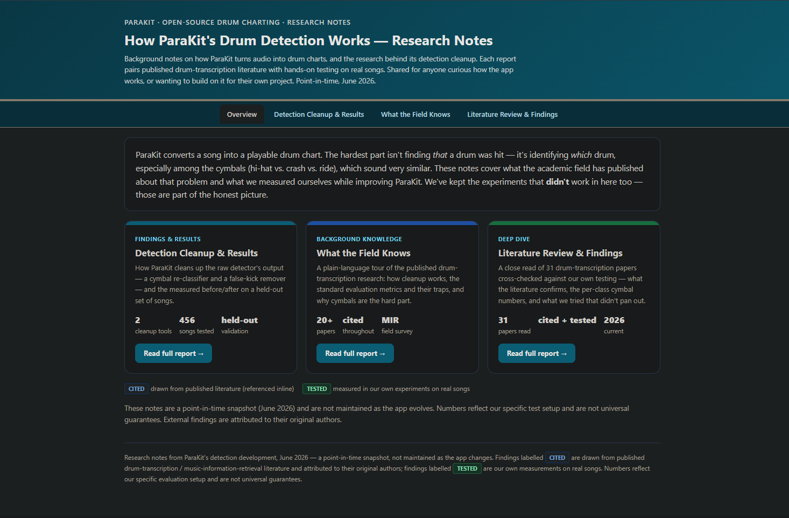

**▶ Open it:** download **[`Detection Research Notes - Web Edition/parakit-detection-research.html`](Detection%20Research%20Notes%20-%20Web%20Edition/parakit-detection-research.html)** and open it in any browser — no internet needed. It's included when you clone the repo.

---

## 📸 Screenshots

<div align="center">
  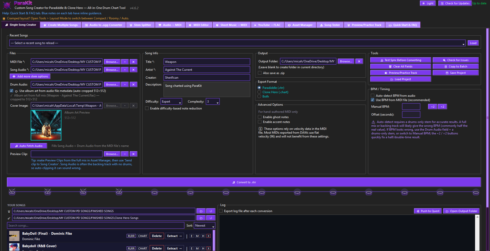
</div>

<details>
<summary><b>🖼️ Click to expand — see every tab</b></summary>

<br>

### 1 · Single Song Creator


### 2 · Create Multiple Songs
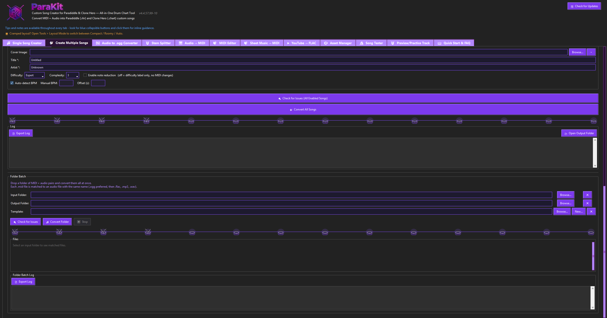

### 3 · Audio → .ogg Converter
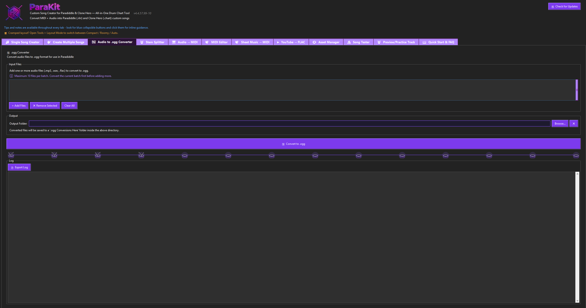

### 4 · Stem Splitter


### 5 · Audio → MIDI
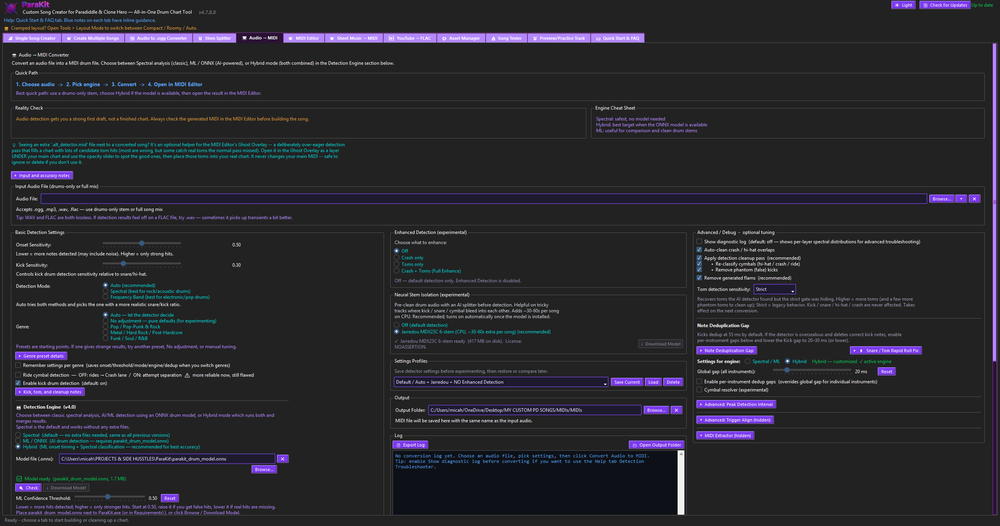

### 6 · MIDI Editor


### 7 · Sheet Music → MIDI
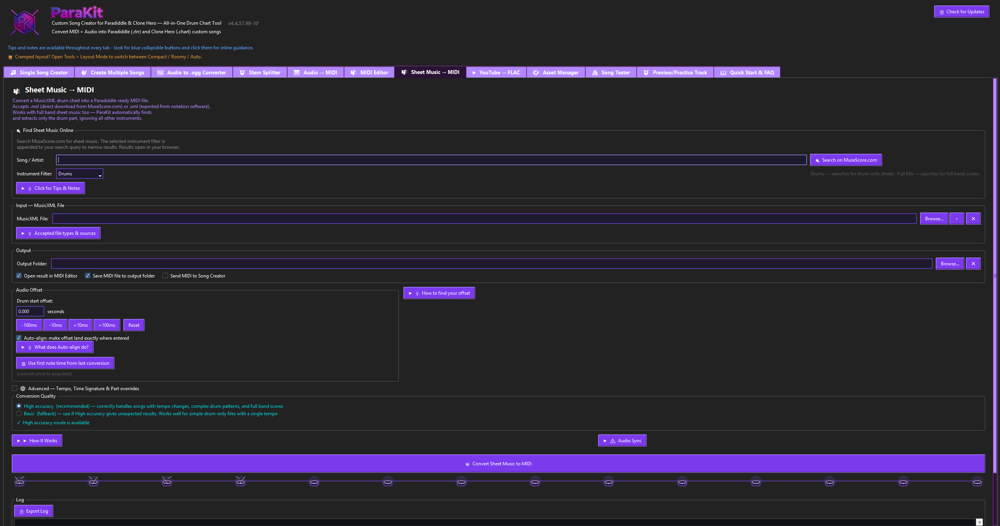

### 8 · YouTube → FLAC


### 9 · Asset Manager


### 10 · Song Tester
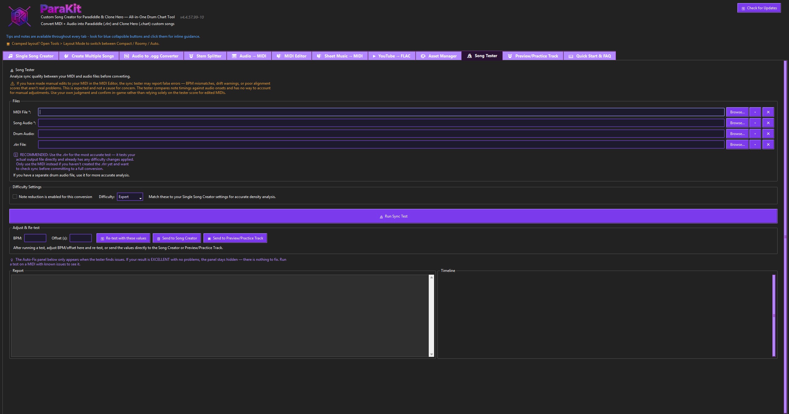

### 11 · Preview / Practice Track
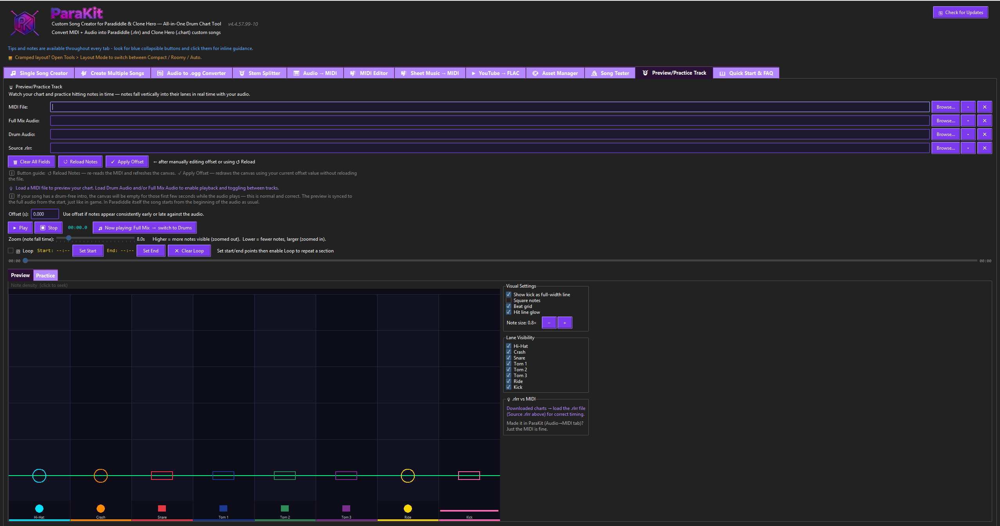<br><br>
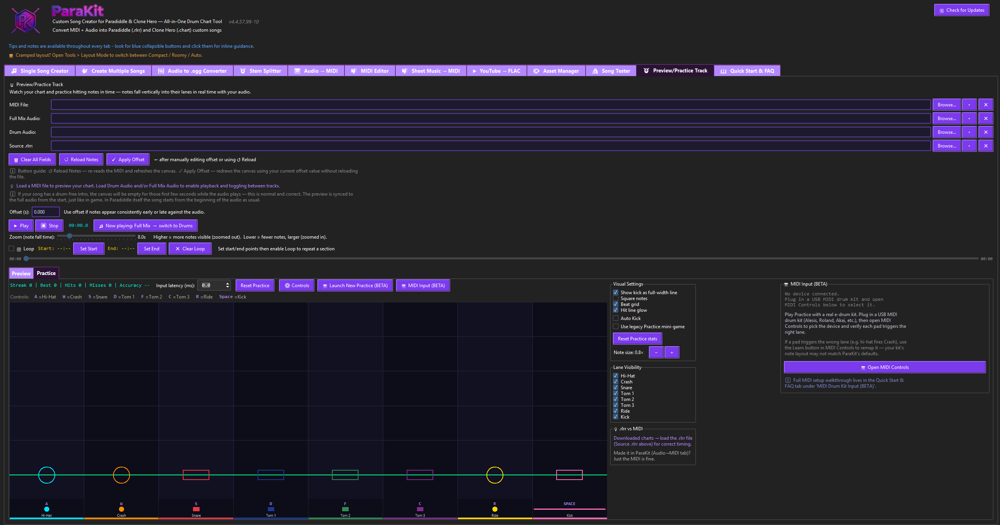

### 12 · Quick Start & FAQ
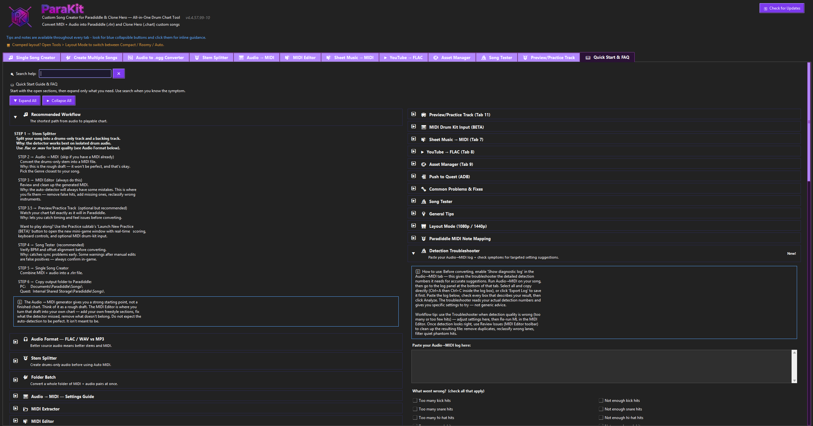

</details>

---

## Requirements

### 1. Python 3.12
ParaKit targets **Python 3.12** specifically. Get it from
[python.org](https://www.python.org/downloads/) (check "Add to PATH" / use the `py` launcher).

### 2. Python packages
```
py -3.12 -m pip install -r requirements.txt
```
(See `requirements.txt` — note the **Stem Splitter** pulls in `demucs` + `torch`, a large
~2–3 GB download you can skip if you won't split stems.)

### 3. Bundled command-line tools (the "requirements bundle")
ParaKit shells out to several tools that are **not** Python packages:

- **FFmpeg** (`ffmpeg` / `ffplay` / `ffprobe`) — audio conversion / `pydub`
- **yt-dlp** (+ **deno**, its JS signature runtime) — YouTube → FLAC downloads
- **ADB** (+ `AdbWinApi.dll`, `AdbWinUsbApi.dll`) — "push to Quest" / device transfer

These are distributed separately as the **`Requirements.zip` bundle** (≈174 MB — too large to
include in the Git repo). **Download it here → [Requirements.zip (LimeWire)](https://limewire.com/d/HrcqC#lS73gPUpJa)**

I have also uploaded the Jarredou model alongside the Reqs on the LimeWire page since the original repo for it is down.
There are mirrors on HuggingFace but I don't wanna force people to dig thru the giant repo + read thru the 600+ page report.

Extract it, then place the files next to `ParaKit v4.0.py`, or keep them in the included
`Requirements\` subfolder beside it. They're kept out of the Git tree on purpose — large
binaries with their own licenses, well over GitHub's per-file size limit. Leave yt-dlp's
auto-update on so it stays current with YouTube changes.

---

## Run it

```
py -3.12 "ParaKit v4.0.py"
```
…or just double-click **`Run ParaKit v4.0.bat`**.

### Typical workflow
1. **Stem Splitter** — isolate drums from the backing track
2. **Audio → MIDI** — transcribe the drums-only stem to MIDI
3. **MIDI editor** — clean up and refine the chart
4. **Preview / Practice** — watch it as falling notes
5. **Song Tester** — confirm sync
6. **Assets** — set metadata, album art, preview clip
7. **Export** — Paradiddle `.rlrr` or Clone Hero `.chart`

---

<a id="web-editions"></a>

## 🥁 Practice Mode (v2 / v3) — Web Edition

> ### 🎯 What these web tools are for — and what they're *not*
> **The Practice and Preview web editions are not meant to replace Paradiddle — or any other rhythm game you play your charts on.** They're **authoring & QA tools**. The whole point is to make charting easier: to **spot and fix errors fast**, and to confirm a chart **"feels" right to actually play** — as quickly and effortlessly as possible — *before* it goes into the real game. Catch the snare that's a hair early, the crash that should be a ride, the part that just doesn't groove; fix it, and verify the fix, in seconds. And they stay **deeply customizable** (Kit Studio, lane layouts, note shapes/sizes, palettes, and more), so there's room for more abstract methods and full freedom of approach.

> **Two editions are available — v2 and the new v3 — on purpose.** v3 is a from-scratch combined rebuild: the falling-note play **plus** a full **Kit Studio** and a polished, everything-up-front home. Both are kept up because I'm still deciding which parts of each I like best and what should be folded together or trimmed — so **try both and use whichever you prefer**. Your feedback helps shape the single best version that eventually folds back into the main ParaKit desktop app in **v5**.

> **🎹 USB-MIDI needs the right browser.** These editions run in any modern browser, but **direct USB drum-kit input uses the [Web MIDI API](https://developer.mozilla.org/en-US/docs/Web/API/Web_MIDI_API#browser_compatibility)**, which isn't supported everywhere. **Playing on your keyboard works in every browser** — only the MIDI-kit input depends on this:

**TL;DR — for a USB drum kit, open the page in Chrome or Edge.** Keyboard play works in every browser. Full per-platform breakdown (from MDN's `requestMIDIAccess` data):

| Platform | Browser | USB-MIDI input | Since |
|----------|---------|:--------------:|:-----:|
| 🖥️ Desktop | **Chrome** | ✅ Yes | v43 |
| 🖥️ Desktop | **Edge** | ✅ Yes | v79 |
| 🖥️ Desktop | **Opera** (& Chromium: Brave, etc.) | ✅ Yes | v30 |
| 🖥️ Desktop | **Firefox** | ⚠️ Yes — see notes&nbsp;\* | v108 |
| 🖥️ Desktop | **Safari** | ❌ No&nbsp;\* | — |
| 📱 Mobile | **Chrome** for Android | ✅ Yes | v43 |
| 📱 Mobile | **Opera** for Android | ✅ Yes | v30 |
| 📱 Mobile | **Samsung Internet** | ✅ Yes | v4 |
| 📱 Mobile | **Android WebView** | ✅ Yes | v43 |
| 📱 Mobile | **Firefox** for Android | ❌ No | — |
| 📱 Mobile | **Safari** on iOS | ❌ No&nbsp;\* | — |
| 📱 Mobile | **WebView** on iOS | ❌ No&nbsp;\* | — |
| ⚙️ Other | **Node.js** | ❌ No | — |

> **\* See implementation notes.** The asterisked rows carry caveats in MDN's data — some otherwise-unsupported or limited cases **can be enabled with extra configuration** (a permission prompt, a browser flag, or a polyfill). Firefox works since v108 but MDN still flags the whole API **"not Baseline."** Sources: [MDN — Web MIDI API › Browser compatibility](https://developer.mozilla.org/en-US/docs/Web/API/Web_MIDI_API#browser_compatibility) · [caniuse](https://caniuse.com/midi).

<details>
<summary>📸 Source screenshots (MDN — for reference)</summary>

<br>

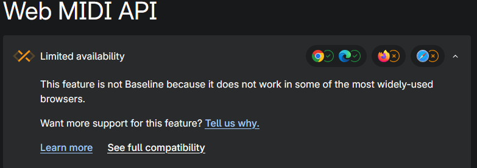<br><br>
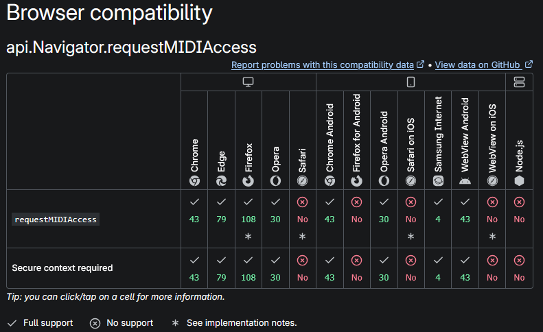

<sub>Source: [MDN Web Docs — Web MIDI API › Browser compatibility](https://developer.mozilla.org/en-US/docs/Web/API/Web_MIDI_API#browser_compatibility).</sub>

</details>

### Practice Mode v3 — the combined rebuild *(with Kit Studio)*

`Kit Studio is the built in customization studio that lets you customize your experience to your liking, change the orders of lanes, change note sizes and shapes, and much more.*`

A from-scratch rebuild that folds the falling-note **play** experience together with a full **Kit Studio** and a polished home. It does everything v2 does — notes down 8 lanes, keyboard **+ USB-MIDI** play, latency calibration, a results screen with a timing histogram — and adds:

- **🥁 Kit Studio (the headline)** — rearrange the lanes, set each lane's **color / shape / width**, add **aux lanes**, **lefty-flip** the whole kit, save kit presets, pin a kit to a song. Edit it live mid-song or from the home.
- **A polished Song / Setup / Input home** — every option up front: your **songs folder** (a searchable library of `.rlrr` packages) *or* a single-chart load, the play toggles + fall-time / note-size sliders, and your **MIDI device + key bindings** shown inline.
- **Native `.rlrr`** — point it at a Paradiddle songs folder and play any chart, or load a single `.rlrr` (+ optional audio; a synth fills in if there's none).
- **In-play live-settings dock** (toggle with **H**), **loop A/B**, **speed control**, on-screen **pads**, accessible colorblind-safe palettes, and per-song calibration.

**▶ Try it:** download **[`Practice Window v3 - Web Edition/parakit-practice-v3.html`](Practice%20Window%20v3%20-%20Web%20Edition/parakit-practice-v3.html)** and open it in any modern browser (Chrome or Edge for USB-MIDI).

<p align="center">
  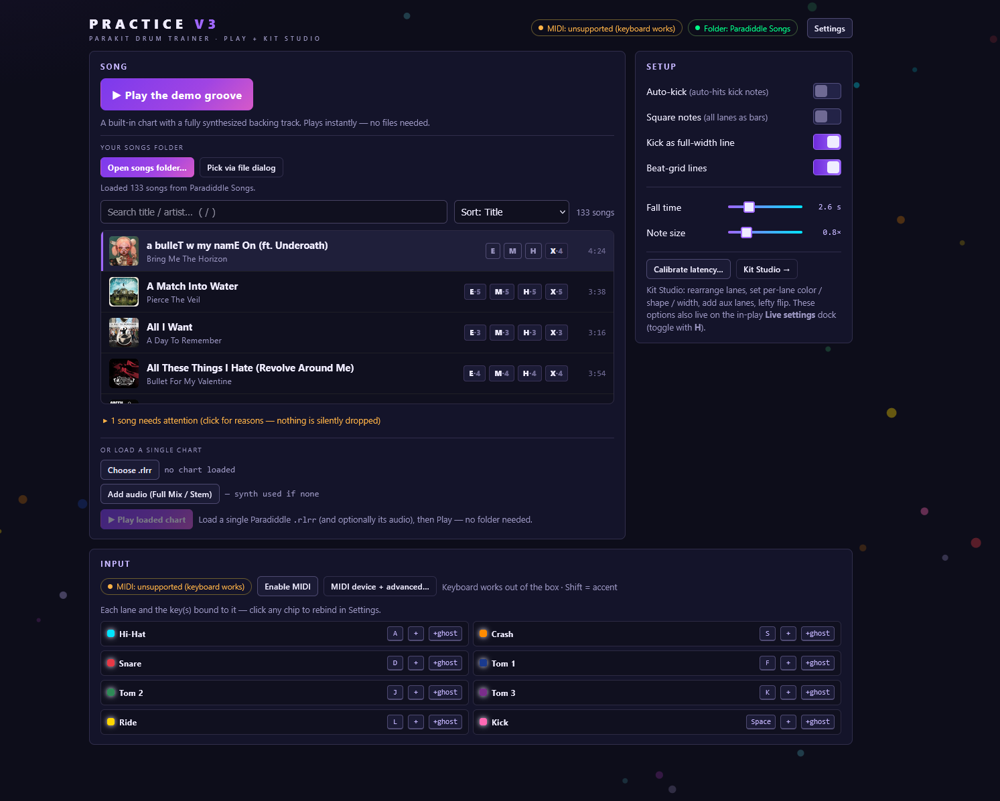
  
  
  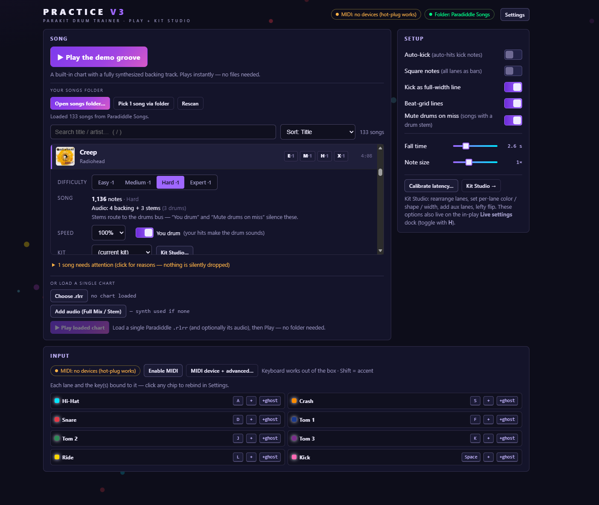
</p>

### Practice Mode v2

The falling-note **Practice** experience, rebuilt from scratch as a fast, **self-contained web app** — a big step up from the in-app mini-game and the `practice_v2/` alpha. Notes fall down 8 lanes in time with the music while you play along on a **USB MIDI drum kit or your keyboard**.

- **Rock-solid timing** — a sample-accurate Web Audio clock, no drift.
- **One file, zero setup** — open it in any modern browser; includes a built-in demo plus a synth that makes any chart audible even with no audio file.
- **Latency calibration, mid-song mix/stem switching, touch support, a results screen with a timing histogram**, and full keyboard + MIDI play.
- **Loading your own song** — the built-in demo + synth play by default, so a track is always there the moment you open it. To practice your own: click **Choose MIDI** or **Choose .rlrr** to load a chart, and **Full Mix** / **Drum Stem** to load the audio (no audio file? the chart is synthesized so it's still audible).

**▶ Try it:** download **[`Practice Window v2 - Web Edition/parakit-practice.html`](Practice%20Window%20v2%20-%20Web%20Edition/parakit-practice.html)** and open it in any modern browser (Chrome or Edge for USB-MIDI).

<p align="center">
  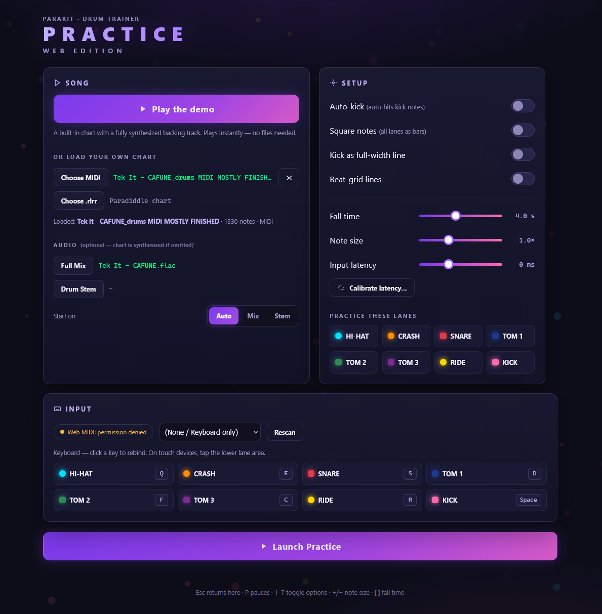
  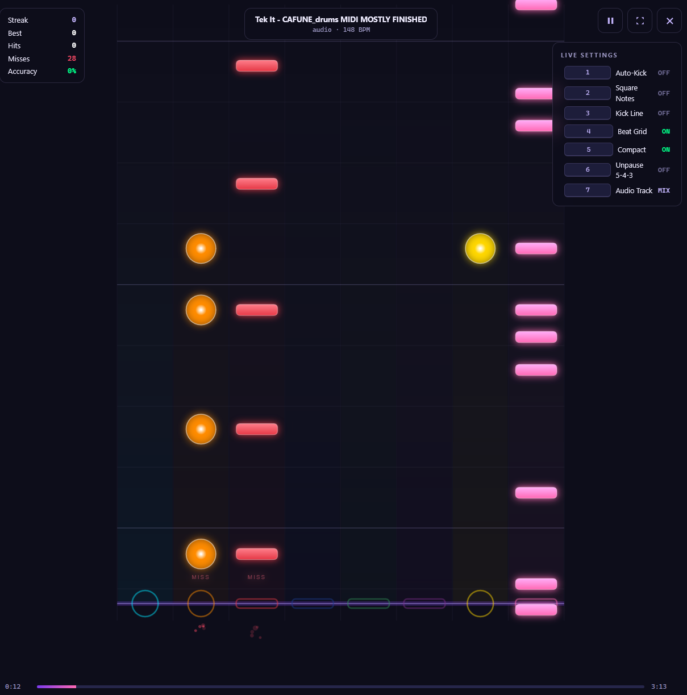
  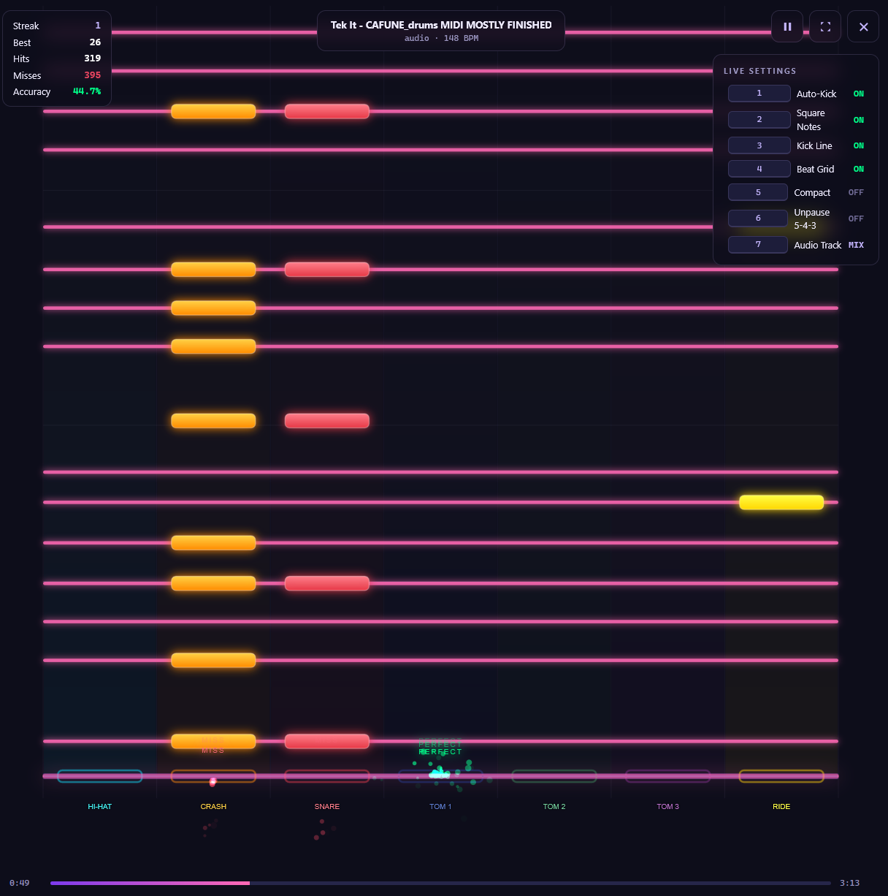
</p>

> **Both v2 and v3 are complete and ready to play today.** A single, best-of-both native (`.py`) version folded back into the app is planned for a later release.

---

## 🔎 New — Preview Track v2: Web Edition

**Watch your drum chart fall in time with the music — then fix what's wrong without ever leaving the view.** Preview Track is the *review* half of ParaKit's Preview/Practice tab, rebuilt as a fast, **self-contained web app**. Notes scroll down 8 lanes synced to the audio so you can **catch detection problems** — a snare a hair early, a crash that should've been a ride, a doubled hit — and the headline of v2: a **live Edit Mode that lets you fix them right there on the falling chart**, then resume. The see-it → fix-it loop, closed, with no tab switch.

> **🎹 USB-MIDI here needs Chrome or Edge too.** Like the Practice editions, MIDI-kit input uses the **Web MIDI API** — supported in **Chrome / Edge / Chromium** browsers, **not in Safari**, and limited in **Firefox**. Keyboard play works in every browser; see the browser-support table under **Practice Mode** above, or [MDN's compatibility list](https://developer.mozilla.org/en-US/docs/Web/API/Web_MIDI_API#browser_compatibility).

- **✎ Edit Mode (press `E`)** — pause and the subdivision grid becomes a precise ruler. **Click** an empty spot to place a note (snapped to the grid); **drag a note vertically to move it in time, horizontally to reclassify its lane** — drag a wrong-drum note onto the right one; one gesture, two fixes. **Right-click deletes** (hold & sweep = eraser); **wheel** scrubs, **Ctrl+wheel** zooms the fall window; `Ctrl+Z` / `Ctrl+Y` undo/redo.
- **Tap-along charting** — keys **`1`–`8` drop a note at the hit line, even during playback**, so you can play along and tap in missing notes. **● Record** captures live keyboard/MIDI hits with an optional **Count-in** + **Metronome**.
- **Review controls** — **Speed** 0.5×–1.25× (slow a busy passage down to inspect it), **Fall time**, **Grid** (1/4–1/32) + **Snap**, **🥁 Pads** for mouse/touch, **⇪ Receive** a chart from the MIDI editor, **MIDI in** for a USB kit, and built-in demo charts.
- **Hide notes past the hit line** — a toggle in Preview Settings (off by default) that hides notes once they cross the hit line / playhead, so only upcoming notes stay on screen — cleaner for precise timing analysis.
- **Loading your own song** — the built-in demo + synth play by default, so a track is always there without loading anything. To review **your own**: click **Mix / Drums / Stems** to load an audio file (full mix or an isolated stem), and **⇪ Import** to load a chart (`parakit-chart-v1` JSON/MIDI); **⇪ Export** saves your edits back out. Charts round-trip with the MIDI editor and Practice v2.

**▶ Try it:** download **[`Preview Track v2 - Web Edition/parakit-preview.html`](Preview%20Track%20v2%20-%20Web%20Edition/parakit-preview.html)** and open it in any modern browser (Chrome or Edge for USB-MIDI).

<p align="center">
  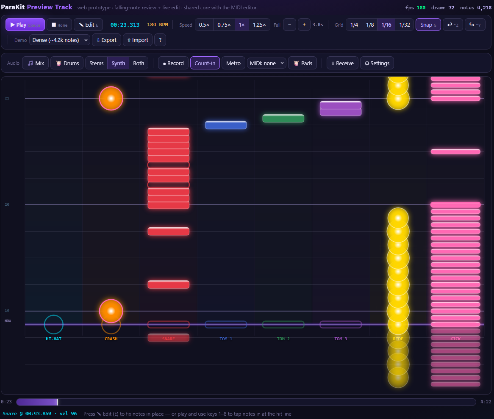
  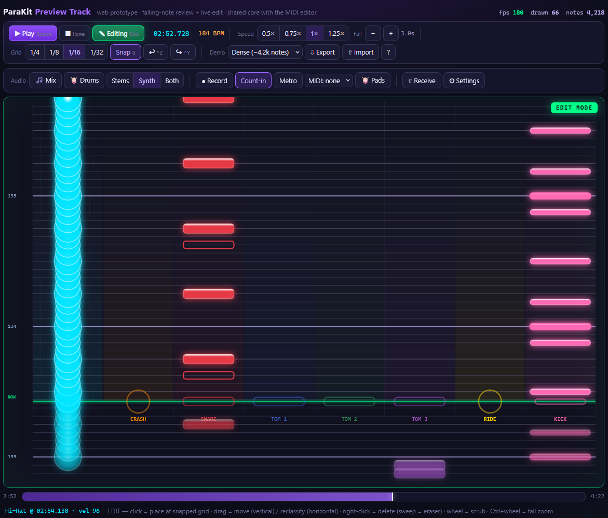
</p>

---

## RTX 50-series GPUs and stem splitting

The stem splitter uses GPU acceleration on NVIDIA **GTX 10-series through RTX 50-series**.
As of **v4.4.58-12**, ParaKit detects your GPU's architecture and uses CUDA whenever your
installed PyTorch supports it — including **RTX 50-series** (Blackwell — 5070/5080/5090),
which needs a **CUDA 12.8+ (`cu128`) PyTorch build**. If your PyTorch doesn't include your
GPU's architecture, the split log reports which architectures it *does* support, and the app
falls back to **CPU** (still works, just slower). AMD / Intel GPUs are CPU-only too (Demucs
needs CUDA).

A working GPU fix exists (CUDA 12.8 / `cu128` PyTorch + a save-path tweak) — see
[`docs/TROUBLESHOOTING.md`](docs/TROUBLESHOOTING.md). We're also preparing a separate,
**creator-verified RTX 50-series build** with GPU acceleration configured out of the box,
to ship as a follow-up. The CPU fallback always stays in the code regardless — the point is
that the feature works on every machine, even if a bit slower.

---

## Build your own version

Because this is the full source, you can add features, remove them, rearrange the UI, or
make your own personal ParaKit. See [`docs/BUILDING.md`](docs/BUILDING.md) for running from
source and compiling a standalone `.exe`.

---

## Changelog

| Version | Summary |
|---|---|
| **v4.6.1**<br>2026-07-10 | <ul><li>**Note choices now tied to each MIDI chart** (not one global setting): a fresh MIDI starts at the defaults, and re‑loading a MIDI you tuned before restores its choices — so you never re‑tune the same chart twice.</li><li>**Lane‑note readout**: the MIDI Editor's left lane strip now shows each lane's current output note under its name; the Hi‑Hat lane shows its note plus "& per note" (hats can still be Closed/Open/Pedal individually), and now picks its note like the other lanes.</li><li>**Open hi‑hats look distinct**: an Open hi‑hat (note 46) renders hollow with a thin yellow outline in the piano roll (filled cyan + yellow outline in the velocity lane).</li><li>**Velocity lane**: same‑beat notes in different lanes now sit side by side instead of stacking on top of each other.</li><li>**Clone Hero export**: crashes now map to the green cymbal (not the hi‑hat's yellow lane), so a simultaneous hi‑hat + crash no longer collapses; accent/ghost markers now use the correct per‑lane note numbers.</li><li>Fixed the Note Manager's colour swatches showing as empty boxes, and the header sometimes coming up in light mode on launch.</li></ul> |
| **v4.6.0**<br>2026-07-10 | <ul><li>**NEW — Manual MIDI Note Manager** (MIDI Editor, next to the Tempo Map button): pick which MIDI note each drum lane writes on export — e.g. Electric vs Acoustic Snare, Crash 15″/17″/Splash, Ride 17″/20″/Bell, high vs low toms. Crash and Ride switch the actual piece in Paradiddle; every lane's choice sets the note e‑kits/DAWs receive. Saved between sessions.</li><li>**NEW — per‑note hi‑hats**: right‑click any hi‑hat note (or a selection) to set it **Closed / Open / Pedal**; mixed open‑closed charts survive export.</li><li>**Clone Hero export fixes**: Easy/Medium/Hard now export with the correct difficulty section (was always Expert); ghost/accent notes now actually write; with reduction on, the `.chart` matches the reduced `.rlrr`; extended e‑kit hi‑hat notes are no longer dropped from Paradiddle exports.</li><li>**Safer in‑app updates**: "Download update now" is now all‑or‑nothing — it verifies every file before replacing anything and rolls back on failure, so a failed update can't leave a half‑updated install.</li><li>**MIDI Editor**: flags now follow notes through Quantize/Soft‑Quantize; paste/repeat select exactly the pasted copies.</li><li>Sheet Music→MIDI no longer leaks a temp file per conversion; stem‑model downloads finalize atomically.</li></ul> |
| **v4.5.9.5**<br>2026-07-09 | <ul><li>**Detection Troubleshooter — more built-in answers** (kick de-bunching ≈55 ms, tom detection-sensitivity guidance, cleanup-pass note) and **honest "reality check" advice**: it now tells you when a setting has hit its useful limit and the real fix is manual (in the MIDI Editor), instead of nudging a value back and forth forever. The results box is taller and the "What's New" panel moved left to give it room.</li></ul> |
| **v4.5.9.4**<br>2026-07-09 | <ul><li>**New Dark / Light theme toggle** next to "Check for Updates". **Dark** is a new deep-purple look (now the default); **Light** is ParaKit's original gray. It switches instantly — no restart — and remembers your choice.</li><li>**Fixed inconsistent log colors** — some tabs' activity logs showed up lighter/gray while others were black. Every log now uses the same background and follows the theme you're in.</li></ul> |
| **v4.5.9.3**<br>2026-07-08 | <ul><li>**"Download update now" now shows its work.** When you let ParaKit install an update for you, a progress window opens with a live log of every file as it goes — downloaded, already up to date, or failed — plus a progress bar and a clear "done, close and reopen ParaKit" summary. Before, the button just went quiet until it finished, so it looked like nothing was happening.</li></ul> |
| **v4.5.9.2**<br>2026-07-08 | <ul><li>**The "Update Available" popup now shows what's new.** When a newer version is found, it previews that version's changelog right in the popup — so you can see what the update fixes and changes without opening GitHub or downloading first. If you've skipped a few versions, it lists every change since the one you're running. *(Because the preview is drawn by the app you're running, it starts appearing once you're on this version or later.)*</li><li>Fixed the update popup's **"Open GitHub" button** — it now opens the repo's main page instead of the raw code view of the app file.</li></ul> |
| **v4.5.9.1**<br>2026-07-07 | <ul><li>**Album-art search is much smarter (Asset Manager).** It now searches **iTunes, Deezer, and the Cover Art Archive** and ranks the results by how well each matches the song you typed — so it stops grabbing a random cover from the wrong artist, and finds art iTunes alone was missing (a lot of indie singles are on Deezer but not iTunes). The new **"Show alternate art choices"** button shows up to 3 other covers the search found so you can pick the right one. ("Fetch Metadata" is now **"Fetch Album Art"**.)</li><li>**Song libraries — right-click "Edit artist"** (Downloaded Songs *and* Stem Splitter): fix the artist/band metadata for a song downloaded under the wrong name — updates the file's embedded metadata and the library row.</li><li>**Downloaded Songs — right-click "Undo album art search":** if a search replaced the cover with the wrong one, revert to what it was before (usually the original YouTube thumbnail) instead of re-downloading.</li><li>A small **braille spinner** now animates on the library row whose song is playing (both libraries), and stops on pause / when you play another song.</li><li>The **YouTube tab's song library is wider** now (the Activity Log was narrowed to give it room).</li><li>Fixed: an album-art fetch failure logged an internal error instead of the actual reason.</li></ul> |
| **v4.5.8.4**<br>2026-07-07 | <ul><li>**"Use album art from audio file metadata" now falls back to the full mix** — on both the **Single Song Creator** and the **Create Multiple Songs** tab (a per-song toggle). If the loaded Song Audio and Drum Audio have no embedded cover art (common when they're separated stems / a backing track), ParaKit finds the song's full mix from the MIDI file name and uses the album art embedded in it (e.g. a cover added on the YouTube tab). The art shows in the live preview and is written into the export folder as `album.png` alongside the `.rlrr` and audio. (The alternative is embedding art into your backing/song audio file manually via the Asset Manager tab.)</li></ul> |
| **v4.5.8.3**<br>2026-07-07 | <ul><li>**MIDI Editor — Delete and bulk edits no longer hit the wrong notes.** After a drag, insert, or quantize re-sorted the notes, the selection could silently point at different notes than the ones you had highlighted. Fixed.</li><li>**MIDI Editor — reclassifying a note now counts as an unsaved change**, so it triggers the save-on-quit prompt and Send to Song Creator hands off the edited file (before, those edits could be silently lost).</li><li>**Auto-detect BPM actually detects now.** The audio BPM search had quietly broken and returned ~79.5 BPM for nearly every song — charts still played in sync (the offset was always correct), but the written BPM (Clone Hero measure lines, the difficulty-reduction grid) was wrong. Rebuilt and validated. "Use BPM from MIDI file" was never affected.</li><li>**Song titles with characters Windows forbids in filenames no longer break exports** (a `:` aborted the conversion, a `/` nested folders). Names are sanitized; the in-game title stays exactly as typed.</li><li>**Create Multiple Songs (folder batch): the "skip"/"rename" overwrite setting is honored again** — existing song folders were being silently overwritten on re-runs.</li><li>**Sheet Music MIDI export no longer drifts out of time** by the end of long songs.</li><li>**Extractor tool hardening** — the batch tab runs reliably after mixed use, one malformed `.rlrr` no longer hangs the window or aborts the batch, a preview crash is fixed, and same-named outputs get unique names.</li><li>**Neural Stem Isolation** no longer silently falls back for filenames containing `_(`, reports skipped stems, and no longer clobbers another file's saved Audio → MIDI settings.</li><li>**Practice minigame:** remapped keys that aren't letters (digits, punctuation, F-keys, numpad) now work.</li><li>Misc crash guards (BPM typed as `0`, corrupt saved settings, a stuck progress bar) and temp-folder cleanup.</li></ul> |
| **v4.5.7.1**<br>2026-07-05 | <ul><li>**Steadier audio playback, especially in the song libraries.** The Downloaded-Songs and Stem-Splitter library previews now decode the whole track into memory and play it from RAM instead of streaming it off disk, and the shared audio buffer was enlarged — greatly reducing the brief periodic stutters/crackle some machines produced during playback (biggest benefit on busier or slower systems).</li></ul> |
| **v4.5.7**<br>2026-07-05 | <ul><li>**Song descriptions.** The Single Song Creator *and* Create Multiple Songs now have a **Description** field. Paradiddle/ParaDB reads the description straight from the song's `.rlrr` file (there's no website form for it) and shows it on the song's ParaDB page — line breaks are saved as `<br>` for its HTML rendering. Leave it blank and nothing changes.</li><li>**Create Multiple Songs — parity with the Single Song Creator.** Each song slot now has its own **🎵 Auto Fetch Audio** button (fills Song Audio + Drum Audio from the MIDI's file name) and a live **album-art preview** (with a "not square" flag).</li><li>**Steadier playback.** The MIDI Editor and Preview/Practice Track now use a larger audio buffer and pause Python's garbage collection during playback, so brief CPU spikes are much less likely to cause a moment of audio crackle or a playhead stutter.</li></ul> |
| **v4.5.6.1**<br>2026-07-05 | <ul><li>**Audio → MIDI — HOTFIX:** the Cancel button on the Neural Stem Isolation model download was a silent no-op since the feature shipped — the ~417 MB download always ran to completion. Cancel now aborts within a moment, never falls through to the fallback mirror, and cleans up the partial file. (Found while byte-auditing the ParaKit v5 rebuild's port of this dialog.)</li></ul> |
| **v4.5.6**<br>2026-07-04 | <ul><li>**Stem Splitter tab redesign + a new "Your Songs" library.** The settings are now a horizontal card row — **Input & Model**, **Output**, **Split** — that reflows for narrower windows, and the two optional BETA tools (**Custom Isolation** and **DrumSep**) are tucked into a single collapsible **"Advanced tools"** section so the normal Standard-Split path stays front-and-centre. A new **"Your Songs"** library sits at the bottom beside the activity log: it lists the songs in your YouTube output folder — the ones you've downloaded but haven't split yet — with **album art**, **FLAC / OGG / STEMS / MIDI** badges showing what already exists for each, plus search and sort. Each row has **Split** (loads it straight into the splitter), **Play** (preview), and, on already-split songs, **Open Stems**. Point the *Songs Folder* at your downloads and hit Refresh; it stays in sync with the YouTube → FLAC output folder.</li><li>**Compact layout:** the library and activity log now stretch to fill the space below them instead of leaving a gap.</li><li>**Updater:** "Download update now" now also keeps this *What's New* (`CHANGELOG.txt`) and the README current — it previously synced everything except those — plus a line-ending fix so it can verify a handful of text files it used to skip.</li></ul> |
| **v4.5.5.1**<br>2026-07-01 | <ul><li>**Fixed the in-app updater so "Download update now" pulls *everything* a new version needs, not just the main app file.** Before, the button grabbed only `ParaKit v4.0.py` — so if a release also updated supporting files (the detection cleanup code/models, stem-separator code, etc.), you could end up with a mismatched install. The updater now reads a small manifest of the version's files and downloads any that are missing or changed (each one hash-verified before it's written), skips the ones you already have (so the big models aren't re-downloaded every time), and backs up whatever it replaces. Updating via the button now gives you a complete, correct update without re-cloning the whole repo.</li><li>**One-time notice on first launch.** Because the *old* updater couldn't fix itself, anyone who updated in-app before this version may already have some out-of-date supporting files — so 4.5.5.1 shows a one-time notice explaining it, with a single **"Update supporting files now"** button that repairs your install in place (or re-download / re-clone from GitHub). The update-available popup also carries a short reminder about this for the next couple of versions.</li></ul> |
| **v4.5.5**<br>2026-06-30 | <ul><li>**Audio → MIDI — fewer phantom / double kicks.** The kick cleanup pass now also weighs each kick against the one just before it: a weaker kick that lands in the ring-out of the previous kick is usually a false double-trigger, and those get removed. Held-out testing (train on one half of the reference library, measure on the unseen half) shows a small but consistent kick-lane gain — fewer spurious kicks, with real kicks preserved. It's part of the existing Audio→MIDI cleanup pass (on by default; the **Kick cleanup** toggle still turns it off), and with that pass off the detector output is byte-identical to before.</li><li>**MIDI Editor** — the "MIDI timing may be off" warning no longer fires just from loading a new MIDI while the previous song's audio is still in the fields (a false alarm — they're simply different songs). It now appears only when you actually **play or save** a MIDI whose timing genuinely doesn't match the loaded audio.</li></ul> |
| **v4.5.4.3**<br>2026-06-30 | <ul><li>**The Help tab's "What's New" no longer lags.** The version history now loads from `CHANGELOG.txt` and shows in **collapsible sections of 10** that only draw when you open them, capped at the **30 most recent** versions in-app (the full history lives in `CHANGELOG.txt`). The **most recent entry is always pinned at the top**, so the latest update is visible at a glance even with every section collapsed. If `CHANGELOG.txt` is ever missing, a disclaimer + a one-click **Download CHANGELOG.txt** button fetch it back into place. This also trimmed ~2,200 lines out of the app.</li><li>**MIDI Editor waveform:** the two-tone **Stereo** style is now the **first** option (Bars moved to last) and is the robust default — a blank or unrecognized saved preference now falls back to Stereo instead of Bars.</li><li>**Practice Mode v2** (the in-app alpha) is no longer being updated — Practice Mode work is moving to a **v3 / Kit Studio** in the ParaKit **v5** rebuild. The version number drops the trailing `-N` from here on.</li></ul> |
| **v4.5.4.2-1**<br>2026-06-30 | <ul><li>**Fixed — Single Song Creator "Auto Fetch Audio":** the **Song Audio** field is now filled with the **backing track** (the no-drums stem) instead of the full mix, and both Song Audio + Drum Audio prefer the **`.ogg`** copy. Filling the full mix layered a second set of drums over your separate drums stem when you built the pack (doubling the drums); it now pulls the `.ogg` backing from your Stem Splitter **BACKINGS** output. If no backing exists, Song Audio is left empty (with a note) so a full mix is never auto-filled. The other tabs are unchanged.</li></ul> |
| **v4.5.4.1-1**<br>2026-06-29 | <ul><li>**New — Album Art Preview:** the Single Song Creator now shows a live thumbnail under the Cover Image field of whatever cover will actually be embedded — whether you browsed it yourself or used *“Use album art from audio file metadata.”* A caption shows the dimensions and flags non-square art, so you can confirm the right image is loaded and cropped how you expect before building.</li><li>**Fixed:** the YouTube → FLAC custom filename (*“Name file other than video title”*) now **clears itself between videos** — the name box empties automatically after you convert a video, and when you press the URL field’s ✕ button — so the next video no longer silently inherits the previous one’s custom name.</li><li>**Fixed:** the **Downloaded Songs library** now shows the **file name** as the song title — so a custom download name actually appears — with the download’s metadata name as a fallback; the artist still shows underneath from the metadata. Search and sort follow the displayed name, and a right-click Rename still overrides it.</li></ul> |
| **v4.5.4-1**<br>2026-06-25 | <ul><li>**Auto Fetch Audio is now on the Single Song Creator, Preview/Practice Track, and Song Tester tabs** (it was MIDI-Editor-only). From the loaded MIDI's file name it finds the matching Drums stem + Full Mix from your Stem Splitter / YouTube output folders (and next to the MIDI) and fills that tab's audio fields; the buttons carry a 🎵 music-note icon.</li><li>**Neural Stem Isolation (Jarredou MDX23C) now defaults ON once its model is installed**, and is labelled *(recommended)*. First-run users with no model are unaffected — it stays Off until they download it.</li><li>**Fixed:** Auto Fetch Audio now finds your audio even when the MIDI file name has extra words after the tag (e.g. `..._drums MIDI edited`, `...MOSTLY FINISHED`) — it reads the song name correctly instead of coming up empty.</li><li>**New note** (on the Audio → MIDI and Quick Start & FAQ tabs) explaining the optional `.alt_detector.mid` comparison files — the deliberately over-eager tom-detection pass you load *under* your chart in the MIDI Editor's Ghost Overlay to catch toms the normal pass missed.</li></ul> |
| **v4.5.3.1-1**<br>2026-06-25 | <ul><li>**Jarredou neural-stem-isolation model download rewired to Hugging Face (+ automatic fallback mirror).** The in-app download button for the optional **Jarredou MDX23C** stem-isolation model now pulls from the official Hugging Face repo, with a **second Hugging Face mirror tried automatically** if the first is down (the old GitHub source had been removed). The file is size- and SHA256-verified after download. If both mirrors are ever unavailable, the model is still on the **LimeWire Requirements bundle** (linked at the top) as a manual fallback. *(Download-source fix only — no detection or charting changes.)*</li></ul> |
| **v4.5.3-1**<br>2026-06-23 | <ul><li>**Difficulty reduction rebuilt — Easy / Medium / Hard charts are much better.** The auto-reduction used to drop the **kick and toms entirely** on Easy and Medium; it now **keeps a thinned-down kick + tom line** like real charts, matches human note density far more closely, and keeps the strongest beats first. **Expert is unchanged.** Instrument variants (alt kicks/snares, china/splash) that used to disappear on lower difficulties are kept now too. (See the *Difficulty Update* section above.)</li><li>**Caveats:** **Hard** is closest to human charts, **Medium** is good, **Easy** is the roughest tier — on heavily-thinned lanes (Easy kick/toms) it keeps the right lanes at about the right density, but the exact notes won't always match a human's feel, and reduced charts run slightly busier than a human's. Give reduced charts a quick once-over in the MIDI Editor.</li></ul> |
| **v4.5.2-1**<br>2026-06-20 | <ul><li>**New: "Tom detection sensitivity" control for Audio → MIDI.** The detector finds toms, but a strict confidence gate was hiding many of them. A new dropdown under **Audio → MIDI ▸ Advanced** lets you pick how aggressively to recover them — **Strict / Conservative / Balanced / Aggressive** — with **Conservative the new default**, so charts keep more of the toms the detector actually found out of the box (tom F-score ≈ 0.17 → 0.28). **Kick, snare, hi-hat and crash are never affected** by it; choose Strict for the older behavior.</li><li>**The two-tone "Stereo" MIDI Editor waveform is now the default.** The waveform strip draws a *filled* two-tone waveform in ParaKit's theme colors — the left channel in **magenta** above the midline, the right channel in **cyan** below (mono audio splits the same envelope top and bottom). The two colors make small changes in the waveform easier to spot — differences that are hard to notice when the whole waveform is one color stand out at a glance. Switch to **Bars / Filled / Jagged** any time (**Display & Snap ▸ Waveform**); your choice is remembered.</li><li>**New: the MIDI Editor shows the song you're working on.** A title / artist readout sits next to **Auto Fetch Audio**, read from the Full Mix audio's tags (then the drum stem's tags, then a cleaned file name) — so you can see at a glance which song the open chart belongs to.</li><li>**Fixed: the MIDI Editor waveform now scrolls and zooms in sync with the chart on the mouse wheel.** Previously the waveform only kept pace during playback or when you dragged the scrollbar — wheel-scroll and zoom left it behind.</li><li>**Fixed: in the YouTube → FLAC download library, the Delete button now lines up in a clean column on every row.** The **OGG** badge now shows on every song (dim until the `.ogg` exists, just like the **STEMS / MIDI** badges), so rows with fewer files no longer shift the action buttons out of alignment.</li></ul> |
| **v4.5.1-1**<br>2026-06-20 | <ul><li>**Hi-hat recovery — Audio → MIDI now keeps more of the hi-hats it was dropping.** In Hybrid mode a hit normally has to be "confirmed" by the spectral engine, but spectral detects almost no hi-hats — so every hat had to clear a stricter confidence bar on its own, and softer / faster hats (intros, fast hat patterns) were being thrown out. The hi-hat confidence gate is retuned so those real hits survive. **Hi-hat only** — kick, snare, crash, ride and toms are unchanged. Validated on the final chart (after the cleanup pass) across a 60-song corpus and 14 fresh songs spanning pop, R&B, rock, metalcore, funk and electronic — hi-hat accuracy improved on every genre with no false-hat blowups. (See the *Detection Update — Hi-Hat Recovery* section above for the data.)</li></ul> |
| **v4.5.0-1**<br>2026-06-18 | <ul><li>**New: automatic detection cleanup pass for Audio → MIDI.** A trained pass now cleans the converted chart before it opens — moving cymbal hits into the right lane (hi-hat / crash / ride) when the detector lumped them together, and removing "phantom" kicks that don't match a real onset. On unseen songs it measurably improved cymbal accuracy (including recovering ride hits that were being missed) with no loss elsewhere. Three toggles under **Audio → MIDI ▸ Advanced** (all on by default); turn the master off for the exact raw output of older versions. With "Ride cymbal detection" off, the cleanup adds no rides either.</li><li>**Fixed: the MIDI Editor playback preview could slowly drift out of sync with the audio on long songs** — the playhead and falling notes now stay locked to the audio for the whole track.</li></ul> |
| **v4.4.69-1**<br>2026-06-17 | <ul><li>**Fixed: the .ogg checker badge now actually shows up.** It was looking for the `.ogg` next to the song's FLAC, but the Stem Splitter saves `.ogg` files to a different folder than the `.flac` — so the badge now checks your Stem Splitter output folder (and scans your project folder as a fallback). It appears on songs that have `.ogg` stems.</li></ul> |
| **v4.4.68-1**<br>2026-06-17 | <ul><li>**.ogg file checker icon** — each song in the Downloaded Songs library now shows a **purple "OGG" badge** next to the FLAC/WAV format badge when an `.ogg` copy of that song exists on disk (hover it for ".ogg files exist"). The badge only appears when the `.ogg` is actually there, so it's an at-a-glance check for which downloads also have an `.ogg`.</li></ul> |
| **v4.4.67-1**<br>2026-06-17 | <ul><li>**Unsaved-changes warning on quit** — if you close ParaKit while the MIDI Editor still has unsaved edits, a prompt now appears with three choices: **Save MIDI & Quit**, **Exit Without Saving**, or **Cancel / Don't Quit**. Closing the prompt (the X or the Esc key) keeps the app open, so an accidental close never loses your work; choosing Save opens the normal Save dialog (backing out of it cancels the quit too).</li></ul> |
| **v4.4.66-1**<br>2026-06-16 | <ul><li>**Kicks de-bunch automatically** — Audio → MIDI now de-duplicates kick notes at **55 ms by default**, so doubled / clustered kicks come out clean on the first Convert with no tuning. (Fast-kick song losing correct kicks? Lower the per-instrument **Kick** gap to 20–30 ms.)</li><li>**Auto Fetch Audio** (MIDI Editor) now finds the audio for a MIDI saved as an "(editor copy)", matches the exact version/cover when the name has one (e.g. "(Rock Version)", "(R&B cover)") instead of grabbing the wrong one, and falls back to scanning your wider project folder for stems/mixes kept in sub-folders.</li></ul> |
| **v4.4.65-1**<br>2026-06-16 | <ul><li>**Search for missing album art** — a new right-click menu item on each song in the Downloaded Songs library looks up cover art on iTunes by the song's library name and embeds the first match straight into the file. Re-run any time to overwrite the current art (e.g. after renaming the song). The search drops anything in `(parentheses)` or `[brackets]` first (usually "Official Video" / "Lyric Video" noise). Works on FLAC, MP3, OGG, and M4A.</li><li>**Fixed:** the YouTube tab's progress bar could be scrolled out of view with the mouse wheel.</li><li>**Fixed:** "Permission denied" when searching album art on a song you had just played via the library's Play button — the preview player now releases the file before the art re-embed.</li><li>**Fixed:** the art search now uses the song's renamed library name, not the original file name — so right-click → Rename, then Search now does what you'd expect.</li></ul> |
| **v4.4.64.1-1**<br>2026-06-16 | <ul><li>**Coloured Play/Pause buttons** in the Downloaded Songs library — a filled **purple** Play (matching the app's purple buttons) and **pink/magenta** Pause (matching the logo), for better visibility.</li><li>**Badge tooltips** — hovering the FLAC/WAV, STEMS, or MIDI badge now tells you whether that file exists (✔) or wasn't found (✖).</li></ul> |
| **v4.4.64-1**<br>2026-06-16 | <ul><li>**YouTube → FLAC layout** — the Downloaded Songs library and the activity log swapped sides: the **library is now on the left**, the log on the right, so the library sits more directly in your line of sight.</li></ul> |
| **v4.4.63-1**<br>2026-06-16 | <ul><li>**Bigger album-art preview** in the Asset Manager — the Auto-Fetch-Metadata cover preview is now a 240px square (was 120) so the fetched art is easy to see. Display-only; the art applied to the Song Creator is unchanged.</li><li>**Auto Fetch Audio button restyled** (MIDI Editor) — now a purple button (matching Play/Stop) with a cyan border.</li></ul> |
| **v4.4.62-1**<br>2026-06-16 | <ul><li>**Auto Fetch Audio (MIDI Editor):** a button above Play/Stop finds the Drums stem + Full Mix for the loaded MIDI's song (from your Stem Splitter / YouTube output folders and next to the MIDI) and fills those fields.</li><li>**Full-song preview** in the Downloaded Songs library: a Play/Pause button lets you listen to the whole track (no time limit), stops automatically when you leave the tab.</li><li>**Right-click menu** on library songs — Rename, Open file location, Send to Stem Splitter.</li><li>**Delete button** per song — remove from the list only, or permanently delete the file, with a "don't show again" option.</li><li>**Tooltips** on the Send and Open Stems buttons.</li><li>**Cyan FLAC/WAV badge** (was gray, which read like "missing").</li><li>**Larger thumbnail preview** with a cyan border.</li><li>**Automatic update check** on startup that reads this README's version line and tells you when a newer version is out; the Check for Updates button stays as an on-demand fallback.</li></ul> |
| **v4.4.61-1**<br>2026-06-15 | <ul><li>**"Send to Stem Splitter" button** on the YouTube → FLAC tab sends the just-downloaded file straight into the Stem Splitter.</li><li>**Downloaded Songs library** beside the activity log — every download listed with cover art, title, format, duration, and STEMS/MIDI badges; click to Send or Open its stems; search + sort; persists between sessions.</li><li>**Layout reorg** — Format / JS Runtime / Cookies in one band beside the thumbnail so the log and library can expand.</li><li>**Re-split warning** before re-splitting an already-split song (with "don't show again").</li><li>**Audio → MIDI overwrite reminder** that converting a song whose MIDI already exists overwrites it.</li></ul> |
| **Preview Track v2** (Web)<br>2026-06-14 | **Export now writes a real `.midi` file** (format-0 SMF) instead of the internal JSON, so exported charts open in any DAW / notation tool and round-trip with the MIDI editor. Import still accepts `.json`, `.mid` / `.midi`, and `.rlrr`. |
| **Practice Mode v3** (Web)<br>2026-06-12 | <ul><li>**Mute synth** toggle (key M) silences the synth hits so you hear the real audio.</li><li>**Mute drums on miss** (Paradiddle-style) — real drums play as a guide and drop out when you miss (Setup card + key 7; on by default).</li><li>**Compact lanes** toggle (key 8) pulls the lanes to ~65% width.</li><li>**Song info on the pre-play panel** — note count + audio-stem breakdown per difficulty.</li><li>Kit Studio: per-lane **Voice** renamed **Sound**.</li><li>Taller song list so expanded details aren't cut off; folder-picker relabeled "Pick 1 song via folder".</li><li>**Fixes:**<ul><li>Setup-card toggles were unclickable (a decorative knob swallowed clicks)</li><li>stuck pink "Kick as line"</li><li>inert drums-volume slider in you-drum mode</li><li>drum stems now stay audible unless mute-on-miss ducks them</li></ul></li></ul> |
| **Preview Track v2** (Web)<br>2026-06-12 | **Hide notes past the hit line** — a new Preview Settings toggle (off by default) that hides notes once they cross the hit line, for cleaner timing analysis. |
| **v4.4.60-12** | **MIDI Editor — alternate hi-hat notes import correctly.** Hi-hat hits on alternate MIDI notes (21/22/23/26, used by some electronic kits) now import into the Hi-Hat lane and export to Clone Hero instead of being dropped (standard 42/44/46 already worked). |
| **v4.4.59-12** | **MIDI Editor — Velocity Lane colored by drum.** Each velocity bar is drawn in its drum's lane color (Hi-Hat cyan, Snare red, Kick pink, toms blue/green/purple, Crash orange, Ride yellow) to match the piano roll; selected bars stay white. |
| **v4.4.58-12** | **RTX 50-series (Blackwell) GPU acceleration for the Stem Splitter.** ParaKit detects whether your PyTorch was built for your GPU (sm_120) and uses CUDA when it is, instead of always falling back to CPU. 50-series needs a CUDA 12.8+ (`cu128`) PyTorch build; the split log reports which architectures yours supports. (Also fixes RTX 40-series cards that were wrongly on CPU.) |
| **v4.4.57.99-10** | Initial public source release (GPLv3). |

---

## License

ParaKit is released under the **GNU General Public License v3.0** (see [`LICENSE`](LICENSE)).
In short: you're free to use, study, modify, and share it — but if you distribute a modified
version, you must also make your source available under the same license. This keeps ParaKit
and everything built from it **free and open**.

Bundled third-party tools (FFmpeg, yt-dlp, ADB) and Python dependencies each carry their own
licenses.

---

*ParaKit — free forever, no ads.*
