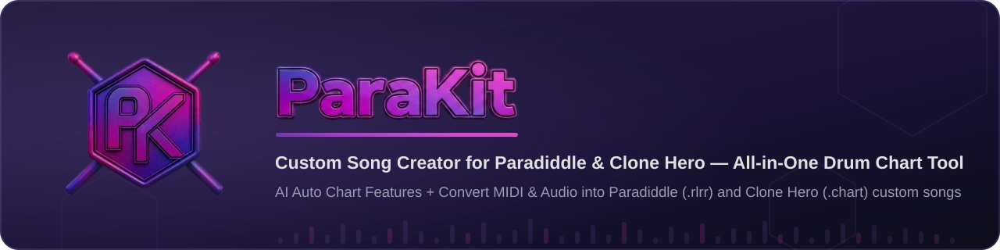
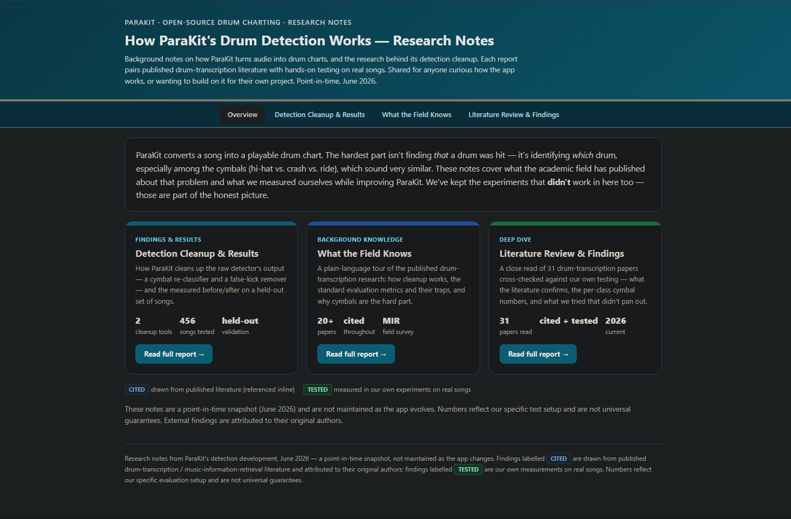

# ParaKit (v4.x source release)

**An all-in-one drum-charting tool for [Paradiddle](https://www.paradiddleapp.com/) (`.rlrr`), with Clone Hero (`.chart`) support.**

>ParaKit is actively developed and supported. **v4.x is the current, actively-developed line** — it is not
>in maintenance mode and is not waiting on anything. New features land here (recent releases added three
>new tabs), and it will keep getting regular updates.

>The **v5 rebuild** (PySide6/Qt) is still in development and **no longer has a target date** — the earlier
>mid-2026 estimate is out of date. v5 is a UI-framework rebuild rather than a feature release, so instead
>of holding work back for it, features ship in v4 as they're ready. **v4 support continues regardless of
>when v5 arrives** — this is not an end-of-life countdown.

> **Version in this release:** `4.10.1`  •  **Runtime:** Python **3.12** (required)

`Check the bottom of the page for the Change/fix log`

> 📄 **Prefer plain text, or reading outside GitHub?** A Notepad-friendly **[`README.txt`](README.txt)** and a separate, full **[`CHANGELOG.txt`](CHANGELOG.txt)** are now included in the repo, same info without the Markdown clutter.

---

## ⚠️ Read this first — which ParaKit is this?

ParaKit is mid–transition between two generations, and it matters for what you can do here:

| | **ParaKit v4.x (this release)** | **ParaKit v5 (future)** |
|---|---|---|
| UI framework | **Tkinter / TTK** | **PySide6 / Qt** |
| Status | The **complete, stable, shipping** app | **Not in this release** — see the note at the top of this page |
| Themeable with UI Studio? | **No** | Yes (UI Studio is built for v5) |

**UI Studio** — the visual UI/layout designer — is built for the **v5 (PySide6)** rebuild
and is **not compatible** with this v4.x (Tkinter) app. It is **not included in this
release** because it can't run without the v5 code. You **cannot** use UI Studio to re-theme or edit
this v4.x app — but once it ships, you'll be able to use it to design for v5 or build your
own custom ParaKit from source.

See [`docs/ROADMAP.md`](docs/ROADMAP.md) for the v5 / UI Studio / GPU-build plan.

---

### Start here

| If you want to… | Go to |
|---|---|
| **Install and run it** | [Download & run](#️-download--run-parakit-copy-paste-setup) — copy-paste setup |
| **See how the pieces fit together** | **[System Chart](docs/SYSTEM_CHART.html)** — the pipeline, all 14 tabs, what's risky to change. Download and open in a browser |
| **Know what's in the repo** | [What's in this repository](#whats-in-this-repository) |
| **Fix something that won't run** | [`docs/TROUBLESHOOTING.md`](docs/TROUBLESHOOTING.md) |

---

## ⬇️ Download & run ParaKit (copy-paste setup)

New to GitHub? The easiest way to get ParaKit, with every file placed correctly, is a few copy-paste commands in your terminal (**Command Prompt**, **PowerShell**, or **Terminal**). You need two free things installed first: **[Git](https://git-scm.com/downloads)** and **[Python 3.12](https://www.python.org/downloads/)** (3.12 is required).

> **Don't have Git, or don't want it?** You don't need it. Click the green **`<> Code`** button near the top of this page → **Download ZIP**, unzip it wherever you like, and skip straight to **step 3**. ParaKit itself never uses Git — the only difference is that you'll update with the in-app **Download update now** button instead of `git pull`, which works exactly the same either way. **Python 3.12 is the only real requirement.**

**1 — Download everything.** Open **Command Prompt** or **PowerShell** and run the command below. It creates a `ParaKit-Open_Source` folder **inside whatever folder your terminal is currently in** — a fresh window opens in your user folder, so by default you'll get it at **`C:\Users\YourName\ParaKit-Open_Source`** (an easy place to find it again):

```
git clone https://github.com/sherifican/ParaKit-Open_Source.git
```

> **Want it somewhere specific** (Desktop, another drive, a "Games" folder, etc.)? Two options:
> - **Go to that folder first, then clone** — e.g. from a fresh terminal, `cd Desktop` then run the clone to put it on your Desktop; or
> - **Add the destination to the command** — put the full folder path you want, in quotes, on the **end** of the clone command (replace the path with yours):
>   ```
>   git clone https://github.com/sherifican/ParaKit-Open_Source.git "D:\Games\ParaKit"
>   ```

**2 — Go into the folder** (the terminal needs to be *inside* the folder for the next steps):

```
cd ParaKit-Open_Source
```

*(Used the custom-path option above? `cd` into that folder instead — e.g. `cd "D:\Games\ParaKit"`.)*

**3 — Install the Python dependencies** (one time):

```
py -3.12 -m pip install -r requirements.txt
```

**4 — Run ParaKit** — double-click **`Run ParaKit v4.0.bat`**, *or* run it from the terminal (handy if you don't want to use the .bat):

```
py -3.12 "ParaKit v4.0.py"
```

That's it. To **update** to the latest version later, just run `git pull` inside the folder (or use the in-app **Download update now** button).

> **A few features need one more download:** the **Stem Splitter**, **YouTube → FLAC**, and some tools use a separate ~174 MB **Requirements bundle** (FFmpeg / yt-dlp / ADB) plus an optional AI stem-isolation model — see the full **[Requirements](#requirements)** section further down. The core charting workflow (Audio → MIDI, MIDI Editor, Song Creator, Song Tester) runs without them.

---

>Note: the compiled .exe version is a little bit behind the .py version at the moment (4.4.52), I've seen a LOT more engagement
with the .py version so that's what I'm more actively supporting, I will periodically update the .exe version when enough changes
pile up or there are significant fixes. I will also compile the v5 rebuild when it's finished for those who want it.

> The old LimeWire links will *EXPIRE* if they are not downloaded at *least* once per 7 days so I made a website to host the .exe versions, but it's having some issues server side. So I'll try to have a fix and the site up before the LW expires.

>**.exe DOWNLOAD:** [LimeWire Bundle Link](https://limewire.com/d/UV9Zm#DHqxKgEtmn)

>**Jarredou Model / Requirements Link:** [LimeWire Jarredou/Req Bundle](https://limewire.com/d/HrcqC#lS73gPUpJa)

>**Note (v4.5.3.1-1):** The in-app download button for the Jarredou neural stem-isolation model has been **rewired to the official [Hugging Face repo](https://huggingface.co/Politrees/UVR_resources)** for it, with a **second Hugging Face mirror as an automatic fallback**. If *both* of those ever go down for any reason, the LimeWire bundle above is still an option.

>ParaKit Official Homepage ***(Site temporarily down)***

>**README FOR .EXE VERSION:** (https://github.com/sherifican/ParaKit---Releases)

---

>**Putting this up at the top so its found easier.**

>**FOR THOSE WHO ARE HAVING ISSUES WITH CONNECTING SOME E-KITS TO THEIR COMPUTER**
>
>On some E-Kits like Alesis Kits for example, on the module in the Utilities menu there's a setting called "LOC" and it's ON by default, you want to turn LOC OFF for the MIDI signal to be sent to your computer. I know this fix works with Windows 11, I can't say for certain about iOS or Linux, or if those OS' even have that same issue. Once you do that any issues with pairing/connected but no inputs getting through should be resolved.

---
>**KNOWN QUIRK WITH THE AUDIO TO MIDI CHART GENERATION:**
>
>**As of v4.4.66-1, ParaKit de-duplicates kicks at 55 ms by default**, so kicks that used to group
>together now come out clean on the first Convert for the vast majority of songs — nothing to do.
>You'll mainly see grouped kicks now if you've **lowered the kick dedup gap** for a fast-kick song
>(needed to keep its correct kicks — but set it too small and the grouping creeps back in). If that
>happens, it's still quick to fix:

>Step 1. Zoom out all the way on your chart in the midi editor tab
>
>Step 2. Hold Shift + Left Click + drag to multi select all the kicks
>
>Step 3. Press the "Dedup x" button in the tool hot bar above your chart and set the ms slider to ~50 - 65ms
>

>Done! this gets rid of the layered extra kicks while leaving your correct kick note placements nearly untouched.

>However, be aware that on particularly fast double bass songs this fix largley does not apply, since it will treat a
>large portion of your correct kicks as duplicates and remove them.  Working on a work-around to this issue.

>**Want to tune it at convert time instead?** [Click here](docs/TROUBLESHOOTING.md#kicks-grouped-together-after-audio-to-midi) for the per-instrument dedup gap settings in the Audio → MIDI tab.

---


*NOTE: *The screenshots show "MIDI Unsupported" that is just because they were not loaded in a supported browser yet, I took the screenshots
in Firefox before I had fixed the MIDI config, see below for details, although Chrome and Edge work best for MIDI inputs**

## Recent Changes

<details>
<summary><b>Open the release-by-release log</b> — newest first. The full history is in <a href="CHANGELOG.txt"><code>CHANGELOG.txt</code></a>.</summary>


*Screenshots will be added here each time there is a Feature/Tab Layout redesign.*

**v4.9.17**<br>2026-08-17

Spectral Comparison — a third view, and a spectrogram that keeps its detail


+ **A Waveform view.** The toolbar toggle now offers a third view alongside Per-Lane and Spectrogram: a mirrored amplitude trace, left channel above the center line and right below, both on one shared scale so a genuinely lopsided mix reads as lopsided instead of being flattened into symmetry. Mono files are drawn as a matched pair. It exists because the heatmap is not always the most readable picture — on a noisy recording, a heavily compressed mix or a low-bitrate source it can wash out until nothing stands out, while the amplitude trace still shows plainly where hits land and how hard they were struck. The two views answer different questions, so neither replaces the other. Monochrome for now.
+ **The spectrogram was discarding its own detail on long songs.** It was drawn on a fixed 6000-column grid stretched across the whole song regardless of length, so past roughly 70 seconds that grid was coarser than the analysis behind it and detail already computed never reached the screen — on a ten-minute track about an eighth of it survived. The symptom was zooming in and getting a bigger version of the same coarse picture instead of a sharper one. It now renders from the full analysis across the visible window, so zooming in genuinely reveals more. Short clips look identical to before, because on those nothing was being discarded — which is also why it went unnoticed.

**v4.9.8**<br>2026-07-31

MIDI Editor — sharper chart, note selection, reactive notes and new toolbar buttons


+ **Reactive Notes, rebuilt.** Notes used to blank solid white as the playhead crossed them, so you lost track of which drum it was at the moment it mattered. A note now flares to a brighter version of its **own lane color** and throws a soft halo that fades out behind it. The original flash is still there as **Flash Notes (Classic Style)** in the new Style dropdown — and as of this release both the toggle and the style are remembered between launches.
+ **Sharper chart sprites.** Notes are drawn as a single clean high-resolution ring instead of the old softer shape, flagged notes get thinner and tidier outlines, and the toolbar buttons wear the v5 outline style. The dot at the top of the green playhead is now an enlarged grab-handle, so it is obvious where to click to drag it.
+ **Seconds on the ruler as you zoom in.** The ruler labels time in seconds ("12s") alongside the bar numbers, in a slightly different color so the two kinds of label never blur together — much easier to line a chart up against a specific moment in the audio.
+ **Note selection.** **Shift+drag** rubber-bands a group, **Ctrl+click** toggles one note in or out, and **Delete** removes the selection. Select a run of hi-hats and right-click one of them to set **Closed / Open / Pedal** across all of them at once.
+ **Two new toolbar buttons.** **Difficulty** reduces the open chart in place, saves a reduced copy separately, or saves-and-compares with the original behind it as a ghost overlay — and re-targets from the original each time, so auditioning tiers never thins an already-thinned chart. **MIDI Input (BETA)** records drum hits straight into the editor from a USB kit.
+ **It opens ready to work.** Picking a MIDI now loads it immediately — by Browse, drag-and-drop or the recents menu — and the lanes, beat grid and ruler are drawn the moment you open the tab instead of after a click on the empty canvas. With a chart already open nothing loads until **Load MIDI** or **Reload**, so unsaved edits are never swapped out from underneath you.

---

**v4.7.8.9**<br>2026-07-13

Audio → MIDI — tab polish


+ The **middle column** (Enhanced Detection, Neural Stem Isolation, Settings Profiles, Output) now has a **subtle tint** so it reads as one grouped panel set, distinct from the settings on the left and Advanced / Debug on the right.
+ Removed the **Reality Check** and **Engine Cheat Sheet** boxes from the top of the tab to cut scrolling (that guidance already lives in the Quick Path box and the Detection Engine section).
+ Fixed the ONNX **model-file row** — the clear (✕) button no longer clips at narrower window widths; Browse sits on its own row beneath the field.

---

**v4.7.8.8**<br>2026-07-12

Audio → MIDI — tab redesign & new Song Library

+ **Redesigned the Audio → MIDI tab** into three columns: the detection settings on the left; **Enhanced Detection**, **Neural Stem Isolation**, **Settings Profiles** and **Output** are now their own cards in the middle with a larger **Log** beneath them; and **Advanced / Debug** stays on the right.
+ **NEW — a "Your Songs" library** right on the tab, mirroring the YouTube and Stem Splitter libraries. Right-click a song, or click its **Create MIDI** button, to load that song's lossless drums split straight into the Audio → MIDI input, ready to convert — with search, sort, album art and full-song preview.
+ The **Stem Splitter model choice (htdemucs / htdemucs_ft) is now remembered** between sessions, so htdemucs_ft users don't have to re-select it every launch.
+ Layout fixes: the ONNX model-file row (Browse / Check / Download Model), the ride-cymbal toggle line, and the Neural Stem Isolation "Download Model" button no longer clip in the narrower column.

---


**v4.7.0**<br>2026-07-10

Single Song Creator

+ Full-tab redesign — every setting grouped into side-by-side cards (Files / Song Info / Output + Export Format / Tools + BPM/Timing), reflowing to two rows on a narrower window so the whole tab fits on screen
+ Advanced Options is now an always-visible card (was a hidden drop-down); Offset moved directly under Manual BPM
+ "Your Songs" library — finished songs scanned live from your Paradiddle + Clone Hero folders, with RLRR / CHART badges, E / M / H / X difficulty badges, Delete, right-click Rename, and Extract → MIDI Extractor


---

**v4.5.6**<br>2026-07-04

Stem Splitter

+ "Your Songs" Library (album art + FLAC / OGG / STEMS / MIDI badges + per-row Split / Play / Open Stems)
+ Settings reorganized into horizontal cards (Input & Model / Output / Split)
+ Custom Isolation & DrumSep collapsed into "Advanced tools"
+ Library / Log split across the bottom


---

**v4.4.64-1**<br>2026-06-16

YouTube ---> FLAC 

+ Song List / Library
+ Swapped with log's original slot
+ Reorganized settings into panels


---

Note: Practice and Preview are now built-in tabs (added in v4.9.3). The standalone HTML/web
editions are still included and still work — use whichever you prefer.

Take a song, isolate the drums, turn them into a playable drum chart, refine it in a
visual MIDI editor, practice it with falling notes, and export it, use iTunes/MusicBrainz to find Album Art & Meta Data,
turn Sheet Music into MIDI files, and create batches of songs at once — all in one app.

ParaKit **always has been and always will be free of charge, and will _never_ host ads.**
This repository now makes the full **v4.x source code** open under the **GPLv3** license,
so anyone can run it from source, learn from it, fix it, or build their own version.

> **Version in this release:** `4.10.1`  •  **Runtime:** Python **3.12** (required)

---

</details>

## What's in this repository

### The app
| Folder / file | What it is |
|---|---|
| **`ParaKit v4.0.py`** | The ParaKit v4.x app — the main program |
| **`parakit_spectral_tab.py`** · **`parakit_spectral_engine.py`** | The **Spectral Comparison** tab and its analysis engine |
| **`parakit_preview_tab.py`** · **`parakit_preview_engine.py`** · **`parakit_preview_sprites.py`** | The **Preview** tab — falling-chart rendering |
| **`parakit_practice_tab.py`** · **`parakit_practice_engine.py`** · **`parakit_practice_home.py`** · **`parakit_practice_widgets.py`** · **`parakit_practice_sprites.py`** | The **Practice** tab — play-along mode, home screen and UI |
| **`parakit_synth_voices.py`** | The built-in **drum synth** — makes a chart audible with no linked audio |
| **`Run ParaKit v4.0.bat`** | Windows double-click launcher |
| **`requirements.txt`** | Python dependencies |

> The `parakit_*.py` files above are **required** — the app imports them at startup. Keep them
> beside `ParaKit v4.0.py`.

### Detection
| Folder / file | What it is |
|---|---|
| **`parakit_drum_model.onnx`** | Neural drum-detection model used by the ML / Hybrid Audio → MIDI engines |
| **`parakit_cleanup/`** | Post-detection **cleanup pass** — cymbal re-classifier and phantom-kick removers |
| **`parakit_separators/`** | Neural drum-stem **separator plug-ins** (Jarredou MDX23C) |
| **`Detection Research Notes - Web Edition/`** | Offline **research notes** (one HTML file): how detection works, the literature behind it, and the experiments — including the ones that failed |

### Charts & conversion
| Folder / file | What it is |
|---|---|
| **`rlrr_parse.py`** | The `.rlrr` parsing core, shared by the app's MIDI Extractor and `extractor/` |
| **`extractor/`** | **RLRR Extractor** — converts `.rlrr` charts back into `.mid` ([readme](extractor/README.md)) |

### Optional standalone web tools
| Folder / file | What it is |
|---|---|
| **`Preview Track v2 - Web Edition/`** | Browser version of falling-chart review + Edit Mode |
| **`Practice Window v3 - Web Edition/`** | Browser practice with **Kit Studio** (the newer rebuild) |
| **`Practice Window v2 - Web Edition/`** | The earlier browser practice edition |
| **`practice_v2/`** · **`practice_minigame/`** | Python practice prototypes that preceded the in-app tab |

> **These are prototypes, not the main way to use ParaKit.** Preview and Practice are now **built into
> the app** as their own tabs. The standalone versions are kept for anyone who wants a no-install
> browser copy — see [Optional: standalone web tools](#-optional-standalone-web-tools).

### Docs & housekeeping
| Folder / file | What it is |
|---|---|
| **`CHANGELOG.txt`** | Full version history — also the source of the app's in-app **What's New** |
| **`README.txt`** | Plain-text companion to this file |
| **`docs/SYSTEM_CHART.html`** | **System Chart** — a single-page technical reference: the five-stage pipeline, all 14 tabs, where the non-tab features live, what gets downloaded and when, how updating works, how the source is laid out, and which parts are risky to change. Download it and open it in a browser; no install, nothing to run. Start here if you want to modify or build on ParaKit |
| **`docs/`** | Building from source, troubleshooting, roadmap |
| **`screenshots/`** | Images used by this README |
| **`parakit.ico`** · **`parakit_header_logo.png`** · **`parakit_logo_FINAL.png`** · **`dot_*.png`** | App icon and interface images |
| **`parakit_repo_banner.svg`** | The banner image at the top of this README |
| **`update_manifest.json`** · **`tools/`** | Used by the app's built-in updater to sync files; not needed to run ParaKit |
| **`LICENSE`** | GNU GPL v3 |

---

## Features

> **Looking for the web-based Practice & Preview tools?** They live [further down this page ↓](#web-editions) — the falling-note Practice editions (v2 / v3, with **Kit Studio**) and the Preview review/edit tool, with screenshots. Everything in between is the main desktop app.

- **MIDI editor** — visual note placement and refinement
- **Audio → MIDI detection** — automatic drum transcription with three engines:
  **Spectral** (traditional), **ML / ONNX** (neural net), and **Hybrid** (combined),
  plus genre presets (Pop / Rock / Metal / Funk)
- **Stem splitter** — isolate a drums-only track from any song (Demucs)
- **MusicXML → MIDI** — convert sheet music into a chart
- **YouTube → FLAC** — download lossless audio to chart from YouTube
- **Asset management** — metadata, album art, preview clips
- **Preview & Practice** — falling notes synced to the audio, keyboard or USB MIDI kit
- **Song Tester** — verify sync before export
- **Export** — Paradiddle (`.rlrr`) and Clone Hero (`.chart`)

---

## 🥁 Detection & charting improvements

Two changes worth calling out for anyone comparing charts across versions. Full detail for these and
everything since is in the **[Changelog](#changelog)** and `CHANGELOG.txt`.

**Auto Difficulty Adjuster** *(v4.5.3)* — the Easy / Medium / Hard versions ParaKit builds from your
Expert chart were rebuilt. The old approach dropped the **kick and toms entirely** on Easy and Medium,
which scored 0.00 against human-made charts for those lanes. It now **thins** each lane instead of
removing it, with density matched to real human charts at each tier. Expert output is unchanged.

**Hi-Hat Recovery** *(v4.5.1)* — hi-hats that the detector genuinely found were being discarded. In
Hybrid mode a hit is normally confirmed by the spectral engine, but spectral finds almost no hi-hats,
so every hat faced the strictest gate. The hi-hat confidence thresholds were retuned against a
60-track corpus; **all other lanes are byte-identical.**

---

## 📊 How Detection Works — Research Notes

Curious how ParaKit turns audio into a drum chart, or want to build on the detection work yourself?
This is a self-contained, **offline research hub** (one HTML file, dark/light mode, three reports in tabs)
documenting the detection-cleanup research behind the app — published drum-transcription literature paired
with hands-on testing on real songs, **with sources listed**, and the experiments that *didn't* work kept in.



**▶ Open it:** download **[`Detection Research Notes - Web Edition/parakit-detection-research.html`](Detection%20Research%20Notes%20-%20Web%20Edition/parakit-detection-research.html)** and open it in any browser — no internet needed. It's included when you clone the repo.

---

## 📏 Agreement with human charts

How closely do ParaKit's converted charts agree with charts people made by hand? Measured, not estimated - the table below is generated by a script against a fixed corpus, and a check fails the build of the next release if this section drifts from the measurement artifact. Read the fine print under the table before quoting any number from it; it says what these figures are and what they are not.

<!-- accuracy:begin -->
<!-- Generated by tools/measure_accuracy.py -- do not edit by hand. -->

| Lane | Precision (±30 ms) | Recall (±30 ms) | F1 (±30 ms) | F1 (±50 ms) | Chance F1 (±30 ms, uniform / structure-preserving) |
|---|---|---|---|---|---|
| Kick | 0.71 | 0.92 | 0.80 | 0.85 | 0.17 / 0.20 |
| Snare | 0.78 | 0.66 | 0.72 | 0.77 | 0.10 / 0.10 |
| Hi-hat | 0.44 | 0.64 | 0.52 | 0.55 | 0.09 / 0.10 |
| Crash | 0.54 | 0.39 | 0.45 | 0.50 | 0.05 / 0.05 |
| Ride | 0.67 | 0.19 | 0.30 | 0.31 | 0.02 / 0.02 |
| Toms (any tom) | 0.43 | 0.19 | 0.26 | 0.28 | 0.02 / 0.02 |
| **All lanes (event-micro)** | **0.64** | **0.65** | **0.64** | **0.69** |  |

*ParaKit v4.10.0, measured 2026-08-21, on a private set of 72 songs that already had human-made Paradiddle Expert charts, screened by median chart-event-to-nearest-librosa-onset distance <= 30 ms over a 90-second middle excerpt. These charts are agreement targets, not ground-truth onsets: charters quantize, simplify fills, omit ghost notes, and map a kit onto game lanes, so perfect agreement is neither possible nor the goal. The v4.10.0 kick, crash and tom operating points were tuned on this same corpus, so this is development-corpus agreement, not an out-of-sample estimate. ±30 ms is the MIREX drum-transcription window and ±50 ms the mir_eval onset default; both were fixed before scoring. Chance F1 is what note placement with no access to the audio would score, pooled identically to the measured numbers (uniform placement, and a circular shift of the real prediction train that keeps its rhythmic structure). Matching is maximum one-to-one per lane; the Toms row merges all toms, so tom-height errors do not count against it, and Ride is the end of the cymbal-relabeling chain, not an independent detector. Per-song F1 at ±30 ms: median 0.66 (IQR 0.56–0.73, min 0.03). Per-track offset centering would move overall F1 to 0.68 (±30) / 0.69 (±50) and is not applied. These figures are not comparable to results on ENST, MDB-Drums, IDMT or E-GMD, and they are not a ranking against any other tool. Full detail, hashes and per-song values: `dataset_audits/accuracy_report_v4.10.0_2026-08-21.json`; regenerate with `tools/measure_accuracy.py`.*
<!-- accuracy:end -->

---

## 📸 Screenshots

<div align="center">
  
</div>

<details>
<summary><b>🖼️ Click to expand — see every tab</b></summary>

<br>

### 1 · Single Song Creator


### 2 · Create Multiple Songs


### 3 · Audio → .ogg Converter


### 4 · Stem Splitter


### 5 · Audio → MIDI


### 6 · MIDI Editor


### 7 · Spectral Comparison
Did the detector chart it right? The chart is overlaid on the audio's energy and the disagreements are
flagged — a green `+` where the audio has a hit but nothing is charted (MISS), an orange `x` where a note
is charted over silence (PHANTOM). Wrong notes can be fixed in place, then the corrected MIDI overwritten
or exported. Detection itself is untouched — the tab only reads audio and chart files.

*Per-Lane view — an energy ribbon plus the chart's notes for each drum:*


*Spectrogram view — full heatmap with note rows:*


*Waveform view — mirrored amplitude, for when the heatmap is hard to read:*


### 8 · Sheet Music → MIDI


### 9 · YouTube → FLAC


### 10 · Asset Manager


### 11 · Song Tester


### 12 · Preview


### 13 · Practice


### 14 · Quick Start & FAQ


</details>

---

## Requirements

### 1. Python 3.12
ParaKit targets **Python 3.12** specifically. Get it from
[python.org](https://www.python.org/downloads/) (check "Add to PATH" / use the `py` launcher).

### 2. Python packages
```
py -3.12 -m pip install -r requirements.txt
```
(See `requirements.txt` — note the **Stem Splitter** pulls in `demucs` + `torch`, a large
~2–3 GB download you can skip if you won't split stems.)

### 3. Bundled command-line tools (the "requirements bundle")
ParaKit shells out to several tools that are **not** Python packages:

- **FFmpeg** (`ffmpeg` / `ffplay` / `ffprobe`) — audio conversion / `pydub`
- **yt-dlp** (+ **deno**, its JS signature runtime) — YouTube → FLAC downloads
- **ADB** (+ `AdbWinApi.dll`, `AdbWinUsbApi.dll`) — "push to Quest" / device transfer

These are distributed separately as the **`Requirements.zip` bundle** (≈174 MB — too large to
include in the Git repo). **Download it here → [Requirements.zip (LimeWire)](https://limewire.com/d/HrcqC#lS73gPUpJa)**

I have also uploaded the Jarredou model alongside the Reqs on the LimeWire page. However the app now has a download button that downloads the model straight from HuggingFace and automatically places it where it needs to go.

If you downloaded it from LimeWire,
 extract it, then place the files next to `ParaKit v4.0.py`, or keep them in the included
`Requirements\` subfolder beside it. They're kept out of the Git tree on purpose — large
binaries with their own licenses, well over GitHub's per-file size limit. Leave yt-dlp's
auto-update on so it stays current with YouTube changes.

---

## Run it

```
py -3.12 "ParaKit v4.0.py"
```
…or just double-click **`Run ParaKit v4.0.bat`**.

### Typical workflow
1. **Stem Splitter** — isolate drums from the backing track
2. **Audio → MIDI** — transcribe the drums-only stem to MIDI
3. **MIDI editor** — clean up and refine the chart
4. **Preview / Practice** — watch it as falling notes
5. **Song Tester** — confirm sync
6. **Assets** — set metadata, album art, preview clip
7. **Export** — Paradiddle `.rlrr` or Clone Hero `.chart`

---

<a id="web-editions"></a>

## 🌐 Optional: standalone web tools

These started as **browser prototypes** for the Practice and Preview features. **Both are now built
into the app** (the **Preview** and **Practice** tabs), so the desktop app is the way to use them —
but the standalone HTML files are kept in the repo for anyone who wants them: they need no install,
no Python, and run offline in any modern browser.

| File | What it is |
|---|---|
| [`Preview Track v2 - Web Edition/parakit-preview.html`](Preview%20Track%20v2%20-%20Web%20Edition/parakit-preview.html) | Falling-chart review + live Edit Mode |
| [`Practice Window v3 - Web Edition/`](Practice%20Window%20v3%20-%20Web%20Edition/) | Practice with Kit Studio (the newer rebuild) |
| [`Practice Window v2 - Web Edition/`](Practice%20Window%20v2%20-%20Web%20Edition/) | The earlier practice edition |

Download the file (or clone the repo) and open it in a browser. Keyboard play works everywhere;
**USB drum-kit input needs Chrome or Edge**, since it relies on the
[Web MIDI API](https://developer.mozilla.org/en-US/docs/Web/API/Web_MIDI_API#browser_compatibility)
(not supported in Safari, limited in Firefox).

---

## RTX 50-series GPUs and stem splitting

The stem splitter uses GPU acceleration on NVIDIA **GTX 10-series through RTX 50-series**.
ParaKit checks your GPU's architecture at runtime and uses CUDA whenever your installed
PyTorch supports it — including **RTX 50-series** (Blackwell — 5070/5080/5090), which needs a
**CUDA 12.8+ (`cu128`) PyTorch build**. If your PyTorch doesn't include your GPU's
architecture, the split log reports which architectures it *does* support, and the app falls
back to **CPU** (still works, just slower). AMD / Intel GPUs are CPU-only too (Demucs needs
CUDA).

**RTX 50-series cards need nothing special from ParaKit — just a `cu128` PyTorch build.**
Installing one is the entire step, and it is covered in
[`docs/TROUBLESHOOTING.md`](docs/TROUBLESHOOTING.md). There is no separate download, no patch,
and nothing to wait for. The CPU fallback always stays in the code regardless, so the feature
works on every machine, even if a bit slower.

---

## Build your own version

Because this is the full source, you can add features, remove them, rearrange the UI, or
make your own personal ParaKit. See [`docs/BUILDING.md`](docs/BUILDING.md) for running from
source and compiling a standalone `.exe`.

---

## Changelog

| Version | Summary |
|---|---|
| **v4.10.1**<br>2026-08-21 | <ul><li>**Chart Timing moved to the MIDI Editor.** The human-chart-timing option from 4.10.0 lived on the Song Creator tab, away from where charts are reviewed. It is now a Chart Timing button on the MIDI Editor toolbar, next to the Difficulty settings it belongs with. Changing it with a song loaded asks whether the loaded chart should be re-timed to match, so the editor view and the setting cannot silently disagree.</li><li>**Dialogs open centered over the app.** Popup windows used to appear in the top-left corner of the screen; they now open centered over the ParaKit window, the way the update notice always has, including on multi-monitor setups.</li><li>**Faster startup.** The Quick Start &amp; FAQ tab now builds the first time it is opened instead of at launch, taking about a quarter off startup time. The tab behaves exactly as before; its first open takes a moment.</li><li>**Small fixes.** The Song Info disclaimer on the Song Creator tab no longer gets cut off. The README gained a banner and an "Agreement with human charts" section.</li></ul> |
| **v4.10.0**<br>2026-08-20 | <ul><li>**Kick, tom and cymbal detection retuned.** The point at which ParaKit decides a detected hit is real was re-measured for three drums against 72 songs that have human-made charts to compare with. Kicks are stricter, removing roughly one spurious kick in eight without losing the real ones. Toms are looser — the tom setting had been sitting above the level the detector actually produces, so it was rejecting toms that had been found correctly, and toms had looked like something the detector was simply bad at. Crashes are looser too, and that one carries: the crash setting is the gate the whole cymbal group passes through, so opening it also recovers ride cymbals and hi-hats that were never reaching the part of ParaKit that tells cymbals apart. Rides improve by about a tenth without the ride setting being touched. Measured against human charts on a rock song and a non-rock song, the new settings land closer to the human chart on both, produce fewer spurious notes, and throw away fewer correct ones. Snare and hi-hat were deliberately left alone; both measured worse in either direction.</li><li>**New — 2x bass pedal notes for Clone Hero, off by default.** Clone Hero has a separate note for the second pedal of a double-kick pair, and ParaKit never emitted it, so fast kick lines always exported as a one-pedal chart. A checkbox in the export's advanced options marks the second kick of any pair closer than 175 milliseconds as a 2x pedal note, so the chart loads as Expert+. Nothing is added or removed — the same kicks are there, some labeled differently.</li><li>**New — match human chart timing, off by default.** People who chart by hand place notes a few thousandths of a second after the drum hit they stand for. A checkbox slides every note 6.5 milliseconds later to match that habit. This is a feel preference, not an accuracy fix: ParaKit's detected times are accurate to about a millisecond, so turning it on deliberately moves the chart away from where the drum actually is and toward where a person would have put it. The whole chart slides as one piece.</li></ul> |
| **v4.9.19**<br>2026-08-18 | <ul><li>**Sheet Music to MIDI works again on a new install.** Converting a MusicXML file said only "conversion failed" and gave no reason. Anyone who installed ParaKit recently got this every time, while an older install kept working - which made it look random rather than broken.<ul><li>The cause was outside ParaKit. The music notation library it uses removed a piece of itself that had been marked for removal for years, and the new version ships to anyone installing today. ParaKit now uses the replacement, which exists in both the old and new versions, so it works whichever one you have.</li><li>Converted files are byte-for-byte identical to before, so nothing you have already made changes.</li></ul></li><li>**The tempo box in that converter never actually did anything.** Found while fixing the above. If a score carried no tempo marking of its own and you typed a tempo in, ParaKit wrote 120 BPM into the MIDI and ignored what you asked for - silently, with no error, in every version that has ever had the box.<ul><li>Scores that already carried a tempo marking were handled by a different piece of code and were always fine, which is why this went unnoticed for so long. Typing a tempo now sets that tempo.</li></ul></li><li>**The GPU notes in the documentation were wrong.** The troubleshooting guide said the Stem Splitter used the graphics card on most NVIDIA cards and fell back to the processor only on AMD, Intel, or the newest RTX 50-series.<ul><li>That was wrong for every Windows install. The standard Windows build of the machine-learning library ParaKit installs contains no graphics-card support at all, so the Stem Splitter has always run on the processor unless a graphics build was installed by hand. The documentation now says so, and the instructions for adding graphics support were corrected.</li><li>No code changed here - the splitter behaves exactly as it did. Only the description of it was wrong.</li></ul></li></ul> |
| **v4.9.18**<br>2026-08-17 | <ul><li>**The chart no longer starts ahead of the music in Preview and Spectral.** Pressing Play started the chart running immediately, then went away and decoded the audio before any sound came out. That decoding time was counted as song time, so the notes were already ahead of the music by the time it started - and stayed exactly that far ahead for the rest of the song. On a six-and-a-half-minute song with a 48 kHz full mix and a separate drums stem it came to about 1.3 seconds, more than three beats at 157 BPM.<ul><li>It was a constant lead rather than a drift, which is why it looked wrong from the very first note instead of slowly wandering. The cost depends on how long the song is and whether the file needs converting to the mixer's rate, so a short clip looked fine and a long one looked badly out.</li><li>The same thing happened on every seek during playback - dragging the position slider, a loop jumping back to its start, and nudging the audio-offset slider - because moving the audio mid-song re-decodes it exactly like starting does. All four now wait for the audio before the clock counts, and the Spectral tab's Play was fixed the same way.</li></ul></li><li>The Practice tab and the MIDI Editor were never affected - Practice takes its position from the audio itself rather than from a clock of its own, and the MIDI Editor plays from audio it has already decoded.</li></ul> |
| **v4.9.17**<br>2026-08-17 | <ul><li>**New Waveform view on the Spectral tab.** The toolbar toggle now offers a third view alongside Per-Lane and Spectrogram. It draws the audio as a mirrored amplitude trace - left channel above the center line, right channel below, both on one shared scale, so a genuinely lopsided mix reads as lopsided instead of being flattened into symmetry. Mono files are drawn as a matched pair.<ul><li>It exists because the spectrogram is not always the most readable picture. On a noisy recording, a heavily compressed mix or a low-bit rate source the heat-map can wash out until nothing stands out, while the amplitude trace still shows plainly where hits land and how hard they were struck.</li><li>The view is monochrome for now. Coloring it by frequency content is a possible later addition, not a promise.</li></ul></li><li>**The spectrogram was discarding its own detail on long songs.** It was drawn on a fixed 6000-column grid stretched across the whole song regardless of length. Past roughly 70 seconds that grid is coarser than the analysis behind it, so detail the app had already computed was thrown away before reaching the screen - on a ten-minute track it drew about an eighth of what it knew.<ul><li>The symptom was zooming in and getting a bigger version of the same coarse picture rather than a sharper one. It now renders from the full analysis across the visible window, so zooming in genuinely reveals more. Short clips look identical to before because on those nothing was being discarded - which is also why this went unnoticed for so long.</li></ul></li></ul> |
| **v4.9.16**<br>2026-08-17 | <ul><li>**Song library badges update without a restart.** Splitting stems or converting a MIDI for a song in the library left that song's OGG, STEMS and MIDI badges grey. They only caught up after pressing one of the library's own buttons, or after closing and reopening ParaKit - so a song you had just worked on looked untouched.</li><li>**The badges were never reading stale information.** Each one checks the disk every time it is drawn, so the answer was always correct; the rows simply were not being redrawn when a job ended. They now redraw as soon as a stem split, an .ogg conversion, or an Audio to MIDI conversion finishes - including when one fails partway, since a run that stops early can still leave a file behind and that file should show up too.</li><li>Nothing about how the badges decide what exists has changed, so a badge that was right before is still right; it is just no longer late.</li></ul> |
| **v4.9.15**<br>2026-08-17 | <ul><li>**Add Snare Roll now defaults to sixteenth notes** instead of thirty-second notes. The tool shipped in v4.9.14 defaulting to the fastest spacing, on the reasoning that conversion already catches slower rolls, so the ones worth placing by hand must be the fast ones. That turned out to be wrong.<ul><li>Measured across 1,266 rolls in 171 community charts, conversion misses roughly the same share of rolls at every speed - about a fifth - and it misses sixteenth-note rolls slightly more often than thirty-second-note ones, not less. There is no speed conversion reliably catches, so "default to the one it misses" cannot pick a spacing at all.</li><li>What does decide it is how often each spacing actually appears: about two thirds of rolls in real charts are sixteenths, and those are also the ones missed most often. Sextuplets and thirty-second notes are still one click away, and the list is ordered from slowest to fastest.</li></ul></li><li>**Spacing is still worth checking by ear.** Whether a roll survives conversion depends on how far apart the hits are in real time rather than on how they are written - recovery is best around a twelfth of a second between hits and falls off both above and below that. After placing a roll, zoom in and nudge each note against the waveform; real rolls drift around the grid.</li></ul> |
| **v4.9.14**<br>2026-08-14 | <ul><li>**Doubled cymbal notes are removed.** Conversion could place two cymbal notes on top of each other in the same lane, almost always hi-hats. They are easy to miss when checking a chart and only became obvious in the game, where the only fix was going back and deleting them by hand. Two separate things caused it.<ul><li>One strike could be detected twice, once by each of the two detectors that run together, landing about a fiftieth of a second apart. The earlier note is kept, because it comes from the detector trained on human-timed drum recordings and sits closer to the actual stick contact.</li><li>A single strike could also be listed under two different cymbals at once, and the pass that sorts cymbals into their proper lanes moved both into the same lane instead of noticing they were one hit. That pass was built never to lose a note, which is exactly why the duplicate survived it.</li></ul></li><li>**How much this changes.** Measured across 290 community charts it removes about one note in every 2,700 - roughly one song in four has at least one, and a song that has any usually has several. Nothing outside the hi-hat, crash and ride lanes is touched, and notes have to be closer together than a thirty-second note at 300 BPM before either is removed, so fast playing is safe.</li><li>**Pasted notes stay selected.** Pasting in the MIDI Editor left nothing highlighted, and the copy usually landed directly on top of the notes it came from - so moving it meant separating two overlapping stacks by hand first. Pasted notes can now be dragged or deleted straight away, and clicking a stack that includes selected notes picks the selected one, the way a DAW does.</li><li>**New - Add Snare Roll.** Fast rolls are what conversion misses most, and loosening detection enough to catch them adds notes elsewhere that were never played. A button beside Tempo Map now places one directly: choose how many notes and how tightly spaced, then click the chart once. The tool switches itself off after a single placement so it cannot be applied twice by accident, and one undo removes the whole roll.<ul><li>Spacing follows the song's tempo rather than a fixed number of milliseconds - measured over 1,194 community charts, roll spacing tracks the beat far more consistently than it tracks the clock.</li><li>Thirty-second notes are the default, with sixteenths and sextuplets available. After placing a roll, zoom in and nudge the timing against the waveform; real rolls drift around the grid.</li></ul></li></ul> |
| **v4.9.13**<br>2026-08-10 | <ul><li>**Note volume is now a choice, and it starts switched off.** The previous release began writing a volume for every note, taken from how hard the drum was struck, and gave nobody the option. Audio to MIDI now carries a **Vary note volume to match the playing** checkbox.<ul><li>Off is the default because the two directions are not equally easy to undo: adding variation to a flat chart is one setting away, while removing it from a chart you did not want varied means editing every note by hand.</li><li>Unticked, conversions come out exactly as they did before that release.</li><li>Clone Hero ghost and accent notes are marked from these volumes, so they are absent too, as they were then. Tick the box and both come back.</li></ul></li><li>**Kick notes are never varied, either way.** A kick's volume has to be read from the 20-120 Hz range, which is also where the bass guitar sits, so the reading followed the bassline as much as the drumming - a quiet kick under a loud bass note came out loud, and a firm kick under a rest came out quiet. Kick is written at one volume whatever the setting above says.</li><li>**Fewer notes that were never played.** When detection fires where nothing was struck, the note it invents has almost no energy behind it, because there was nothing there to measure. Snare and kick notes that come back that quiet are now dropped before the chart is written.<ul><li>Both were measured against a large library of community charts before being switched on.</li><li>This runs whether or not note volume is enabled - the volume is still measured, it simply is not written into the chart.</li><li>Hi-hat, crash, ride and tom were measured the same way and deliberately left alone.</li></ul></li><li>**Cymbals played with a snare are no longer deleted.** A pass that removed cymbals landing at the same moment as a snare has been switched off. It was treating ordinary drumming as bleed - a snare hit together with a hi-hat and a crash is a normal thing to play. Checked against human-made charts, roughly nine of every ten cymbals it deleted were notes the chart wanted.</li><li>**Advice that pointed at something removed.** The Help tab suggested a Metal / Hard Rock / Post-Hardcore preset for heavy songs and the Detection Troubleshooter offered Metal as a fix for too many detected notes. Genre presets were removed in the previous release, so both pointed at nothing - and the Metal suggestion was backwards anyway, since that preset added notes rather than removing them.</li><li>**Twelve fixed bugs**, each reproduced and verified before it was touched.<ul><li>The MIDI Extractor dropped china, splash and 13-inch crash from every extracted file.</li><li>The cleanup pass could swap two cymbals played at the same instant, putting each on the other's lane.</li><li>The Preview tab timed every multi-track MIDI at 120 BPM, so notes drifted even though the BPM shown was right.</li><li>The Preview tab refused chart files that every other part of ParaKit opens without complaint.</li><li>The Practice Mixer's Drums slider switched the backing drums back on during You-drum mode.</li><li>Saved Audio to MIDI settings could be overwritten by an older snapshot, which then wrote the stale value back to disk.</li><li>A batch run could destroy its own output: two difficulties of the same song overwrote each other's Clone Hero chart while both reported success.</li><li>Re-exporting a chart destroyed the existing file the moment the export began, so a failure part-way left nothing behind.</li><li>Clone Hero covers were copied under a .png name whatever format they really were; they are now converted properly.</li><li>Dragging one note before the start of a song shifted the whole saved chart later by the same amount.</li><li>The retired genre presets still presented as live in several places.</li><li>The ML sensitivity slider does nothing across the bottom of its travel for some instruments. That is now stated in the conversion log rather than left to be discovered.</li></ul></li></ul> |
| **v4.9.12**<br>2026-08-05 | <ul><li>**Converted charts now have loud and quiet notes.** Every kick ParaKit detected was written at exactly the same volume as every other kick, and the same for every snare and cymbal — a delicate verse and a full-power chorus came out identical. Each hit now gets a volume taken from how hard that drum was actually struck. A song genuinely played flat still comes out flat.</li><li>**Ghost and accent notes in Clone Hero exports now actually appear.** The option had been on by default and could never have done anything to a chart ParaKit made: accents mark notes above a volume and ghosts below one, and every note had the same fixed volume, so none ever reached either mark.</li><li>**The genre presets have been removed.** They had been tuned on recordings of drums played alone, but conversion runs on a drum track separated out of a finished mix — so the tuning could never have shown the problem it was most likely to cause. Metal was measured across 48 songs and added around 90% more snare notes, on every kind of music alike rather than on metal in particular. Saved settings that name a genre still load and use default detection.</li></ul> |
| **v4.9.11**<br>2026-08-05 | <ul><li>**ParaKit opens about a second and a half sooner.** Every launch spent 1.4 s building the Preview tab's synthesised drum kit — all fourteen voices at three volumes — before the window appeared, whether or not you ever opened Preview. That now happens in the background once the app is already usable.</li><li>**The genre list had two choices that did the same thing.** "Auto — let the detector decide" and "No adjustment — pure defaults" produced identical charts, and nothing was ever detecting your genre. One honest option remains; either old setting still works if you had it saved.</li><li>**A mistyped genre in a batch template used to go unnoticed** — anything unrecognised quietly fell back to default detection while the run reported success. The log now says so, and names what it used and what it accepts.</li></ul> |
| **v4.9.10**<br>2026-08-01 | <ul><li>**Fixed — Review Issues could correct the wrong notes.** The window remembered what it found by position, so if you deleted, sorted or undid anything before pressing Auto Fix, every position had shifted and it acted on whatever note had moved into that slot. It remembers the notes themselves now, and says to rescan if the chart has changed too much.</li><li>**Fixed — two tabs could overwrite each other's work.** Spectral Comparison's Overwrite and the MIDI Editor's Save could both write the same file, and whichever you used second silently discarded the other's corrections.</li><li>**Fixed — unsaved edits were lost without warning.** Sending a chart to Preview loaded the saved file, so unsaved edits silently did not appear; Preview also replaced an edited chart on load, import or clear without asking. Both prompt now.</li><li>**Fixed — the stem separator setting could be ignored.** Audio → MIDI read your Neural Stem Isolation choice while the conversion was already running, on a different thread. If that read failed the conversion carried on as though it were off — producing a different chart, with no warning. It is read once at the start now, and the buttons lock during a run like every other detection setting.</li><li>**Fixed — settings that did not stick.** The detection engine could be silently reverted at launch to an older saved profile's value, and the older value written back over the newer one. Ride, kick, separator and debug were missing from saved profiles, and kick and debug were not saved anywhere at all. Genre profiles promised to remember five settings and saved three.</li><li>**Fixed — per-song settings could overwrite each other.** Two files with the same name in different folders, or the same song as .wav and .flac, shared one entry. Each gets its own now; anything already saved still loads.</li><li>**Fixed — Practice's latency calibration could store the wrong value with the wrong sign.** The old test clicked twice a second, so any real delay past a quarter-second matched the *next* click: a 300 ms delay was stored as -150 ms, pushing your timing further out while every tap looked like it matched. Bluetooth headphones sit in exactly that range. The test now uses a slower, deliberately uneven click and refuses to apply a result it cannot measure, naming what it saw.</li><li>**Fixed — the Song Tester crashed on the problems it exists to find,** and its highlights now actually land in the editor.</li><li>**Fixed — a failed .ogg conversion no longer destroys the previous file,** album art could come from the wrong song, and a failed model download no longer deletes the model you already had.</li><li>**Fixed — tap tempo was wrong at changed playback speeds.** Tapping along to a 120 BPM song at half speed wrote 30 BPM, and that value feeds the tempo map.</li><li>**Fixed — the MIDI Extractor's folder batch silently ran the wrong thing** after a single file had been picked, and an unreadable file killed the run with the window stuck on "Running...".</li><li>**Fixed — success messages that were never checked.** Several confirmations said a setting had been saved whether or not the write succeeded; two log exports did nothing at all on an unwritable folder, with no error.</li><li>**Fixed — audio kept playing after Preview closed,** stem-split leftovers were not cleaned up, and an unexpected error in batch conversion left the progress bar spinning forever.</li><li>**Help and labels corrected** — Help described a tab that no longer exists, several controls did nothing, and a few labels described behaviour the app had outgrown.</li></ul> |
| ***v4.9.9*** | *Staged but never released. The change it carried was measured against the previous behaviour, performed worse, and was reverted before any public build existed — so this history goes from v4.9.8 straight to v4.9.10. No update was missed.* |
| **v4.9.8**<br>2026-07-31 | <ul><li>**Fixed — difficulty tiers stacked on top of each other when you auditioned them.** Reducing a chart to Medium, saving, comparing, then reducing to Hard produced a Hard chart *sparser than the Medium it came from* — 103 notes where reducing straight to Hard gives 172, against Medium's own 107 — and the status line reported it as a normal Hard chart. Comparing finishes by loading the reduced chart as the working chart, and that load cleared the record of what the original was, so the next reduction measured against the already-thinned chart. The original is now restored as the baseline after a comparison, so every tier is cut from the full chart no matter how many you try first.</li><li>**Fixed — the MIDI Editor could draw the previous song's waveform.** Loading a new stem could leave the old song's waveform under the new song's name. Notes are aligned against that waveform, so the picture used for lining up a chart could quietly belong to a different song.</li><li>**Fixed — the Chart Troubleshooter's duplicate and long-break checks were reading their windows as seconds instead of milliseconds.** The duplicate check was meant to look within 20 ms and the break check within 500 ms. At 120 BPM a 20-*second* window spans about 160 sixteenth notes, so nearly every note sharing a lane with any neighbor was reported as a duplicate, the 500-second break check never fired at all, and long charts scanned far more slowly than they should have.</li><li>**Fixed — one drawing error during MIDI Editor playback ended playback for the rest of the session.** The view stopped updating while the audio kept playing, the editor never noticed the song had ended, and a playback optimization was left switched on that no other tab could clear. Drawing errors are now contained: playback keeps running, the view recovers on the next frame, and a one-time notice appears in the status line.</li><li>**Reactive Notes now remembers your choice.** The checkbox and its Style dropdown persist between launches — v4.9.7 made the new glow the default, so anyone who preferred **Flash Notes (Classic Style)** had to pick it again on every start.</li></ul> |
| **v4.9.7**<br>2026-07-29 | <ul><li>**Picking a chart in the MIDI Editor now opens it.** Choosing a MIDI filled in the path but drew nothing until **Load MIDI** was pressed, so on a cold start the editor sat empty and looked broken. Browse, drag-and-drop and the recents menu all open the chart straight away now. This only happens when the editor is empty — with a chart already open nothing loads until **Load MIDI** / **Reload** is pressed, so unsaved edits are never swapped out from underneath you.</li><li>**Reactive Notes: a new glow style, now the default.** Notes used to blank solid white as the playhead crossed them, which meant losing track of which drum it was at the moment it mattered. A note now flares to a brighter version of its own lane color and throws a soft halo that fades out behind it, so it stays identifiable while it lights up. The original white flash is unchanged and still available as **Flash Notes (Classic Style)** in a Style dropdown under the Reactive Notes checkbox.</li></ul> |
| **v4.9.6**<br>2026-07-28 | <ul><li>**Fixed — converting a FULL MIX no longer wrecks the chart.** Feeding Audio → MIDI a whole song instead of a drums-only stem roughly *doubled* the kick lane and lost most of the hi-hats. The cause was routing, not detection: the drum separator splits drums into their parts and has nowhere to put bass or vocals, so the bass was pushed into the drum stems and its low end landed on kick. ParaKit now recognises a full mix and splits it **first**, then hands the drums stem to the separator. Measured against 334 human-charted songs the corrected route scores 0.835 where the old one scored 0.418. Splitting the song yourself in the Stem Splitter is still the best chart — but converting a full mix is no longer a trap.</li><li>**NEW — difficulty reduction moved into the MIDI Editor.** Thinning a chart to Easy, Medium or Hard used to happen invisibly while the song was built, so the only way to see the result was to import the finished file. There is now a **Difficulty** button on the MIDI Editor toolbar: pick a difficulty, then apply it to the open chart (Ctrl+Z undoes it), save it as a separate chart file, or save it and load it back with the original behind it as a ghost overlay to compare the two in one click. Choosing a different difficulty afterwards re-targets from the original chart rather than thinning what is already thinned. The old *Enable difficulty-based note reduction* checkbox in the Song Creator tabs is gone — difficulty there is a label only.</li><li>**"Remove cross-stem bleed kicks" now describes what it is actually for.** Some "kicks" the detector finds are really the bass guitar leaking into the drums track, and this pass compares each kick against the song's bass, vocals and other parts to find them. It only deletes clear-cut cases and flags the rest in the MIDI Editor. Still EXPERIMENTAL and still needs the full mix — but with the routing fix above that no longer costs you chart quality, and it reuses the split instead of separating the song twice.</li><li>**Practice no longer claims Mute-on-Miss is working when it cannot.** The in-session dock now shows it as unavailable instead of silently doing nothing.</li><li>**Fixed — the dependency list in the repo root was the wrong one.** It listed the in-progress v5 rebuild's requirements, so a fresh install could pull packages ParaKit v4 does not use.</li><li>**Fixed — long tooltips ran off the edge of the screen** instead of wrapping.</li><li>**Fixed — two temp-folder leaks** in the new full-mix split; a failed split used to leave several full-length audio files behind every time.</li></ul> |
| **v4.9.5**<br>2026-07-28 | <ul><li>**Fixed — the automatic chart cleanup was silently doing nothing.** On v4.9.3 the cleanup stage (cymbal re-classification and phantom-kick removal) failed to start on every conversion and was skipped without a visible error — the chart was still written, just without that pass. It runs again.</li><li>**Fixed — the Keyboard test window would not close once a test was started.** Neither Close nor the window X dismissed it, and because that window captures input, the rest of the app stopped responding until ParaKit was force-quit.</li><li>**Practice now says when "You drum" / Mute-on-Miss cannot work.** Both mute the recorded drum stem, so they only do anything when the other linked file is a *drumless* backing. Many charts link a full mix plus a drum stem instead, where muting the stem cannot remove drums already baked into the mix. Practice now states this before you press play, names which of the two reasons applies, and labels the source button for what it would actually play.</li><li>**Fixed — the Spectral tab's per-lane "Notes" toggle did nothing in Edit mode.** Edit mode deliberately keeps notes visible, but it did so silently, so the button looked broken. It now greys out while Edit is on.</li><li>**Fixed — YouTube playlist downloads no longer file the artist as "&lt;Artist&gt; - Topic".** YouTube's auto-generated artist channels carry that suffix; it is now removed as the download is filed. Applies to new downloads.</li><li>**"Remove cross-stem bleed kicks" is now marked EXPERIMENTAL.** It only finds anything when converting from a full mix, and full-mix conversions currently produce a noticeably worse chart than converting an already-split drums stem. Useful for spotting ghost kicks; not a way to get a better chart.</li></ul> |
| **v4.9.4**<br>2026-07-27 | <ul><li>**The cross-stem bleed option now states that it needs the FULL MIX, and reports what it did.** Converting from a drums-only stem left it nothing to compare against, so it found nothing while still spending the time on a separation — and said nothing either way. It now logs when zero kicks were flagged and warns when the input looks like a drums-only stem.</li></ul> |
| **v4.9.3**<br>2026-07-25 | <ul><li>**NEW TAB — Spectral Comparison: a visual second opinion on the detector.** It answers one question: did the detector chart it right? Load the audio and the detected chart, press Compare, and the tab overlays the chart on the audio's energy and flags the disagreements — a green `+` where the audio has a hit but nothing is charted (MISS), an orange `x` where a note sits over silence (PHANTOM). Two views (Per-Lane energy ribbons, and a full Spectrogram with note rows), click to seek, play along, and fix wrong notes right there in Edit mode before overwriting or exporting the corrected MIDI. *Detection itself is untouched — the tab only reads audio and chart files.*</li><li>**NEW TABS — Preview and Practice.** Preview renders a chart so you can check it before export; Practice plays it back to drum along with. Both include audio-source controls: choose **Backing + Drums** or **Full Mix**, see exactly which stem files are linked (and which are missing), and ParaKit warns you when a "backing" track already contains drums so you don't hear them twice.</li><li>**NEW — built-in drum synth.** No audio linked to a song? Charts are still playable and audible: ParaKit synthesizes the drum hits from the chart itself. When you do have audio the synth layers on top so you can hear your own hits against the track (press **M** to mute).</li><li>**Performance pass across the whole app.** ParaKit no longer wakes the CPU a few hundred times a second waiting for MIDI input, so it runs quieter and cooler when idle — most noticeable on laptops. The MIDI Editor is leaner on big charts (size-aware undo history, memory-capped audio cache) and the piano roll redraws more efficiently during playback.</li><li>**Fixed — charts with non-UTF8 text failed to load.** `.rlrr` files saved in other encodings (latin-1 / cp1252 / utf-16) now open correctly instead of erroring.</li><li>*This release bundles everything since v4.7.26 — see CHANGELOG.txt or the in-app What's New for the full v4.8.0 → v4.9.3 detail, including the MIDI Editor improvements and every bug fix along the way.*</li></ul> |
| **v4.9.2**<br>2026-07-24 | <ul><li>**Preview tab — sharper notes and readable cymbals.** High-resolution falling-note sprites (the same technique the MIDI Editor and Practice highway use), crisp at every size. **New:** a toggle draws Hi-Hat, Crash and Ride as wide **ovals** — much easier to tell apart in fast cymbal sections — while toms and kick keep their normal shape. Adds a note-size slider with a reset, and matches the default note shapes across Preview and Practice.</li><li>**New — built-in drum synth (Preview + Practice).** Charts are playable and audible with no linked audio.</li><li>**More of the Spectral Comparison tab**, plus a couple of MIDI Editor improvements.</li></ul> |
| **v4.9.1**<br>2026-07-24 | <ul><li>**MIDI Editor visual refresh** *(look only — the tool layout above the chart is unchanged)*: crisper note sprites, thinner outlines on flagged notes, and v5-style toolbar buttons. **New:** second markers on the ruler — as you zoom in it labels time in seconds ("12s") alongside bar numbers, in a different colour so the two never blur together. The dot on the green playhead is now an enlarged grab-handle, so it's obvious where to drag.</li><li>**Practice home screen rebuilt** toward the v5 look — gradient buttons, album-art cover, cleaner pills and panels.</li></ul> |
| **v4.9.0**<br>2026-07-24 | <ul><li>**New — cross-stem bleed phantom-kick review** (Audio → MIDI, off by default). A post-detection pass looks for charted kicks that line up with loud moments in the *other* drum stems but not the kick stem — a common sign the "kick" is really bleed from a nearby drum — and **flags** them for review. *It never deletes a note on its own*; flagged kicks are marked so they can be checked and removed by ear in the MIDI Editor. Detection itself is untouched.</li><li>**Fixed:** stem separation looked frozen on long songs — it now shows a steady progress heartbeat so it's clear the work is still running.</li><li>The phantom-kick review flag is now orange, matching the Detection Troubleshooter — the same kind of issue always wears the same colour.</li></ul> |
| **v4.8.0**<br>2026-07-24 | <ul><li>**NEW TAB — Spectral Comparison: a visual second opinion on the detector.** Did the detector chart it right? Load the audio and the detected chart, press Compare, and the tab overlays the chart on the audio's energy and flags the disagreements — a green `+` where the audio has a hit but nothing is charted (MISS), an orange `x` where a note is charted over silence (PHANTOM). Energy alone is never treated as a miss: drums share frequency bands, so bleed is expected and only the flags mark disagreements worth reviewing by ear.</li><li>**Two views** — Per-Lane (an energy ribbon plus the chart's notes for each drum) and Spectrogram (full heatmap with note rows and render controls). Click the canvas to seek, play along with the shared audio preview, fix wrong notes right there in Edit mode (undo/redo included), then Overwrite or Export the corrected MIDI.</li><li>The tab sits between MIDI Editor and Sheet Music → MIDI. *Detection itself is untouched — the tab reads audio and chart files only.*</li></ul> |
| **v4.7.26**<br>2026-07-16 | <ul><li>**One release, three hardening rounds.** After 4.7.25 we ran three independent automated "breakers" — programs whose only job is to make the app misbehave by actually running it — then fixed everything they proved and re-ran them on the fixes, three rounds deep. **Twelve** quiet bugs fixed. *None changes detection results or charting.*</li><li>**Fixed — MIDI Editor Save could destroy your chart.** A save that failed part-way (disk full, an antivirus/sync stall, a crash) could truncate your file to a useless stub, taking an editing session's hand-fixes with it. The save is now **atomic** — a complete replacement is written first and only swapped in once fully on disk — so a failed save leaves the file untouched. *(And a follow-up bug that fix introduced, caught by the next round: a backup/sync tool merely holding the file could make the swap fail; ParaKit now falls back to a direct write so the save lands either way.)*</li><li>**Fixed — .ogg Converter silently overwrote files.** Two inputs with the same name (e.g. `01 Intro.wav` from two albums, or the `drums.wav` in every split folder) collapsed into **one** output while the dialog still said "2 converted successfully". Same-named files now come out as `01 Intro.ogg` + `01 Intro (2).ogg`, and the count always matches what's on disk.</li><li>**Fixed — batch "converted" could mean an empty song.** A song whose chart came out with zero notes was still written and counted as a success; the batch now refuses it like the Single Song Creator always has.</li><li>**Fixed — album-art Undo could put a deleted song's cover onto a different song** that later reused the same filename. The undo backup now dies with the song (and is marked dead even if a scanner is holding it open at that instant).</li><li>**Fixed — a line break in a song title broke the Clone Hero export** (it can arrive automatically from an audio file's own tags). Titles are now cleaned of line breaks before `.chart`/`song.ini` are written; ordinary titles are unaffected.</li><li>**Fixed — Song Tester crashed on a note-less file** with a raw traceback; it now says plainly there's nothing to analyze.</li><li>**Fixed — completed the model-status work from 4.7.22–4.7.25:** a model that went bad *on disk* (replaced in place at the same size, as cloud-sync does) could keep a green "Model ready" tick all session; ParaKit no longer caches model-status answers at all, so the status is always about the file you have right now.</li><li>*Under the hood: the self-test suite grew from 10 to 38 executable checks (27/28 mutation-proven), plus a new regression harness that diffs every batch of fixes against the previous build before it can ship.*</li></ul> |
| **v4.7.25**<br>2026-07-15 | <ul><li>**Fixed:** another program merely *having* the model file open could still get it marked bad for the rest of the session. v4.7.24 fixed the case where a file was locked so tightly ParaKit couldn't read it at all — but that's only half of it. A program holding the file **for writing while still letting others read it** (a sync client, a backup tool, a file indexer, or ParaKit's own model download as it finishes) leaves the file perfectly readable, while the part of ParaKit that loads the model still fails — so the check meant to tell *"bad file"* from *"busy file"* quietly missed it, and a **perfectly good model got flagged as broken**. Same symptoms as before: "Model error" on a good file, Convert refused, a suggestion to re-download a file that was already correct, and Hybrid quietly dropping to Spectral on a fresh install. **ParaKit no longer guesses at this** — if it can read the file at all, it now loads the model straight from the data it just read, so the answer is about the model itself and never about who else had the file open. **Affected v4.7.23 and v4.7.24.**</li><li>*No change to detection results, charting, or any conversion setting.*</li></ul> |
| **v4.7.24**<br>2026-07-15 | <ul><li>**👉 If you use Spectral, or tried Hybrid before and had trouble — read this.** Hybrid is now the default, and it's worth another look even if you'd written it off. **Almost all of ParaKit's detection work over the last several releases applies only to the ML/Hybrid engine** — on Spectral you haven't been getting any of it. **v4.5.1-1** fixed Hybrid throwing away hi-hats it had genuinely detected (soft/fast hats in intros and fast patterns, dropped by an over-strict confirmation gate) — validated across a 60-song corpus plus 14 fresh songs spanning pop, R&B, rock, metalcore, funk and electronic, improving hi-hat accuracy on every genre with no false-hat blowups. **v4.5.2-1** added Tom Sensitivity (re-swept in **v4.7.9** for the current model) — and **on Spectral that dropdown does nothing at all, except OFF**. **v4.7.11** retired the old "Enhanced Detection" toggle, which never did anything. So if Hybrid disappointed you once, the things that most likely disappointed you have since been fixed — and those fixes never reached Spectral. **Expect better accuracy and recall, most noticeably on hi-hats and toms.** *To switch: Audio → MIDI ▸ scroll the "Basic Detection Settings" card to the **Detection Engine** section at the bottom ▸ pick Hybrid. Your choice is remembered.*</li><li>**New — a fresh install now defaults to the Hybrid engine** when a working drum model is present (falling back to Spectral if it's missing or unusable). Hybrid was already the option labelled *"recommended for best accuracy"*, and the recent detection tuning **only applies to it**: the Tom Sensitivity presets and the v4.5.1-1 hi-hat recovery both work on the ML/Hybrid path only — on Spectral, **the Tom Sensitivity dropdown does nothing at all except OFF**. Defaulting to Spectral meant new users never got any of that work. *If you've ever picked an engine yourself, your choice is kept — this only affects installs with no saved setting.*</li><li>**Fixed (a v4.7.23 regression):** a model file that was **briefly unreadable could be marked bad permanently**. v4.7.23 added a real check that the model loads — but if something else held the file open at that moment (antivirus scanning it, OneDrive syncing, a backup running), the check failed and ParaKit remembered that answer *as if the file itself were broken*. Since ParaKit checks the model shortly after startup, a routine antivirus scan could cause it: "Model error" on a perfectly good file for the rest of the session, Convert refusing to run, and a message suggesting you re-download a file that was already fine. ParaKit now tells the difference between *"this isn't a model"* and *"I couldn't read it just now"*, and only refuses the first. **Affected v4.7.23 only.**</li><li>*No change to detection results for an existing conversion — same engine, same settings, same chart.*</li></ul> |
| **v4.7.23**<br>2026-07-15 | <ul><li>**Fixed:** a damaged or wrong **model file** could hand you a chart made by an **engine you didn't choose**, without saying so. ParaKit only checked the model existed and was ≥1 KB — never that it *was* a model. Anything that cleared that check failed later, mid-conversion, and ParaKit quietly switched to **Spectral** and reported a normal "Conversion Complete!". Pick ML, get a chart with no ML in it (in our test: **12 notes where the real model found 20**), with one line mid-log as the only clue.</li><li>**Fixed:** the model status line showed a green **"Model ready"** for a file that wasn't a usable model — and since "ready" also greys out **Get Model**, there was no obvious way to download a good copy. ParaKit now *loads* the model to check it, shows **"Model error"** when it can't, and leaves Get Model available.</li><li>ParaKit now checks the model when you press **Convert** and refuses a bad one with a clear message **before** starting, instead of failing halfway through.</li><li>If detection ever *does* fall back (antivirus or OneDrive locking the model at the wrong moment), the **completion window now says so** in its title and text — as do the log and status bar.</li><li>*No change to detection results, charting, or any conversion setting — a conversion that worked before produces exactly the same chart.*</li></ul> |
| **v4.7.22**<br>2026-07-15 | <ul><li>**Fixed:** the **same two temporary-file problems** fixed for tom removal in v4.7.20/v4.7.21 were still present in the **cleanup pass**, where they'd been since v4.5.0. The cleanup writes through a temporary file whose name was built from your chart's own name, so **(a)** a leftover from an interrupted conversion could permanently and silently disable the cleanup pass for that song, and **(b)** a long enough song title pushed that name past Windows' 255-character limit and did the same. Both showed up only as "skipped" in the log. The temporary name no longer contains the chart's name at all. *This changes no output — charts are byte-for-byte what they were.*</li><li>**Fixed:** if the cleanup pass stopped partway **and the chart couldn't be re-read at that moment** (an antivirus scan or OneDrive holding the file open — which the act of writing the chart can itself trigger), ParaKit reported it as **"skipped"**. "Skipped" means your chart was never touched, and that wasn't true — it had been rewritten. ParaKit now says plainly that it *couldn't check* rather than claiming nothing happened. In that case the note count may read high, and the log now tells you to re-convert if it looks off.</li><li>*No change to detection, charting, or any conversion setting — charts convert exactly as they did in v4.7.18 through v4.7.21.*</li></ul> |
| **v4.7.21**<br>2026-07-15 | <ul><li>**Fixed:** songs with a **very long title** could silently lose **Tom Detection = OFF**. ParaKit writes the tom removal through a temporary file next to your chart, and that file's name was built from the song's own file name — Windows limits any single file name to 255 characters, so a long enough title pushed the temporary name over the limit, the removal failed, and the log said "skipped" while leaving every tom in a chart you'd asked to have none. The temporary name no longer contains the song title, so your title lengths can't affect it at all.</li><li>**Fixed:** if the cleanup pass failed partway through and the work it had already done only **re-labelled** cymbals (crash → ride, say) without adding or removing notes, the log still called it **"skipped"** — the same word used when your chart genuinely is untouched. ParaKit now compares the chart file itself before and after. *Your charts were correct either way; only the log line was wrong.*</li><li>*No change to detection, charting, or any conversion setting — charts convert exactly as they did in v4.7.18 through v4.7.20.*</li></ul> |
| **v4.7.20**<br>2026-07-15 | <ul><li>**Fixes a problem introduced by v4.7.19 earlier the same day — if you're on v4.7.19 and use Tom Detection = OFF, please update.** v4.7.19 made the tom removal safe against an interrupted write by going through a temporary file next to your chart. That temporary file always had the **same name**, so if a conversion was interrupted at exactly the wrong moment it could be left behind — and if something then held onto it (an antivirus scan, a OneDrive upload, a backup tool, or a read-only flag), every later conversion of **that song** hit the same leftover and **Tom Detection = OFF silently did nothing at all, permanently, for that song**. The log said "skipped" and nothing else went wrong, so the only visible symptom was toms you'd switched off. ParaKit now uses a unique temporary name each time, which can't collide with a leftover. *Only v4.7.19 was affected — v4.7.18 and earlier never used a temporary file.*</li><li>**Fixed:** if the cleanup pass failed partway through its own work, the log could still call it **"skipped"** and the **Total notes** figure could read high. ParaKit now checks the chart itself to see whether it changed, rather than relying on the cleanup to report on itself.</li><li>*No change to detection, charting, or any conversion setting — charts convert exactly as they did in v4.7.18 and v4.7.19.*</li></ul> |
| **v4.7.19**<br>2026-07-15 | <ul><li>**A rare way to lose a finished chart is gone.** With Tom Detection set to **OFF**, ParaKit removed the toms by writing directly over your finished chart. If that write was interrupted — a full disk, a OneDrive or network sync stall, an antivirus lock — the chart was left truncated and unopenable, and ParaKit still said **"Conversion Complete!"** and quoted the full note count. It now writes the change to a temporary file and swaps it in only once it's complete, so an interrupted write leaves your chart exactly as it was detected. (The cleanup pass has worked this way since v4.5.0; the tom removal, added later, never got the same protection.)</li><li>**Fixed:** in that situation the reported **Total notes** could also be too high — the pre-cleanup figure v4.7.17 and v4.7.18 set out to correct.</li><li>**Fixed:** the cleanup pass could log **"skipped"** when it had actually run and updated your chart. ParaKit now counts the change directly from the chart on disk rather than relying on what the cleanup reports about itself, so the log and the note total always agree with the file you have.</li><li>*No change to detection, charting, or any conversion setting — charts convert exactly as they did in v4.7.18.*</li></ul> |
| **v4.7.18**<br>2026-07-15 | <ul><li>**Follow-up to 4.7.17 — the note count stays honest even when something goes wrong.** If ParaKit couldn't re-read your finished chart to count it (locked, missing or damaged file), it quietly fell back to the detector's **pre-cleanup** total again — the same too-high number 4.7.17 set out to fix. It now subtracts exactly what the cleanup removed, so the figure stays right even when the re-count fails, and says so in the log.</li><li>**Fixed:** an internal safety fallback in the cleanup could read a setting from the wrong thread, which on Windows failed and made the cleanup **skip itself silently** — while the checkbox still showed it ON. It now refuses to guess and logs it.</li><li>Removed an unused internal path that could have applied the cleanup and tom removal to a chart a second time.</li></ul> |
| **v4.7.17**<br>2026-07-15 | <ul><li>**Audio → MIDI — the note count you're shown is now the chart you actually got.** "Total notes" (in the log and the **Conversion Complete!** dialog) was the number the *detector* found, counted **before** the cleanup pass ran — so it was too high once the cleanup removed phantom kicks (our test track reported **1513** when the chart on disk had **1505**). ParaKit now finishes the cleanup first and counts the finished chart.</li><li>**Fixed: the cleanup now runs and reports *before* the conversion is announced.** Previously `Done!` and the completion dialog appeared while the chart was still being rewritten, and the `Cleanup pass:` line always turned up at the very bottom of the log — making it look like the cleanup never ran.</li><li>Changing a cleanup toggle mid-conversion no longer affects the conversion already running — those settings are captured when you press Convert, like every other Audio → MIDI setting.</li></ul> |
| **v4.7.16**<br>2026-07-15 | <ul><li>**Fixed the GPU install command shown on startup (RTX 50-series).** When dependencies are missing, ParaKit's install message pointed at the **cu121** PyTorch build — which does **not** support **RTX 50-series (Blackwell)** cards. Anyone with a 5060/5070/5080/5090 who followed our own instructions silently ended up on **CPU-only stem splitting** — the exact "splitting is slow / my GPU isn't used" problem `docs/TROUBLESHOOTING.md` describes. It now says **cu128**, which works on 50-series *and* older cards, and matches the troubleshooting doc.</li></ul> |
| **v4.7.15**<br>2026-07-15 | <ul><li>**Damaged files now say what's wrong instead of failing silently.** Choosing an audio file that is **empty (0 bytes)**, is actually a **folder**, or is another file renamed to `.wav` used to start the conversion anyway — Convert greyed out, the run died with a technical error buried in the log, and you got no chart and no explanation. ParaKit now checks the file **before anything starts** and tells you plainly what's wrong.</li><li>**Same for the drum model file** — an empty `.onnx`, or a folder named `.onnx`, passed the old check and the conversion failed mid-run with a technical error. You now get a clear **"Bad Model File"** message pointing at the Download Model button.</li></ul> |
| **v4.7.14**<br>2026-07-15 | <ul><li>⚠️ **Important fix — opening a chart no longer rewrites it.** The detection **cleanup pass ran on every chart you opened** — "Preview last", or a chart from the **Sheet Music → MIDI** tab — not just on a chart you had just converted, and it paired that chart with whatever audio you converted **last** (for a Sheet Music chart, an unrelated song). In practice nothing was corrupted — Sheet Music charts happened to trip a guard inside the cleanup, and "Preview last" happened to carry the right audio — but that was luck, not design. Cleanup now runs **only on a chart you just converted**, the same rule the tom **OFF** step got in v4.7.12. **Opening a chart is now strictly a read.**</li></ul> |
| **v4.7.13**<br>2026-07-15 | <ul><li>⚠️ **Important fix — the last three tabs were unreachable on a fresh install.** The colour-coded tab bar (v4.7.10) put all twelve tabs in one fixed row needing ~1410px, but the first-run window was 1100px and the old fallback tab strip is hidden — so **Song Tester, Preview/Practice Track and Quick Start & FAQ were cut off entirely**, meaning a new user couldn't even open the Help tab. The bar now **wraps onto as many rows as your window needs** (every tab stays reachable at any size, even resized small), and the first-run window is wider so tabs start on one clean row. Saved window sizes are untouched.</li><li>**Fixed: a second conversion started from the menu while one was still running** (the Convert button is disabled during a run, but the menu item wasn't) made both runs share one set of settings — the second run's Tom setting could be applied to the first run's finished chart, and both could write the same output. A second conversion is now refused until the first finishes.</li><li>**Fixed: Sheet Music → MIDI charts were tagged with whatever audio you last converted** on Audio → MIDI. "Re-run ML" trusted that tag, so it would quietly re-convert that unrelated song — skipping the overwrite warning — and could replace an Audio → MIDI chart you were editing.</li></ul> |
| **v4.7.12**<br>2026-07-14 | <ul><li>⚠️ **Important fix — Tom "OFF" could erase toms from charts you were only opening.** With Tom sensitivity set to **OFF**, simply *opening* an existing chart could permanently delete every tom from that file: it hit **"Preview last"** (re-opening a chart you converted earlier at a different sensitivity) and **Sheet Music → MIDI** output, which has nothing to do with the Audio → MIDI setting. The tom-OFF step was attached to the shared "open in the MIDI Editor" helper instead of to a freshly finished conversion, so it also ran on charts you were merely opening. It now only ever touches the chart from the conversion that just finished. **Update if you use Tom OFF.** (Charts already damaged can't be recovered by the app — re-convert if you still have the audio.)</li><li>**Fixed: changing Tom sensitivity mid-conversion affected the running conversion**, despite the setting saying it applies to the *next* one — switching to OFF mid-run could wipe a Moderate conversion's toms, and switching away from OFF could leave toms in a chart you asked to be OFF. The tom setting is now captured when the conversion starts, like every other Audio → MIDI setting.</li><li>Removed two leftover mentions of the `.alt_detector.mid` comparison file (Help tab + the detection troubleshooter) — that file was only written by the retired Enhanced Detection pass, so it never exists.</li></ul> |
| **v4.7.11**<br>2026-07-14 | <ul><li>**Audio → MIDI — Enhanced Detection folded into the default.** The experimental **Enhanced Detection** options (Crash / Toms / Crash + Toms) have been folded into the default detection pipeline and removed as a separate toggle — the fine-tuned model plus the cleanup pass now handle crash and tom detection directly on every conversion, so there's nothing extra to switch on. A short note where the toggle used to be (and in the Help tab) explains it. Your detection results don't change — the default pipeline is what conversions were already using.</li></ul> |
| **v4.7.10**<br>2026-07-14 | <ul><li>**Audio → MIDI — Tom "OFF" now truly zeroes toms.** OFF removes **every** tom, floor toms included, so it's a real off switch — previously it only dropped the mid/rack toms and left the floor-tom line in. Reach for it when a song is picking up phantom toms, then add any real toms back in the MIDI Editor. (Detection is unchanged; this only strips toms on the OFF setting.)</li><li>**Color-coded tab buttons.** The tabs are now tinted for at-a-glance navigation: **Stem Splitter green, Audio → MIDI yellow, MIDI Editor orange, YouTube → FLAC cyan, Asset Manager red, Quick Start & FAQ magenta**; the rest stay purple — matching the in-game Paradiddle drum-kit piece colors. The active tab keeps the dark-purple pressed look and tabs lighten on hover.</li><li>**Matching library badges.** The **MIDI** badge is now yellow, the **Create MIDI** chip is yellow, and on the Stem Splitter library the **Open Stems** chip has a green outline and the **Split** chip a magenta one.</li></ul> |
| **v4.7.9**<br>2026-07-14 | <ul><li>**Audio → MIDI — new drum-detection model + ride cymbals on by default.** Updated the drum-detection model to a fine-tuned version with a re-tuned gate profile — validated on 39 freshly-downloaded, **training-blind** metal tracks (pre-registered, score-once protocol, independent 3-way review): **macro-F +0.048, crash +0.051** (95% CI entirely positive), every lane improved or unchanged, no regressions. The previous model is kept for one-step rollback.</li><li>**Ride cymbals now kept in the Ride lane by default.** The cleanup pass separates rides automatically instead of folding every cymbal into Crash — turn the **Ride** toggle **OFF** to fold all cymbals into Crash and reclassify by hand. The older, unreliable spectral ride estimator has been retired.</li><li>**Tom sensitivity re-calibrated** for the new model: **Strict / Moderate (default) / Aggressive / OFF.** Moderate is the precision sweet spot — it cuts phantom toms sharply versus the model's raw output (especially on metal). Dense songs can still leave a few phantom toms; reclassify or delete them in the MIDI Editor, drop to Strict for fewer, or OFF.</li><li>**Song Library:** the **Create MIDI** chip now shows a **purple outline** when it's active (a drums-only split exists for that song) and stays gray when there's no split yet — a clearer at-a-glance cue for which songs are ready.</li></ul> |
| **v4.7.8.10**<br>2026-07-13 | <ul><li>**Audio → MIDI — Song Library "Create MIDI" fix.** Create MIDI now loads the song's lossless **drums-only** split (never the full mix), and is **disabled** for any song that hasn't been split into stems yet — so you can't accidentally feed the full mix into Audio → MIDI. Split a song on the Stem Splitter tab first and the button lights up. Clicking Create MIDI now also **scrolls the tab back to the top** so the loaded Audio file field is in view.</li></ul> |
| **v4.7.8.9.1**<br>2026-07-13 | <ul><li>**MIDI Editor — hi-hats: right-click now deletes; select first to change articulation.** Right-clicking a hi-hat note now **deletes** it — the same quick one-click removal you already get on every other lane. To change a hi-hat's **Closed / Open / Pedal** articulation instead, first **select** the note(s) (Ctrl-click one, or rubber-band a group), then right-click one of them — the variation menu opens and your choice applies to **every selected hi-hat** at once.</li><li>**Audio → MIDI:** the **Advanced / Debug — optional tuning** heading is now **orange** so it stands out as an important settings section.</li></ul> |
| **v4.7.8.9**<br>2026-07-13 | <ul><li>**Audio → MIDI — middle column tinted.** Enhanced Detection, Neural Stem Isolation, Settings Profiles and Output now share a subtle tint so the middle reads as one grouped panel set, distinct from the left settings and the right Advanced / Debug column.</li><li>Removed the **Reality Check** and **Engine Cheat Sheet** boxes from the top of the tab to cut scrolling — that guidance already lives in the Quick Path box and the Detection Engine section.</li><li>Fixed the ONNX **model‑file row**: the clear (✕) button no longer clips at narrower window widths; Browse sits on its own row beneath the field.</li></ul> |
| **v4.7.8.8**<br>2026-07-12 | <ul><li>**Audio → MIDI — full‑tab redesign.** The tab is now three columns: detection settings on the left; **Enhanced Detection**, **Neural Stem Isolation**, **Settings Profiles** and **Output** as their own cards in the middle with a larger **Log** beneath them; **Advanced / Debug** on the right.</li><li>**NEW — a "Your Songs" library on the tab** (mirrors the YouTube / Stem Splitter libraries). Right‑click a song, or hit **Create MIDI**, to load that song's lossless drums split straight into the Audio → MIDI input, ready to convert — with search, sort, album art and full‑song preview.</li><li>The **Stem Splitter model choice (htdemucs / htdemucs_ft) is now remembered** between sessions.</li><li>Layout fixes: the ONNX model‑file row (Browse / Check / Download Model), the ride‑cymbal toggle line, and the Neural Stem Isolation "Download Model" button no longer clip in the narrower column.</li></ul> |
| **v4.7.8.7**<br>2026-07-12 | <ul><li>**Clone Hero / .rlrr — china & 13" crash no longer dropped.** Converting Paradiddle charts to Clone Hero (and importing a `.rlrr` into the MIDI Editor or Practice view) silently deleted china, 13"‑crash and splash cymbal hits — a large share of a typical library lost cymbals with no warning. They now map to the **Crash** lane (china is treated as crash everywhere, matching the difficulty reducer).</li><li>**Batch converter** no longer writes a broken, section‑less Clone Hero chart when a slot has no drum events — it skips that slot with an error instead of installing an unplayable song.</li><li>**MIDI Editor:** the one‑time `.parakit_bak` safety backups now appear in the **Load MIDI** dialog, so you can reopen one to recover (they're ordinary MIDI files).</li></ul> |
| **v4.7.8.6**<br>2026-07-12 | <ul><li>**Difficulty reduction keeps the whole song.** Easy/Medium/Hard charts made with note‑reduction previously thinned toward the end — kick and snare could drop out of the back of longer songs. Reduced charts now spread notes evenly across the full length. Expert is unchanged.</li><li>**MIDI timing rounds to the nearest tick** instead of always rounding down — removes a small drift (~8 ms over ~10 saves) when repeatedly saving the same chart in the MIDI Editor; also applied to the Audio→MIDI and Sheet‑Music→MIDI exports.</li><li>Fixed a rare **doubled note** when the Advanced Peak Detection / Trigger Align options were used together.</li></ul> |
| **v4.7.8.5**<br>2026-07-12 | <ul><li>**Whole‑app stability & correctness pass** — 24 fixes.</li><li>**Stem Splitter library:** Delete / Rename now targets only the exact song, never a same‑named one (e.g. acting on "Song" no longer also catches "Song_Remix"); faster search; more reliable ".ogg files exist" badge.</li><li>**MIDI Editor:** loading or clearing over unsaved edits now warns first; saving over an original MIDI that holds notes the editor can't display warns you and writes a one‑time backup; flags follow their notes with reliable undo; multi‑row tempo maps no longer scramble timing; "remove duplicates" respects the "Selected notes only" scope; audio is released after Stop/Pause (no more "file in use"). **NEW: MIDI Input (BETA)** — this was supposed to be in the app already but due to an oversight I never added the function into the MIDI Editor tab, it exists now. Record drum hits straight into the editor from a connected kit.</li><li>**Audio → MIDI:** converting asks before overwriting an existing MIDI; Auto‑Detect BPM fits the offset to the timeline the chart plays on, so foreign MIDIs stop drifting.</li><li>**Single Song Creator:** "Use BPM from MIDI" reads the song's real starting tempo; a typo in the Offset field is caught instead of silently becoming 0.</li><li>**Preview / Practice:** correct pause position, no drift over a long song, smoother playback on dense charts.</li><li>**Song Tester:** measures against the song's real starting tempo.</li><li>Preference / settings saves are now atomic and report failures instead of silently losing data.</li></ul> |
| **v4.7.2**<br>2026-07-10 | <ul><li>**Stem Splitter "Your Songs" library** — right‑click a song for two new actions:</li><li>**Rename song** — renames the song's *whole file set together* (the audio, its drum stems, and its MIDI) so the links between them stay intact; all‑or‑nothing (it undoes itself if it can't finish).</li><li>**Delete song** — permanently deletes that whole set from disk (audio + stems + MIDI); it lists the files and asks first, no undo.</li><li>Fix: a song's album art in this library now updates if the file is re‑tagged, instead of showing the old thumbnail.</li></ul> |
| **v4.7.1**<br>2026-07-10 | <ul><li>Follow‑up fixes to the v4.7.0 Single Song Creator.</li><li>**Rename song** now also updates the title *inside* the files, so a renamed song shows the new name in‑game too (Paradiddle + Clone Hero), not just in the library — and it's now all‑or‑nothing so a song can't get split into two rows.</li><li>**Clone Hero export:** enabling only ghost notes (or only accents) no longer also emits the other kind.</li><li>**"Your Songs" library:** faster on large libraries, refreshes when you change the Output/CH folder, album art updates when replaced in place, difficulty badges read more precisely, and a song whose Paradiddle + Clone Hero files share one folder is handled correctly by Delete/Rename.</li></ul> |
| **v4.7.0**<br>2026-07-10 | <ul><li>**Single Song Creator — full‑tab redesign**: every setting is now grouped into side‑by‑side cards (Files · Song Info · Output + Export Format · Tools + BPM/Timing) so the whole tab fits on screen with little or no scrolling; on a narrower window the cards reflow into two rows.</li><li>**Advanced Options** (ghost/accent notes) is now an always‑visible card under Export Format instead of a hidden drop‑down, and **Offset (seconds)** sits directly under Manual BPM.</li><li>**"Your Songs" library**: **Play was replaced with Delete** (a finished song's folder only holds backing/drums stems); Delete permanently removes the song's folder(s) after asking and is resilient to Windows/OneDrive locks. **NEW right‑click → Rename song** renames the song's folder(s) on disk. Format badges are now all‑caps **RLRR / CHART**, and the Paradiddle source row uses a 🥁 icon.</li><li>Extra stem rows say **"Drums" / "Song"** (were "Drum audio"/"Song audio") so nothing gets cut off, and the **Album Art Preview** has a cyan border matching the other thumbnails.</li></ul> |
| **v4.6.2**<br>2026-07-10 | <ul><li>**NEW — "Your Songs" library in the Single Song Creator**: the tab now shows all your finished songs, scanned live from up to two folders — Source 1 defaults to your Output Folder, Source 2 to your Clone Hero folder (or `Output Folder\Clone Hero Songs`, the same default the CH export uses). Both are pickable and resettable, and songs already on disk appear immediately — nothing needs re‑converting.</li><li>**Library rows**: `rlrr` (purple, Paradiddle Ready) and `chart` (cyan, Clone Hero Ready) badges, full‑song **Play/Pause** preview, an **Extract →** button that sends the song's best `.rlrr` straight to the MIDI Extractor, and **E/M/H/X** badges (green/yellow/orange/red) showing which difficulties exist. A song's `.rlrr` folder and its same‑named Clone Hero folder merge into one row; search + sort included; right‑click opens the song's folders. Every finished conversion refreshes the list automatically.</li><li>**Single Song Creator layout refresh**: the Output / action‑buttons / Export Format sections are now three side‑by‑side cards (like the YouTube tab), with the new library beside a taller log below the Convert button.</li></ul> |
| **v4.6.1**<br>2026-07-10 | <ul><li>**Note choices now tied to each MIDI chart** (not one global setting): a fresh MIDI starts at the defaults, and re‑loading a MIDI you tuned before restores its choices — so you never re‑tune the same chart twice.</li><li>**Lane‑note readout**: the MIDI Editor's left lane strip now shows each lane's current output note under its name; the Hi‑Hat lane shows its note plus "& per note" (hats can still be Closed/Open/Pedal individually), and now picks its note like the other lanes.</li><li>**Open hi‑hats look distinct**: an Open hi‑hat (note 46) renders hollow with a thin yellow outline in the piano roll (filled cyan + yellow outline in the velocity lane).</li><li>**Velocity lane**: same‑beat notes in different lanes now sit side by side instead of stacking on top of each other.</li><li>**Clone Hero export**: crashes now map to the green cymbal (not the hi‑hat's yellow lane), so a simultaneous hi‑hat + crash no longer collapses; accent/ghost markers now use the correct per‑lane note numbers.</li><li>Fixed the Note Manager's colour swatches showing as empty boxes, and the header sometimes coming up in light mode on launch.</li></ul> |
| **v4.6.0**<br>2026-07-10 | <ul><li>**NEW — Manual MIDI Note Manager** (MIDI Editor, next to the Tempo Map button): pick which MIDI note each drum lane writes on export — e.g. Electric vs Acoustic Snare, Crash 15″/17″/Splash, Ride 17″/20″/Bell, high vs low toms. Crash and Ride switch the actual piece in Paradiddle; every lane's choice sets the note e‑kits/DAWs receive. Saved between sessions.</li><li>**NEW — per‑note hi‑hats**: right‑click any hi‑hat note (or a selection) to set it **Closed / Open / Pedal**; mixed open‑closed charts survive export.</li><li>**Clone Hero export fixes**: Easy/Medium/Hard now export with the correct difficulty section (was always Expert); ghost/accent notes now actually write; with reduction on, the `.chart` matches the reduced `.rlrr`; extended e‑kit hi‑hat notes are no longer dropped from Paradiddle exports.</li><li>**Safer in‑app updates**: "Download update now" is now all‑or‑nothing — it verifies every file before replacing anything and rolls back on failure, so a failed update can't leave a half‑updated install.</li><li>**MIDI Editor**: flags now follow notes through Quantize/Soft‑Quantize; paste/repeat select exactly the pasted copies.</li><li>Sheet Music→MIDI no longer leaks a temp file per conversion; stem‑model downloads finalize atomically.</li></ul> |
| **v4.5.9.5**<br>2026-07-09 | <ul><li>**Detection Troubleshooter — more built-in answers** (kick de-bunching ≈55 ms, tom detection-sensitivity guidance, cleanup-pass note) and **honest "reality check" advice**: it now tells you when a setting has hit its useful limit and the real fix is manual (in the MIDI Editor), instead of nudging a value back and forth forever. The results box is taller and the "What's New" panel moved left to give it room.</li></ul> |
| **v4.5.9.4**<br>2026-07-09 | <ul><li>**New Dark / Light theme toggle** next to "Check for Updates". **Dark** is a new deep-purple look (now the default); **Light** is ParaKit's original gray. It switches instantly — no restart — and remembers your choice.</li><li>**Fixed inconsistent log colors** — some tabs' activity logs showed up lighter/gray while others were black. Every log now uses the same background and follows the theme you're in.</li></ul> |
| **v4.5.9.3**<br>2026-07-08 | <ul><li>**"Download update now" now shows its work.** When you let ParaKit install an update for you, a progress window opens with a live log of every file as it goes — downloaded, already up to date, or failed — plus a progress bar and a clear "done, close and reopen ParaKit" summary. Before, the button just went quiet until it finished, so it looked like nothing was happening.</li></ul> |
| **v4.5.9.2**<br>2026-07-08 | <ul><li>**The "Update Available" popup now shows what's new.** When a newer version is found, it previews that version's changelog right in the popup — so you can see what the update fixes and changes without opening GitHub or downloading first. If you've skipped a few versions, it lists every change since the one you're running. *(Because the preview is drawn by the app you're running, it starts appearing once you're on this version or later.)*</li><li>Fixed the update popup's **"Open GitHub" button** — it now opens the repo's main page instead of the raw code view of the app file.</li></ul> |
| **v4.5.9.1**<br>2026-07-07 | <ul><li>**Album-art search is much smarter (Asset Manager).** It now searches **iTunes, Deezer, and the Cover Art Archive** and ranks the results by how well each matches the song you typed — so it stops grabbing a random cover from the wrong artist, and finds art iTunes alone was missing (a lot of indie singles are on Deezer but not iTunes). The new **"Show alternate art choices"** button shows up to 3 other covers the search found so you can pick the right one. ("Fetch Metadata" is now **"Fetch Album Art"**.)</li><li>**Song libraries — right-click "Edit artist"** (Downloaded Songs *and* Stem Splitter): fix the artist/band metadata for a song downloaded under the wrong name — updates the file's embedded metadata and the library row.</li><li>**Downloaded Songs — right-click "Undo album art search":** if a search replaced the cover with the wrong one, revert to what it was before (usually the original YouTube thumbnail) instead of re-downloading.</li><li>A small **braille spinner** now animates on the library row whose song is playing (both libraries), and stops on pause / when you play another song.</li><li>The **YouTube tab's song library is wider** now (the Activity Log was narrowed to give it room).</li><li>Fixed: an album-art fetch failure logged an internal error instead of the actual reason.</li></ul> |
| **v4.5.8.4**<br>2026-07-07 | <ul><li>**"Use album art from audio file metadata" now falls back to the full mix** — on both the **Single Song Creator** and the **Create Multiple Songs** tab (a per-song toggle). If the loaded Song Audio and Drum Audio have no embedded cover art (common when they're separated stems / a backing track), ParaKit finds the song's full mix from the MIDI file name and uses the album art embedded in it (e.g. a cover added on the YouTube tab). The art shows in the live preview and is written into the export folder as `album.png` alongside the `.rlrr` and audio. (The alternative is embedding art into your backing/song audio file manually via the Asset Manager tab.)</li></ul> |
| **v4.5.8.3**<br>2026-07-07 | <ul><li>**MIDI Editor — Delete and bulk edits no longer hit the wrong notes.** After a drag, insert, or quantize re-sorted the notes, the selection could silently point at different notes than the ones you had highlighted. Fixed.</li><li>**MIDI Editor — reclassifying a note now counts as an unsaved change**, so it triggers the save-on-quit prompt and Send to Song Creator hands off the edited file (before, those edits could be silently lost).</li><li>**Auto-detect BPM actually detects now.** The audio BPM search had quietly broken and returned ~79.5 BPM for nearly every song — charts still played in sync (the offset was always correct), but the written BPM (Clone Hero measure lines, the difficulty-reduction grid) was wrong. Rebuilt and validated. "Use BPM from MIDI file" was never affected.</li><li>**Song titles with characters Windows forbids in filenames no longer break exports** (a `:` aborted the conversion, a `/` nested folders). Names are sanitized; the in-game title stays exactly as typed.</li><li>**Create Multiple Songs (folder batch): the "skip"/"rename" overwrite setting is honored again** — existing song folders were being silently overwritten on re-runs.</li><li>**Sheet Music MIDI export no longer drifts out of time** by the end of long songs.</li><li>**Extractor tool hardening** — the batch tab runs reliably after mixed use, one malformed `.rlrr` no longer hangs the window or aborts the batch, a preview crash is fixed, and same-named outputs get unique names.</li><li>**Neural Stem Isolation** no longer silently falls back for filenames containing `_(`, reports skipped stems, and no longer clobbers another file's saved Audio → MIDI settings.</li><li>**Practice minigame:** remapped keys that aren't letters (digits, punctuation, F-keys, numpad) now work.</li><li>Misc crash guards (BPM typed as `0`, corrupt saved settings, a stuck progress bar) and temp-folder cleanup.</li></ul> |
| **v4.5.7.1**<br>2026-07-05 | <ul><li>**Steadier audio playback, especially in the song libraries.** The Downloaded-Songs and Stem-Splitter library previews now decode the whole track into memory and play it from RAM instead of streaming it off disk, and the shared audio buffer was enlarged — greatly reducing the brief periodic stutters/crackle some machines produced during playback (biggest benefit on busier or slower systems).</li></ul> |
| **v4.5.7**<br>2026-07-05 | <ul><li>**Song descriptions.** The Single Song Creator *and* Create Multiple Songs now have a **Description** field. Paradiddle/ParaDB reads the description straight from the song's `.rlrr` file (there's no website form for it) and shows it on the song's ParaDB page — line breaks are saved as `<br>` for its HTML rendering. Leave it blank and nothing changes.</li><li>**Create Multiple Songs — parity with the Single Song Creator.** Each song slot now has its own **🎵 Auto Fetch Audio** button (fills Song Audio + Drum Audio from the MIDI's file name) and a live **album-art preview** (with a "not square" flag).</li><li>**Steadier playback.** The MIDI Editor and Preview/Practice Track now use a larger audio buffer and pause Python's garbage collection during playback, so brief CPU spikes are much less likely to cause a moment of audio crackle or a playhead stutter.</li></ul> |
| **v4.5.6.1**<br>2026-07-05 | <ul><li>**Audio → MIDI — HOTFIX:** the Cancel button on the Neural Stem Isolation model download was a silent no-op since the feature shipped — the ~417 MB download always ran to completion. Cancel now aborts within a moment, never falls through to the fallback mirror, and cleans up the partial file. (Found while byte-auditing the ParaKit v5 rebuild's port of this dialog.)</li></ul> |
| **v4.5.6**<br>2026-07-04 | <ul><li>**Stem Splitter tab redesign + a new "Your Songs" library.** The settings are now a horizontal card row — **Input & Model**, **Output**, **Split** — that reflows for narrower windows, and the two optional BETA tools (**Custom Isolation** and **DrumSep**) are tucked into a single collapsible **"Advanced tools"** section so the normal Standard-Split path stays front-and-centre. A new **"Your Songs"** library sits at the bottom beside the activity log: it lists the songs in your YouTube output folder — the ones you've downloaded but haven't split yet — with **album art**, **FLAC / OGG / STEMS / MIDI** badges showing what already exists for each, plus search and sort. Each row has **Split** (loads it straight into the splitter), **Play** (preview), and, on already-split songs, **Open Stems**. Point the *Songs Folder* at your downloads and hit Refresh; it stays in sync with the YouTube → FLAC output folder.</li><li>**Compact layout:** the library and activity log now stretch to fill the space below them instead of leaving a gap.</li><li>**Updater:** "Download update now" now also keeps this *What's New* (`CHANGELOG.txt`) and the README current — it previously synced everything except those — plus a line-ending fix so it can verify a handful of text files it used to skip.</li></ul> |
| **v4.5.5.1**<br>2026-07-01 | <ul><li>**Fixed the in-app updater so "Download update now" pulls *everything* a new version needs, not just the main app file.** Before, the button grabbed only `ParaKit v4.0.py` — so if a release also updated supporting files (the detection cleanup code/models, stem-separator code, etc.), you could end up with a mismatched install. The updater now reads a small manifest of the version's files and downloads any that are missing or changed (each one hash-verified before it's written), skips the ones you already have (so the big models aren't re-downloaded every time), and backs up whatever it replaces. Updating via the button now gives you a complete, correct update without re-cloning the whole repo.</li><li>**One-time notice on first launch.** Because the *old* updater couldn't fix itself, anyone who updated in-app before this version may already have some out-of-date supporting files — so 4.5.5.1 shows a one-time notice explaining it, with a single **"Update supporting files now"** button that repairs your install in place (or re-download / re-clone from GitHub). The update-available popup also carries a short reminder about this for the next couple of versions.</li></ul> |
| **v4.5.5**<br>2026-06-30 | <ul><li>**Audio → MIDI — fewer phantom / double kicks.** The kick cleanup pass now also weighs each kick against the one just before it: a weaker kick that lands in the ring-out of the previous kick is usually a false double-trigger, and those get removed. Held-out testing (train on one half of the reference library, measure on the unseen half) shows a small but consistent kick-lane gain — fewer spurious kicks, with real kicks preserved. It's part of the existing Audio→MIDI cleanup pass (on by default; the **Kick cleanup** toggle still turns it off), and with that pass off the detector output is byte-identical to before.</li><li>**MIDI Editor** — the "MIDI timing may be off" warning no longer fires just from loading a new MIDI while the previous song's audio is still in the fields (a false alarm — they're simply different songs). It now appears only when you actually **play or save** a MIDI whose timing genuinely doesn't match the loaded audio.</li></ul> |
| **v4.5.4.3**<br>2026-06-30 | <ul><li>**The Help tab's "What's New" no longer lags.** The version history now loads from `CHANGELOG.txt` and shows in **collapsible sections of 10** that only draw when you open them, capped at the **30 most recent** versions in-app (the full history lives in `CHANGELOG.txt`). The **most recent entry is always pinned at the top**, so the latest update is visible at a glance even with every section collapsed. If `CHANGELOG.txt` is ever missing, a disclaimer + a one-click **Download CHANGELOG.txt** button fetch it back into place. This also trimmed ~2,200 lines out of the app.</li><li>**MIDI Editor waveform:** the two-tone **Stereo** style is now the **first** option (Bars moved to last) and is the robust default — a blank or unrecognized saved preference now falls back to Stereo instead of Bars.</li><li>**Practice Mode v2** (the in-app alpha) is no longer being updated — Practice Mode work is moving to a **v3 / Kit Studio** in the ParaKit **v5** rebuild. The version number drops the trailing `-N` from here on.</li></ul> |
| **v4.5.4.2-1**<br>2026-06-30 | <ul><li>**Fixed — Single Song Creator "Auto Fetch Audio":** the **Song Audio** field is now filled with the **backing track** (the no-drums stem) instead of the full mix, and both Song Audio + Drum Audio prefer the **`.ogg`** copy. Filling the full mix layered a second set of drums over your separate drums stem when you built the pack (doubling the drums); it now pulls the `.ogg` backing from your Stem Splitter **BACKINGS** output. If no backing exists, Song Audio is left empty (with a note) so a full mix is never auto-filled. The other tabs are unchanged.</li></ul> |
| **v4.5.4.1-1**<br>2026-06-29 | <ul><li>**New — Album Art Preview:** the Single Song Creator now shows a live thumbnail under the Cover Image field of whatever cover will actually be embedded — whether you browsed it yourself or used *“Use album art from audio file metadata.”* A caption shows the dimensions and flags non-square art, so you can confirm the right image is loaded and cropped how you expect before building.</li><li>**Fixed:** the YouTube → FLAC custom filename (*“Name file other than video title”*) now **clears itself between videos** — the name box empties automatically after you convert a video, and when you press the URL field’s ✕ button — so the next video no longer silently inherits the previous one’s custom name.</li><li>**Fixed:** the **Downloaded Songs library** now shows the **file name** as the song title — so a custom download name actually appears — with the download’s metadata name as a fallback; the artist still shows underneath from the metadata. Search and sort follow the displayed name, and a right-click Rename still overrides it.</li></ul> |
| **v4.5.4-1**<br>2026-06-25 | <ul><li>**Auto Fetch Audio is now on the Single Song Creator, Preview/Practice Track, and Song Tester tabs** (it was MIDI-Editor-only). From the loaded MIDI's file name it finds the matching Drums stem + Full Mix from your Stem Splitter / YouTube output folders (and next to the MIDI) and fills that tab's audio fields; the buttons carry a 🎵 music-note icon.</li><li>**Neural Stem Isolation (Jarredou MDX23C) now defaults ON once its model is installed**, and is labelled *(recommended)*. First-run users with no model are unaffected — it stays Off until they download it.</li><li>**Fixed:** Auto Fetch Audio now finds your audio even when the MIDI file name has extra words after the tag (e.g. `..._drums MIDI edited`, `...MOSTLY FINISHED`) — it reads the song name correctly instead of coming up empty.</li><li>**New note** (on the Audio → MIDI and Quick Start & FAQ tabs) explaining the optional `.alt_detector.mid` comparison files — the deliberately over-eager tom-detection pass you load *under* your chart in the MIDI Editor's Ghost Overlay to catch toms the normal pass missed.</li></ul> |
| **v4.5.3.1-1**<br>2026-06-25 | <ul><li>**Jarredou neural-stem-isolation model download rewired to Hugging Face (+ automatic fallback mirror).** The in-app download button for the optional **Jarredou MDX23C** stem-isolation model now pulls from the official Hugging Face repo, with a **second Hugging Face mirror tried automatically** if the first is down (the old GitHub source had been removed). The file is size- and SHA256-verified after download. If both mirrors are ever unavailable, the model is still on the **LimeWire Requirements bundle** (linked at the top) as a manual fallback. *(Download-source fix only — no detection or charting changes.)*</li></ul> |
| **v4.5.3-1**<br>2026-06-23 | <ul><li>**Difficulty reduction rebuilt — Easy / Medium / Hard charts are much better.** The auto-reduction used to drop the **kick and toms entirely** on Easy and Medium; it now **keeps a thinned-down kick + tom line** like real charts, matches human note density far more closely, and keeps the strongest beats first. **Expert is unchanged.** Instrument variants (alt kicks/snares, china/splash) that used to disappear on lower difficulties are kept now too. (See the *Difficulty Update* section above.)</li><li>**Caveats:** **Hard** is closest to human charts, **Medium** is good, **Easy** is the roughest tier — on heavily-thinned lanes (Easy kick/toms) it keeps the right lanes at about the right density, but the exact notes won't always match a human's feel, and reduced charts run slightly busier than a human's. Give reduced charts a quick once-over in the MIDI Editor.</li></ul> |
| **v4.5.2-1**<br>2026-06-20 | <ul><li>**New: "Tom detection sensitivity" control for Audio → MIDI.** The detector finds toms, but a strict confidence gate was hiding many of them. A new dropdown under **Audio → MIDI ▸ Advanced** lets you pick how aggressively to recover them — **Strict / Conservative / Balanced / Aggressive** — with **Conservative the new default**, so charts keep more of the toms the detector actually found out of the box (tom F-score ≈ 0.17 → 0.28). **Kick, snare, hi-hat and crash are never affected** by it; choose Strict for the older behavior.</li><li>**The two-tone "Stereo" MIDI Editor waveform is now the default.** The waveform strip draws a *filled* two-tone waveform in ParaKit's theme colors — the left channel in **magenta** above the midline, the right channel in **cyan** below (mono audio splits the same envelope top and bottom). The two colors make small changes in the waveform easier to spot — differences that are hard to notice when the whole waveform is one color stand out at a glance. Switch to **Bars / Filled / Jagged** any time (**Display & Snap ▸ Waveform**); your choice is remembered.</li><li>**New: the MIDI Editor shows the song you're working on.** A title / artist readout sits next to **Auto Fetch Audio**, read from the Full Mix audio's tags (then the drum stem's tags, then a cleaned file name) — so you can see at a glance which song the open chart belongs to.</li><li>**Fixed: the MIDI Editor waveform now scrolls and zooms in sync with the chart on the mouse wheel.** Previously the waveform only kept pace during playback or when you dragged the scrollbar — wheel-scroll and zoom left it behind.</li><li>**Fixed: in the YouTube → FLAC download library, the Delete button now lines up in a clean column on every row.** The **OGG** badge now shows on every song (dim until the `.ogg` exists, just like the **STEMS / MIDI** badges), so rows with fewer files no longer shift the action buttons out of alignment.</li></ul> |
| **v4.5.1-1**<br>2026-06-20 | <ul><li>**Hi-hat recovery — Audio → MIDI now keeps more of the hi-hats it was dropping.** In Hybrid mode a hit normally has to be "confirmed" by the spectral engine, but spectral detects almost no hi-hats — so every hat had to clear a stricter confidence bar on its own, and softer / faster hats (intros, fast hat patterns) were being thrown out. The hi-hat confidence gate is retuned so those real hits survive. **Hi-hat only** — kick, snare, crash, ride and toms are unchanged. Validated on the final chart (after the cleanup pass) across a 60-song corpus and 14 fresh songs spanning pop, R&B, rock, metalcore, funk and electronic — hi-hat accuracy improved on every genre with no false-hat blowups. (See the *Detection Update — Hi-Hat Recovery* section above for the data.)</li></ul> |
| **v4.5.0-1**<br>2026-06-18 | <ul><li>**New: automatic detection cleanup pass for Audio → MIDI.** A trained pass now cleans the converted chart before it opens — moving cymbal hits into the right lane (hi-hat / crash / ride) when the detector lumped them together, and removing "phantom" kicks that don't match a real onset. On unseen songs it measurably improved cymbal accuracy (including recovering ride hits that were being missed) with no loss elsewhere. Three toggles under **Audio → MIDI ▸ Advanced** (all on by default); turn the master off for the exact raw output of older versions. With "Ride cymbal detection" off, the cleanup adds no rides either.</li><li>**Fixed: the MIDI Editor playback preview could slowly drift out of sync with the audio on long songs** — the playhead and falling notes now stay locked to the audio for the whole track.</li></ul> |
| **v4.4.69-1**<br>2026-06-17 | <ul><li>**Fixed: the .ogg checker badge now actually shows up.** It was looking for the `.ogg` next to the song's FLAC, but the Stem Splitter saves `.ogg` files to a different folder than the `.flac` — so the badge now checks your Stem Splitter output folder (and scans your project folder as a fallback). It appears on songs that have `.ogg` stems.</li></ul> |
| **v4.4.68-1**<br>2026-06-17 | <ul><li>**.ogg file checker icon** — each song in the Downloaded Songs library now shows a **purple "OGG" badge** next to the FLAC/WAV format badge when an `.ogg` copy of that song exists on disk (hover it for ".ogg files exist"). The badge only appears when the `.ogg` is actually there, so it's an at-a-glance check for which downloads also have an `.ogg`.</li></ul> |
| **v4.4.67-1**<br>2026-06-17 | <ul><li>**Unsaved-changes warning on quit** — if you close ParaKit while the MIDI Editor still has unsaved edits, a prompt now appears with three choices: **Save MIDI & Quit**, **Exit Without Saving**, or **Cancel / Don't Quit**. Closing the prompt (the X or the Esc key) keeps the app open, so an accidental close never loses your work; choosing Save opens the normal Save dialog (backing out of it cancels the quit too).</li></ul> |
| **v4.4.66-1**<br>2026-06-16 | <ul><li>**Kicks de-bunch automatically** — Audio → MIDI now de-duplicates kick notes at **55 ms by default**, so doubled / clustered kicks come out clean on the first Convert with no tuning. (Fast-kick song losing correct kicks? Lower the per-instrument **Kick** gap to 20–30 ms.)</li><li>**Auto Fetch Audio** (MIDI Editor) now finds the audio for a MIDI saved as an "(editor copy)", matches the exact version/cover when the name has one (e.g. "(Rock Version)", "(R&B cover)") instead of grabbing the wrong one, and falls back to scanning your wider project folder for stems/mixes kept in sub-folders.</li></ul> |
| **v4.4.65-1**<br>2026-06-16 | <ul><li>**Search for missing album art** — a new right-click menu item on each song in the Downloaded Songs library looks up cover art on iTunes by the song's library name and embeds the first match straight into the file. Re-run any time to overwrite the current art (e.g. after renaming the song). The search drops anything in `(parentheses)` or `[brackets]` first (usually "Official Video" / "Lyric Video" noise). Works on FLAC, MP3, OGG, and M4A.</li><li>**Fixed:** the YouTube tab's progress bar could be scrolled out of view with the mouse wheel.</li><li>**Fixed:** "Permission denied" when searching album art on a song you had just played via the library's Play button — the preview player now releases the file before the art re-embed.</li><li>**Fixed:** the art search now uses the song's renamed library name, not the original file name — so right-click → Rename, then Search now does what you'd expect.</li></ul> |
| **v4.4.64.1-1**<br>2026-06-16 | <ul><li>**Coloured Play/Pause buttons** in the Downloaded Songs library — a filled **purple** Play (matching the app's purple buttons) and **pink/magenta** Pause (matching the logo), for better visibility.</li><li>**Badge tooltips** — hovering the FLAC/WAV, STEMS, or MIDI badge now tells you whether that file exists (✔) or wasn't found (✖).</li></ul> |
| **v4.4.64-1**<br>2026-06-16 | <ul><li>**YouTube → FLAC layout** — the Downloaded Songs library and the activity log swapped sides: the **library is now on the left**, the log on the right, so the library sits more directly in your line of sight.</li></ul> |
| **v4.4.63-1**<br>2026-06-16 | <ul><li>**Bigger album-art preview** in the Asset Manager — the Auto-Fetch-Metadata cover preview is now a 240px square (was 120) so the fetched art is easy to see. Display-only; the art applied to the Song Creator is unchanged.</li><li>**Auto Fetch Audio button restyled** (MIDI Editor) — now a purple button (matching Play/Stop) with a cyan border.</li></ul> |
| **v4.4.62-1**<br>2026-06-16 | <ul><li>**Auto Fetch Audio (MIDI Editor):** a button above Play/Stop finds the Drums stem + Full Mix for the loaded MIDI's song (from your Stem Splitter / YouTube output folders and next to the MIDI) and fills those fields.</li><li>**Full-song preview** in the Downloaded Songs library: a Play/Pause button lets you listen to the whole track (no time limit), stops automatically when you leave the tab.</li><li>**Right-click menu** on library songs — Rename, Open file location, Send to Stem Splitter.</li><li>**Delete button** per song — remove from the list only, or permanently delete the file, with a "don't show again" option.</li><li>**Tooltips** on the Send and Open Stems buttons.</li><li>**Cyan FLAC/WAV badge** (was gray, which read like "missing").</li><li>**Larger thumbnail preview** with a cyan border.</li><li>**Automatic update check** on startup that reads this README's version line and tells you when a newer version is out; the Check for Updates button stays as an on-demand fallback.</li></ul> |
| **v4.4.61-1**<br>2026-06-15 | <ul><li>**"Send to Stem Splitter" button** on the YouTube → FLAC tab sends the just-downloaded file straight into the Stem Splitter.</li><li>**Downloaded Songs library** beside the activity log — every download listed with cover art, title, format, duration, and STEMS/MIDI badges; click to Send or Open its stems; search + sort; persists between sessions.</li><li>**Layout reorg** — Format / JS Runtime / Cookies in one band beside the thumbnail so the log and library can expand.</li><li>**Re-split warning** before re-splitting an already-split song (with "don't show again").</li><li>**Audio → MIDI overwrite reminder** that converting a song whose MIDI already exists overwrites it.</li></ul> |
| **Preview Track v2** (Web)<br>2026-06-14 | **Export now writes a real `.midi` file** (format-0 SMF) instead of the internal JSON, so exported charts open in any DAW / notation tool and round-trip with the MIDI editor. Import still accepts `.json`, `.mid` / `.midi`, and `.rlrr`. |
| **Practice Mode v3** (Web)<br>2026-06-12 | <ul><li>**Mute synth** toggle (key M) silences the synth hits so you hear the real audio.</li><li>**Mute drums on miss** (Paradiddle-style) — real drums play as a guide and drop out when you miss (Setup card + key 7; on by default).</li><li>**Compact lanes** toggle (key 8) pulls the lanes to ~65% width.</li><li>**Song info on the pre-play panel** — note count + audio-stem breakdown per difficulty.</li><li>Kit Studio: per-lane **Voice** renamed **Sound**.</li><li>Taller song list so expanded details aren't cut off; folder-picker relabeled "Pick 1 song via folder".</li><li>**Fixes:**<ul><li>Setup-card toggles were unclickable (a decorative knob swallowed clicks)</li><li>stuck pink "Kick as line"</li><li>inert drums-volume slider in you-drum mode</li><li>drum stems now stay audible unless mute-on-miss ducks them</li></ul></li></ul> |
| **Preview Track v2** (Web)<br>2026-06-12 | **Hide notes past the hit line** — a new Preview Settings toggle (off by default) that hides notes once they cross the hit line, for cleaner timing analysis. |
| **v4.4.60-12** | **MIDI Editor — alternate hi-hat notes import correctly.** Hi-hat hits on alternate MIDI notes (21/22/23/26, used by some electronic kits) now import into the Hi-Hat lane and export to Clone Hero instead of being dropped (standard 42/44/46 already worked). |
| **v4.4.59-12** | **MIDI Editor — Velocity Lane colored by drum.** Each velocity bar is drawn in its drum's lane color (Hi-Hat cyan, Snare red, Kick pink, toms blue/green/purple, Crash orange, Ride yellow) to match the piano roll; selected bars stay white. |
| **v4.4.58-12** | **RTX 50-series (Blackwell) GPU acceleration for the Stem Splitter.** ParaKit detects whether your PyTorch was built for your GPU (sm_120) and uses CUDA when it is, instead of always falling back to CPU. 50-series needs a CUDA 12.8+ (`cu128`) PyTorch build; the split log reports which architectures yours supports. (Also fixes RTX 40-series cards that were wrongly on CPU.) |
| **v4.4.57.99-10** | Initial public source release (GPLv3). |

---

## License

ParaKit is released under the **GNU General Public License v3.0** (see [`LICENSE`](LICENSE)).
In short: you're free to use, study, modify, and share it — but if you distribute a modified
version, you must also make your source available under the same license. This keeps ParaKit
and everything built from it **free and open**.

Bundled third-party tools (FFmpeg, yt-dlp, ADB) and Python dependencies each carry their own
licenses.

---

*ParaKit — free forever, no ads.*
