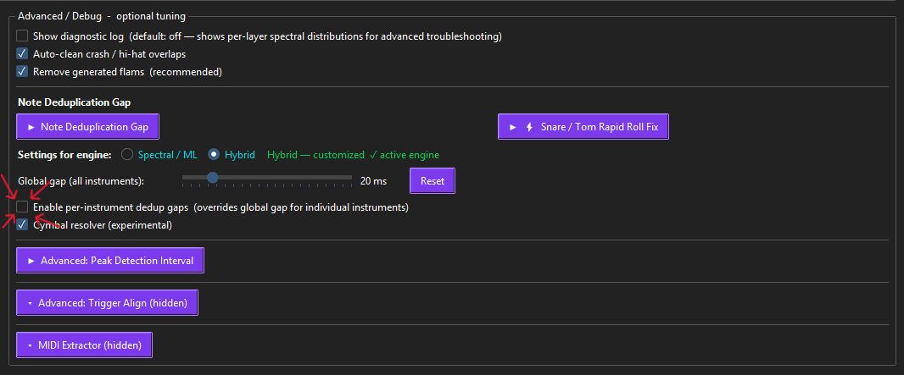
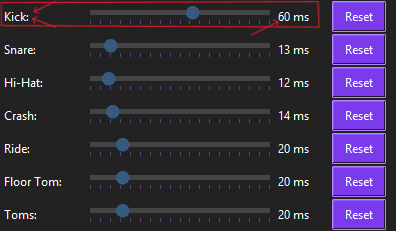
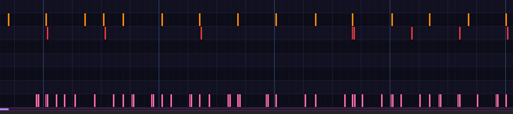
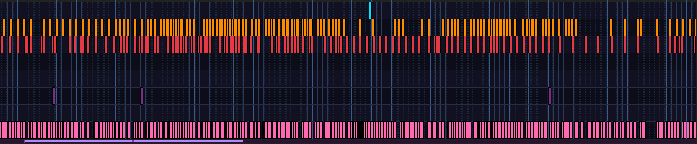
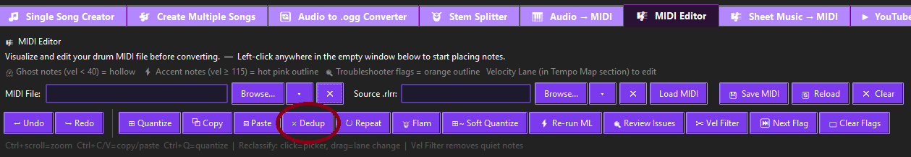
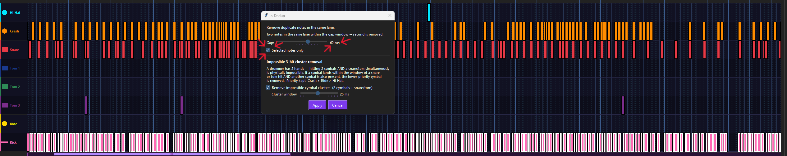
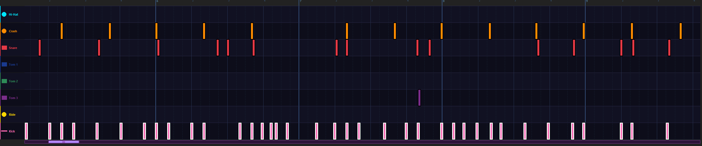

# Troubleshooting

## Kicks grouped together after Audio to MIDI

The Audio → MIDI detector can place several **kick** (bass-drum) notes almost on top of each other —
a little cluster where there should be one kick. **As of v4.4.66-1, ParaKit de-duplicates kicks at
55 ms by default, so this is handled automatically for the vast majority of songs.** You'll mainly
run into it now if you've **lowered the kick dedup gap** — some fast-kick songs need a smaller gap to
keep their correct kicks, but set it too small and the clustering creeps back in. Either way it's
quick to handle: tune the gap **before** the chart generates, or clean it up **after**.

### Tune the kick gap before converting
Kicks already de-duplicate at **55 ms by default**, so most songs need nothing here. Use this when a
specific song needs a different gap:
1. On the **Audio → MIDI** tab, open **Advanced / Debug → Note Deduplication Gap**.
2. Tick **"Enable per-instrument dedup gaps"** — this overrides the single global gap with one
   slider per drum.
3. Set the **Kick** slider for the situation:
   - **Correct kicks being deleted** (fast double-kicks, blast beats)? **Lower** it to about
     **20–30 ms** or less.
   - **Kicks still clustering** (for example after you'd already lowered it)? Raise it back toward
     **50–65 ms**.

   (Leave the other instruments at their defaults unless you have a reason to change them.)
4. Make sure your **Detection Engine** (Spectral / ML / Hybrid) and **Genre** are set to the best
   match for the song, then press **Convert**.

Steps 1–2 — open **Advanced / Debug → Note Deduplication Gap** and tick **Enable per-instrument dedup gaps**:



Step 3 — set the **Kick** gap for the song (shown here at ~60 ms; **lower** it to 20–30 ms if correct kicks are being deleted):



The kicks come out de-bunched from the start — no cleanup needed.

### Fix it after the chart is already generated
If you already converted and see the clustered kicks, fix them in the MIDI Editor. Here's the
problem — kicks doubled up where there should be one (bottom **Kick** lane):



**1. Zoom all the way out** on the chart so you can grab the whole song at once.



> **Long songs:** some tracks are too long to fit start-to-end even when fully zoomed out. If yours
> won't, just dedup the part you can see, then scroll along and **repeat this method** until you've
> deduped all the kicks.

**2. Select the kicks** — hold **Shift + Left-click + drag** to rubber-band-select them.

**3. Open Dedup** — it's on the toolbar above the chart (between **Paste** and **Repeat**):



Then tick **Selected notes only**, set the **Gap** slider to **~50–65 ms**, and press **Apply**.



The kicks come out de-bunched — single notes where there used to be clusters:



Either way removes the layered extra kicks while leaving your correct kick placements nearly
untouched.

---

## "Python was not found" / wrong Python version
ParaKit needs **Python 3.12** specifically. Check what you have:
```
py -0p
```
If 3.12 isn't listed, install it from [python.org](https://www.python.org/downloads/release/python-3120/).
Always launch with the explicit version so a newer Python doesn't get picked up:
```
py -3.12 "ParaKit v4.0.py"
```

## "FFmpeg not found" / audio conversion fails
ParaKit calls **FFmpeg** for audio conversion (via `pydub`) and the YouTube tab.
FFmpeg is a bundled binary, **not** a pip package — get it from the ParaKit
**requirements bundle** and place `ffmpeg.exe` next to `ParaKit v4.0.py` or in a
`Requirements\` subfolder beside it (or add it to your system `PATH`).

## YouTube downloads fail / "authentication challenge"
That's a **yt-dlp** issue, not an audio bug. Make sure `yt-dlp` from the requirements
bundle is present and up to date. yt-dlp 2025+ may also need a JavaScript runtime
(e.g. Node.js or Deno) on PATH for its signature solver — ParaKit's YouTube tab shows
specific guidance when it detects this.

## Stem Splitter is very slow / not using my GPU
GPU acceleration (CUDA) works on NVIDIA **GTX 10-series → RTX 40-series**. On other GPUs
(AMD, Intel) and on **RTX 50-series** cards, splitting runs on **CPU**. It still works —
just slower. See the next section for the RTX 50-series situation.

---

## RTX 50-series (Blackwell: 5070 / 5080 / 5090) GPU acceleration

**The situation.** The stem splitter uses Demucs (PyTorch). The PyTorch build that ships
with ParaKit does not include kernels for Blackwell GPUs (compute capability **sm_120**),
so on an RTX 50-series card the splitter correctly falls back to **CPU**. Everything still
works — just at CPU speed.

**Recommended fix — wait for the dedicated build.** We're packaging a separate,
**creator-verified RTX 50-series build** that has GPU acceleration configured and tested
out of the box (no manual setup). If you have a 50-series card, that's the easiest path —
watch the [releases page](https://github.com/sherifican/ParaKit---Releases).

**For advanced users who want to enable it now (not turnkey).** The GPU **compute** half is
straightforward and confirmed working on a 5070: install a CUDA 12.8 (`cu128`) PyTorch build
in your Python 3.12 environment:
```
py -3.12 -m pip install --index-url https://download.pytorch.org/whl/cu128 torch torchaudio torchvision
```
Verify it sees the card with no compatibility warning:
```
py -3.12 -c "import torch; print(torch.cuda.get_device_name(0), torch.cuda.get_device_capability(0))"
```

**The catch (be aware).** Newer PyTorch (2.11) changed how `torchaudio` writes audio files —
it now routes saving through **TorchCodec**, which additionally needs **FFmpeg _shared
libraries_** (the full "shared" FFmpeg build, not the static `ffmpeg.exe`-only one). Without
that, the GPU split itself succeeds but **writing the output stems fails**. Sorting that out
cleanly (TorchCodec + matching FFmpeg shared libs, or a save-path tweak) is exactly what the
dedicated 50-series build packages for you — which is why we recommend it over hand-rolling
the upgrade. Note also that swapping PyTorch versions in your main Python environment can
affect anything else that uses it.

> **Python 3.12 is required either way** — do not upgrade ParaKit's Python to "fix" this.

---

## DrumSep / Custom Isolation: model download failed

The advanced **DrumSep** (and the 6-stem Custom Isolation) split uses the **MDX23C DrumSep**
model by **aufr33 & jarredou**. ParaKit downloads it automatically on first use — but the
original upstream host was taken down, so that auto-download can fail if the fallback mirrors
are also unavailable.

**Manual fix** — download the model yourself and drop it where ParaKit looks for it:

1. Get **`MDX23C-DrumSep-aufr33-jarredou.ckpt`** (~437 MB). It's on the same
   [LimeWire page](https://limewire.com/d/HrcqC#lS73gPUpJa) as the requirements bundle
   (it's also mirrored on Hugging Face if you'd rather grab it there).
2. Make sure it's named **exactly** `MDX23C-DrumSep-aufr33-jarredou.ckpt`.
3. Place it in **either** location — ParaKit checks both:
   - **Windows (user cache):** `%APPDATA%\ParaKit\separators\jarredou_mdx23c\MDX23C-DrumSep-aufr33-jarredou.ckpt`
   - **Next to the app:** `parakit_models\jarredou_mdx23c\MDX23C-DrumSep-aufr33-jarredou.ckpt` (beside `ParaKit v4.0.py`)
   - *(macOS/Linux: `~/.config/parakit/separators/jarredou_mdx23c/MDX23C-DrumSep-aufr33-jarredou.ckpt`)*
4. **Restart ParaKit** — DrumSep finds the local copy and skips the download entirely.

**Verify your download (optional but recommended).** The genuine file is exactly
**437,652,699 bytes**, SHA-256:
```
D2A4AA53EB584D21EEAD358A4E66D1882AD182911BE018F052B5DA73BE9096D0
```
On Windows: `certutil -hashfile "MDX23C-DrumSep-aufr33-jarredou.ckpt" SHA256`

> Model credit: **aufr33 & jarredou** (MDX23C DrumSep checkpoint).

---

## Practice / MIDI issues
- **"mido is required"** → `py -3.12 -m pip install mido`
- **"pygame-ce is required"** (Practice v2) → `py -3.12 -m pip install pygame-ce`
- **No MIDI input devices found** → your drum kit may need its driver installed; you can
  always play with the keyboard instead.
- **No MIDI in the *web* Practice / Preview editions** → the browser editions use the **Web MIDI
  API**, which only some browsers support: **Chrome, Edge, and other Chromium browsers** (Opera /
  Brave) work; **Safari (macOS + iOS) does not**, and **Firefox** is limited (supported since
  v108 but flagged "not Baseline"). Use **Chrome or Edge** for a USB drum kit, or play with the
  keyboard (works in every browser). Some of the browsers MDN marks unsupported (the `*` entries
  in its table) can still be coaxed into working with a **flag, permission, or polyfill** — see
  the per-browser implementation notes. Live compatibility:
  <https://developer.mozilla.org/en-US/docs/Web/API/Web_MIDI_API#browser_compatibility>
- **Practice opens but shows no notes** → the MIDI file needs drum notes in the standard GM
  mapping (35/36 kick, 38 snare, 42/44/46 hi-hat, etc.).

## Drag-and-drop doesn't work
That feature uses `tkinterdnd2`. Make sure it installed (`py -3.12 -m pip install tkinterdnd2`).
You can still use the **Browse…** buttons if drag-and-drop is unavailable.
